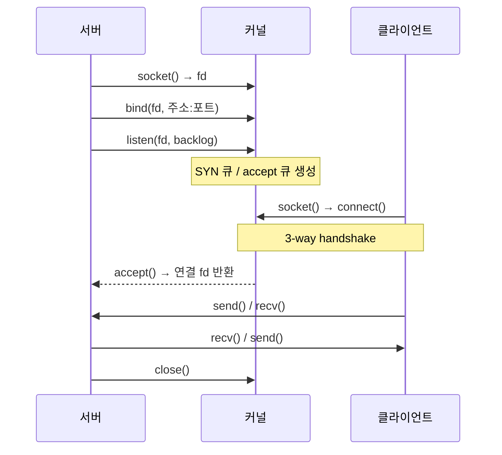
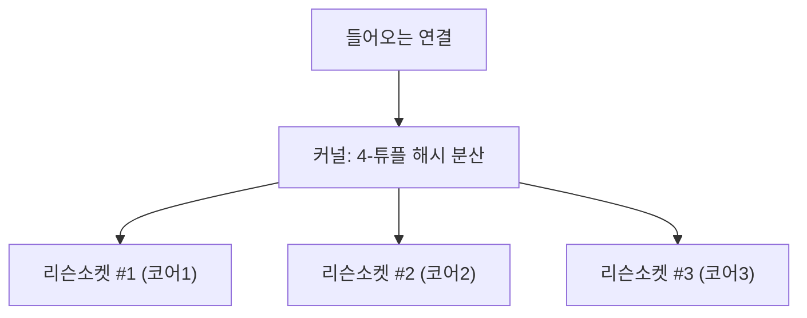

## "소켓을 연다"는 말의 진짜 의미

애플리케이션은 `socket()`, `bind()`, `accept()` 몇 줄로 네트워크를 다룹니다. 하지만 그 한 줄 뒤에서 커널은 **파일 디스크립터**를 발급하고, **수신 큐**를 만들고, NIC가 올린 인터럽트를 처리하고, `sk_buff`를 소켓 버퍼에 줄 세웁니다. 이 글은 "소켓을 안다"를 *시스템 콜 이름을 외운다*에서 *NIC 인터럽트부터 `recv()` 반환까지의 데이터 경로를 그릴 수 있다*로 끌어올립니다.

여기를 모르면 두 순간에 반드시 막힙니다. **(1) 커넥션 1만 개를 어떻게 한 스레드로 받지?** **(2) CPU는 노는데 처리량이 안 나오는 이유는?** 둘 다 답은 소켓 API가 아니라 **그 아래 커널 스택**에 있습니다.

## BSD 소켓 API — 서버와 클라이언트의 상태 흐름

소켓은 1983년 BSD가 정립한 API를 거의 그대로 씁니다. 서버와 클라이언트의 호출 순서가 다릅니다.



핵심은 `listen()`이 만드는 **두 개의 큐**입니다.

| 큐 | 들어가는 시점 | 가득 차면 |
|----|------------|----------|
| **SYN 큐**(half-open) | SYN 수신, SYN-ACK 회신 후 | SYN flood. `tcp_syncookies`로 방어 |
| **accept 큐**(established) | 핸드셰이크 완료, `accept()` 대기 | **새 연결 drop / 재전송 유발** — `backlog`·`somaxconn` 부족 |

> **현장 함정**: `listen(fd, 128)`을 줬어도 커널은 `min(backlog, net.core.somaxconn)`로 자릅니다. 트래픽 폭주 시 `accept` 큐가 차면 커널이 ACK를 무시해 클라이언트가 재전송하고, 사용자에겐 "간헐적 1초 지연"으로 보입니다. `ss -ltn`의 `Recv-Q`(현재 대기)·`Send-Q`(큐 한계)로 확인합니다.

`accept()`는 [TCP 3-way handshake]()가 *이미 끝난* 연결을 큐에서 꺼낼 뿐, 핸드셰이크를 직접 하지 않습니다. 이 분리가 고성능 서버 설계의 출발점입니다.

## 블로킹의 벽: 한 스레드 = 한 연결의 한계

`accept()`도 `recv()`도 기본은 **블로킹**입니다 — 데이터가 올 때까지 스레드가 잠듭니다. 연결마다 스레드를 붙이면(thread-per-connection) 1만 연결에 1만 스레드, 스택 메모리(스레드당 ~1MB)와 컨텍스트 스위칭만으로 무너집니다. 이게 **C10K 문제**입니다.

해법은 **한 스레드가 수천 fd를 감시**하는 I/O 멀티플렉싱입니다. 그 진화가 `select` → `poll` → `epoll`입니다.

| | select | poll | **epoll** |
|---|---|---|---|
| fd 표현 | 비트마스크(FD_SETSIZE 1024) | 배열(무제한) | 커널 레드블랙트리 |
| 매 호출 복사 | 전체 fd set 복사 | 전체 배열 복사 | **등록만 1회** |
| ready 탐색 | O(n) 전체 스캔 | O(n) 전체 스캔 | **O(1)** ready만 반환 |
| 1만 fd에서 | 매우 느림 | 느림 | 빠름 |

`select`/`poll`은 매 호출마다 **전체 fd 목록을 커널에 복사하고 전부 스캔**합니다. fd가 1만 개면 이벤트가 하나여도 1만 개를 훑습니다. `epoll`은 `epoll_ctl`로 관심 fd를 커널에 **한 번 등록**해두고, `epoll_wait`은 **준비된 fd만** 돌려줍니다.

## epoll 이벤트 루프 — ready만 골라 처리

아래는 epoll의 핵심입니다. 수많은 fd 중 대부분은 조용하고(<span style="opacity:.5">회색</span>), 데이터가 도착한 일부만 <span style="color:#2f9e44;font-weight:600">ready</span>가 되어 `epoll_wait`이 그것만 반환합니다. 한 스레드가 전체를 스캔하지 않고 **신호 온 것만** 처리합니다.

<div class="sock-epoll" markdown="0">
<style>
.sock-epoll{margin:1.4rem 0;overflow-x:auto}
.sock-epoll svg{width:100%;max-width:700px;height:auto;display:block;margin:0 auto;font-family:inherit}
.sock-epoll .lbl{fill:currentColor;font-size:12px;font-weight:600}
.sock-epoll .sub{fill:currentColor;font-size:10px;opacity:.55}
.sock-epoll .box{fill:none;stroke:currentColor;stroke-width:1.5;opacity:.4}
.sock-epoll .fd{fill:currentColor;opacity:.18}
.sock-epoll .arr{stroke:currentColor;opacity:.3;stroke-width:1.4;fill:none}
.sock-epoll .r1{animation:sockready 4s ease-in-out infinite}
.sock-epoll .r2{animation:sockready 4s ease-in-out infinite 1.6s}
.sock-epoll .r3{animation:sockready 4s ease-in-out infinite 2.8s}
.sock-epoll .pulse{fill:#2f9e44;opacity:0}
.sock-epoll .pl1{animation:sockpulse 4s ease-in-out infinite}
.sock-epoll .pl2{animation:sockpulse 4s ease-in-out infinite 1.6s}
.sock-epoll .pl3{animation:sockpulse 4s ease-in-out infinite 2.8s}
@keyframes sockready{0%,100%{fill:currentColor;opacity:.18}40%,60%{fill:#2f9e44;opacity:.9}}
@keyframes sockpulse{0%{opacity:0;transform:translateX(0)}38%{opacity:0}45%{opacity:1}90%{opacity:1;transform:translateX(150px)}100%{opacity:0;transform:translateX(150px)}}
</style>
<svg viewBox="0 0 700 240" role="img" aria-label="epoll이 등록된 다수 파일 디스크립터 중 데이터가 도착해 준비된 것만 골라 이벤트 루프에 전달하는 애니메이션">
  <text class="lbl" x="20" y="24">감시 중인 fd (epoll_ctl로 등록)</text>
  <rect class="box" x="20" y="36" width="180" height="180" rx="8"/>
  <rect class="fd r1" x="40"  y="52"  width="140" height="20" rx="4"/>
  <rect class="fd"    x="40"  y="80"  width="140" height="20" rx="4"/>
  <rect class="fd r2" x="40"  y="108" width="140" height="20" rx="4"/>
  <rect class="fd"    x="40"  y="136" width="140" height="20" rx="4"/>
  <rect class="fd"    x="40"  y="164" width="140" height="20" rx="4"/>
  <rect class="fd r3" x="40"  y="192" width="140" height="20" rx="4"/>
  <rect class="pulse pl1" x="186" y="56"  width="12" height="12" rx="3"/>
  <rect class="pulse pl2" x="186" y="112" width="12" height="12" rx="3"/>
  <rect class="pulse pl3" x="186" y="196" width="12" height="12" rx="3"/>
  <line class="arr" x1="200" y1="126" x2="300" y2="126"/>
  <rect class="box" x="300" y="86" width="180" height="80" rx="8"/>
  <text class="lbl" x="390" y="118" text-anchor="middle">epoll_wait()</text>
  <text class="sub" x="390" y="138" text-anchor="middle">ready인 fd만 반환</text>
  <line class="arr" x1="480" y1="126" x2="560" y2="126"/>
  <rect class="box" x="560" y="86" width="120" height="80" rx="8"/>
  <text class="lbl" x="620" y="120" text-anchor="middle">이벤트 루프</text>
  <text class="sub" x="620" y="140" text-anchor="middle">1 스레드</text>
</svg>
</div>

여기에 **트리거 모드**가 추가됩니다. **레벨 트리거(LT, 기본)** 는 버퍼에 데이터가 남아있는 한 계속 알리고, **엣지 트리거(ET)** 는 상태가 *바뀌는 순간만* 한 번 알립니다. ET는 깨우는 횟수를 줄여 더 빠르지만, 알림 한 번에 `EAGAIN`이 날 때까지 **전부 읽어야** 합니다(안 그러면 남은 데이터를 영영 못 깨움). nginx·Redis가 ET를 쓰는 이유이자, 직접 짤 때 가장 흔한 버그 지점입니다.

```c
int ep = epoll_create1(0);
struct epoll_event ev = { .events = EPOLLIN | EPOLLET, .data.fd = conn };
epoll_ctl(ep, EPOLL_CTL_ADD, conn, &ev);
for (;;) {
    int n = epoll_wait(ep, events, MAX, -1);   /* ready 개수만큼만 */
    for (int i = 0; i < n; i++)
        handle(events[i].data.fd);             /* ET면 EAGAIN까지 read */
}
```

## NIC에서 recv()까지 — 패킷 한 개의 커널 여정

데이터가 도착하면, `recv()`가 반환되기까지 커널은 인터럽트·소프트IRQ·`sk_buff`를 거칩니다.

<div class="sock-rx" markdown="0">
<style>
.sock-rx{margin:1.4rem 0;overflow-x:auto}
.sock-rx svg{width:100%;max-width:720px;height:auto;display:block;margin:0 auto;font-family:inherit}
.sock-rx .lbl{fill:currentColor;font-size:11.5px;font-weight:600}
.sock-rx .sub{fill:currentColor;font-size:9px;opacity:.55}
.sock-rx .box{fill:none;stroke:currentColor;stroke-width:1.5;opacity:.45}
.sock-rx .arr{stroke:currentColor;opacity:.3;stroke-width:1.4;fill:none}
.sock-rx .pk{fill:#1971c2}
.sock-rx .m1{animation:sockrx 5s linear infinite}
.sock-rx .m2{animation:sockrx 5s linear infinite 1.6s}
.sock-rx .line{stroke:currentColor;opacity:.2;stroke-dasharray:4 4}
@keyframes sockrx{0%{transform:translateX(0);opacity:0}5%{opacity:1}95%{opacity:1}100%{transform:translateX(620px);opacity:0}}
</style>
<svg viewBox="0 0 720 170" role="img" aria-label="NIC가 받은 패킷이 링 버퍼·소프트IRQ·sk_buff를 거쳐 소켓 수신 버퍼에 쌓이고 recv가 유저 공간으로 복사하는 수신 경로 애니메이션">
  <line class="line" x1="360" y1="20" x2="360" y2="150"/>
  <text class="sub" x="180" y="18" text-anchor="middle">커널 공간</text>
  <text class="sub" x="540" y="18" text-anchor="middle">유저 공간</text>
  <rect class="box" x="20"  y="50" width="90" height="56" rx="8"/>
  <rect class="box" x="135" y="50" width="90" height="56" rx="8"/>
  <rect class="box" x="250" y="50" width="90" height="56" rx="8"/>
  <rect class="box" x="400" y="50" width="100" height="56" rx="8"/>
  <rect class="box" x="540" y="50" width="120" height="56" rx="8"/>
  <text class="lbl" x="65"  y="74" text-anchor="middle">NIC</text>
  <text class="sub" x="65"  y="92" text-anchor="middle">DMA→링버퍼</text>
  <text class="lbl" x="180" y="74" text-anchor="middle">softirq</text>
  <text class="sub" x="180" y="92" text-anchor="middle">NAPI 폴링</text>
  <text class="lbl" x="295" y="74" text-anchor="middle">sk_buff</text>
  <text class="sub" x="295" y="92" text-anchor="middle">프로토콜 처리</text>
  <text class="lbl" x="450" y="74" text-anchor="middle">소켓 버퍼</text>
  <text class="sub" x="450" y="92" text-anchor="middle">recv 큐</text>
  <text class="lbl" x="600" y="74" text-anchor="middle">recv()</text>
  <text class="sub" x="600" y="92" text-anchor="middle">앱 버퍼로 복사</text>
  <line class="arr" x1="110" y1="78" x2="135" y2="78"/>
  <line class="arr" x1="225" y1="78" x2="250" y2="78"/>
  <line class="arr" x1="340" y1="78" x2="400" y2="78"/>
  <line class="arr" x1="500" y1="78" x2="540" y2="78"/>
  <rect class="pk m1" x="16" y="71" width="14" height="14" rx="2"/>
  <rect class="pk m2" x="16" y="71" width="14" height="14" rx="2"/>
</svg>
</div>

1. **NIC**가 패킷을 받아 **DMA**로 메모리(RX 링 버퍼)에 직접 씁니다.
2. 인터럽트가 너무 잦으면 CPU가 마비되므로(인터럽트 스톰), 리눅스는 **NAPI**로 첫 인터럽트 후 **폴링**으로 전환해 한 번에 여러 패킷을 거둡니다.
3. **softirq**(`NET_RX_SOFTIRQ`)가 패킷을 `sk_buff` 구조체로 감싸 IP·TCP 계층을 통과시키고, 목적지 **소켓의 수신 버퍼**에 넣습니다.
4. `recv()`는 그 버퍼에서 **유저 공간으로 복사**해 옵니다. 여기서 커널↔유저 복사가 일어납니다.

> **왜 복사가 비싼가**: 정적 파일 전송처럼 "디스크 → 소켓"만 하는데도 데이터가 *커널→유저→커널*로 두 번 복사되고 컨텍스트 스위칭이 발생합니다. **`sendfile()`**(zero-copy)은 이 왕복을 없애 커널 안에서 바로 보냅니다. nginx·Kafka가 처리량을 뽑는 핵심 기법입니다.

## 멀티코어로 더 — SO_REUSEPORT

한 리슨 소켓을 여러 스레드가 `accept()`하면 **thundering herd**(한 연결에 전부 깨어나 경쟁)와 락 경합이 생깁니다. **`SO_REUSEPORT`** 는 같은 포트에 **여러 리슨 소켓**을 열게 해주고, 커널이 들어오는 연결을 소켓들에 **해시 분산**합니다. 코어마다 독립 accept 큐 → 락 프리에 가까운 수평 확장. nginx `reuseport`, Envoy가 이걸로 멀티코어를 채웁니다.



## 버퍼 크기가 곧 처리량 — 그리고 디버깅

소켓 송수신 버퍼(`SO_SNDBUF`/`SO_RCVBUF`)가 작으면, 고지연 경로에서 **파이프를 못 채워** 처리량이 한계에 걸립니다. 이게 [BDP와 윈도우]() 이야기와 직결됩니다.

| 증상 | 원인 | 진단 | 해법 |
|------|------|------|------|
| `Too many open files` | fd 고갈 | `ulimit -n`, `ls /proc/PID/fd \| wc -l` | `LimitNOFILE` 상향, fd 누수 점검 |
| 간헐적 연결 실패 | accept 큐 오버플로 | `ss -ltn`(Recv-Q/Send-Q), `nstat \| grep ListenOverflow` | `somaxconn`·backlog 상향 |
| CPU 노는데 처리량 ↓ | 작은 소켓 버퍼/윈도우 | `ss -i`(cwnd·rtt), `iperf3` | 버퍼 자동튜닝, `tcp_rmem` 상향 |
| 시스템콜 폭주 | LT에서 과도한 wake | `strace -c -p PID` | ET 전환·배치 처리 |

```bash
strace -p 31337 -e trace=network -tt   # 어떤 소켓 콜이 블로킹되는지
ss -tmi 'dst :443'                      # 소켓별 메모리(m)·내부 TCP 정보(i)
cat /proc/net/sockstat                  # 전체 소켓/메모리 사용 현황
```

## 면접/리뷰 단골 질문

- **Q. select/poll 대신 epoll을 쓰는 이유?** → 매 호출 fd 전체 복사·O(n) 스캔이 없다. 커널에 한 번 등록하고 ready만 O(1)로 받는다. C10K 이상에서 결정적.
- **Q. 레벨 트리거와 엣지 트리거 차이와 함정?** → LT는 데이터 남으면 계속 알림(안전·다소 비효율), ET는 상태 변화 시 1회. ET는 `EAGAIN`까지 다 읽지 않으면 기아 발생.
- **Q. `accept()`는 핸드셰이크를 하나?** → 아니다. 커널이 끝낸 established 연결을 accept 큐에서 꺼낼 뿐. SYN 큐·accept 큐는 별개.
- **Q. zero-copy가 왜 빠른가?** → 커널↔유저 복사와 컨텍스트 스위칭을 제거. `sendfile`/`splice`로 커널 내에서 디스크→소켓 직결.
- **Q. SO_REUSEPORT가 푸는 문제?** → 단일 accept 큐 락 경합과 thundering herd. 코어별 큐로 수평 확장.

## 정리

- 소켓 API의 `listen`은 **SYN 큐 + accept 큐** 두 개를 만들고, `accept`는 완료된 연결을 꺼낼 뿐이다.
- 블로킹 thread-per-connection은 C10K에서 무너진다 → **epoll**이 등록 1회·ready만 O(1) 반환으로 한 스레드에 수만 연결을 태운다.
- 패킷 수신은 **NIC DMA → NAPI/softirq → sk_buff → 소켓 버퍼 → recv 복사** 경로를 탄다. 복사 제거가 `sendfile`(zero-copy).
- 멀티코어는 **SO_REUSEPORT**로, 처리량 한계는 **버퍼/윈도우**로 — 둘 다 `ss -i`로 들여다본다.

> 이 위에서 도는 게 [TCP 상태 머신]()과 [혼잡 제어]()이며, 버퍼가 처리량을 막는 원리는 [네트워크 성능·BDP]()에서, 이 소켓들을 투명하게 가로채는 사이드카는 [현대 네트워킹]()에서 이어집니다.
