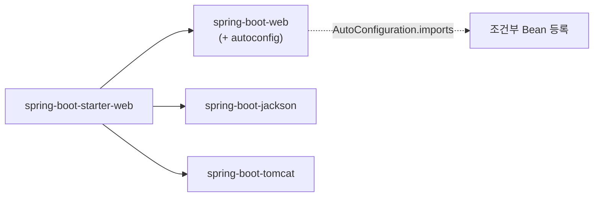

## 메이저 버전이 올라갔다

2025년 11월, **Spring Boot 4.0**과 그 기반인 **Spring Framework 7.0**이 GA로 나왔습니다(이 글 기준 최신은 Boot 4.1 / Framework 7.0.x대). 메이저 점프라 바뀐 게 많은데, "새 기능 목록"을 외우는 건 의미가 없습니다. 중요한 건 **무엇이 왜 바뀌었고, 내 코드 마이그레이션에서 어디가 깨지는가**입니다. 이 글은 그 관점으로 큰 그림을 잡고, 세부 주제는 이어지는 글에서 깊게 다룹니다.

가장 구조적인 변화 한 가지를 먼저 움직임으로 보죠 — 거대 단일 `spring-boot-autoconfigure`가 **기능별 모듈**로 쪼개진 것입니다.

<div class="b4-split" markdown="0">
<style>
.b4-split{margin:1.4rem 0;overflow-x:auto}
.b4-split svg{width:100%;max-width:720px;height:auto;display:block;margin:0 auto;font-family:inherit}
.b4-split .lbl{fill:currentColor;font-size:11px;font-weight:600}
.b4-split .big{fill:currentColor;font-size:11px;font-weight:700}
.b4-split rect.box{fill:none;stroke:currentColor;stroke-width:1.5}
.b4-split g.src rect{opacity:.5}
.b4-split g.src{animation:b4src 5s ease-in-out infinite}
.b4-split g.mod rect{stroke:#1971c2}
.b4-split g.mod text{fill:#1971c2}
.b4-split g.mod{opacity:0;animation:b4split 5s ease-in-out infinite}
.b4-split line.arr{stroke:currentColor;opacity:.25;stroke-width:1.4}
@keyframes b4src{0%,100%{opacity:.95}45%{opacity:.4}}
@keyframes b4split{0%{transform:translate(var(--dx),var(--dy));opacity:0}12%{opacity:1}50%{transform:translate(0,0);opacity:1}86%{transform:translate(0,0);opacity:1}100%{transform:translate(0,0);opacity:0}}
</style>
<svg viewBox="0 0 720 220" role="img" aria-label="거대 단일 spring-boot-autoconfigure 모듈이 기능별 작은 모듈로 분리되는 애니메이션">
  <g class="src">
    <rect class="box" x="24" y="82" width="170" height="56" rx="8"/>
    <text class="big" x="109" y="106" text-anchor="middle">spring-boot-</text>
    <text class="big" x="109" y="122" text-anchor="middle">autoconfigure</text>
  </g>
  <line class="arr" x1="200" y1="110" x2="404" y2="52"/>
  <line class="arr" x1="200" y1="110" x2="404" y2="114"/>
  <line class="arr" x1="200" y1="110" x2="404" y2="176"/>
  <g class="mod" style="--dx:-300px;--dy:58px">
    <rect class="box" x="408" y="30" width="124" height="44" rx="7"/>
    <text class="lbl" x="470" y="56" text-anchor="middle">…boot-web</text>
  </g>
  <g class="mod" style="--dx:-440px;--dy:58px">
    <rect class="box" x="556" y="30" width="124" height="44" rx="7"/>
    <text class="lbl" x="618" y="56" text-anchor="middle">…boot-jackson</text>
  </g>
  <g class="mod" style="--dx:-300px;--dy:-4px">
    <rect class="box" x="408" y="92" width="124" height="44" rx="7"/>
    <text class="lbl" x="470" y="118" text-anchor="middle">…boot-data-jpa</text>
  </g>
  <g class="mod" style="--dx:-440px;--dy:-4px">
    <rect class="box" x="556" y="92" width="124" height="44" rx="7"/>
    <text class="lbl" x="618" y="118" text-anchor="middle">…boot-security</text>
  </g>
  <g class="mod" style="--dx:-300px;--dy:-66px">
    <rect class="box" x="408" y="154" width="124" height="44" rx="7"/>
    <text class="lbl" x="470" y="180" text-anchor="middle">…boot-actuator</text>
  </g>
  <g class="mod" style="--dx:-440px;--dy:-66px">
    <rect class="box" x="556" y="154" width="124" height="44" rx="7"/>
    <text class="lbl" x="618" y="180" text-anchor="middle">…boot-webmvc</text>
  </g>
</svg>
</div>

## 큰 그림: 왜 "메이저"인가

마이너 업데이트가 아니라 메이저 점프인 이유는 **바닥(런타임·플랫폼)이 올라갔기 때문**입니다.

| 축 | Boot 3 | **Boot 4 / FW 7** |
|----|--------|-------------------|
| 최소 Java | 17 | **17** (유지, 단 21/25 강력 권장) |
| 런타임 활용 | — | **Java 25 first-class** (가상 스레드 등) |
| Jakarta EE | EE 9/10 | **EE 11** (Servlet 6.1, JPA 3.2, Validation 3.1) |
| 널 안전성 | Spring 자체 `@Nullable` | **JSpecify** 표준 |
| 직렬화 기본 | Jackson 2 | **Jackson 3** (패키지 변경) |

`javax.*` → `jakarta.*` 전환은 이미 Boot 3에서 끝났어야 할 숙제라, Boot 4 자체가 강제하는 소스 변경은 생각보다 적습니다. 진짜 손이 가는 건 **모듈 좌표, 널 애너테이션, Jackson 3** 세 가지입니다.

## 1. 모듈화 — 가장 구조적인 변화

자동 구성을 다룬 [별도 글]()에서 봤듯, 그동안 거의 모든 자동 구성은 단일 `spring-boot-autoconfigure` jar 안에 들어 있었습니다. Boot 4는 이를 **기능별 모듈**(`spring-boot-web`, `spring-boot-data-jpa`, `spring-boot-jackson`, `spring-boot-actuator` …)로 분리했습니다.



**왜 쪼갰나?** ① 의존성 경계가 명확해져 "쓰지도 않는 자동 구성"이 클래스패스에 덜 끌려옵니다. ② 각 기능 모듈이 자기 `AutoConfiguration.imports`를 들고 다녀, 자동 구성 후보 스캔이 모듈 단위로 국소화됩니다.

**체감 변화가 적은 이유**: 대부분의 사람은 모듈을 직접 의존하지 않고 **starter**를 의존합니다([starter 글]()). starter가 새 모듈 좌표를 흡수하므로, BOM만 따르면 좌표는 자동으로 맞습니다. 단, **starter 없이 개별 아티팩트를 직접 import 하던 프로젝트**는 좌표(artifactId)가 바뀌어 깨질 수 있습니다 — 이게 마이그레이션 1순위 점검 대상입니다.

## 2. JSpecify 널 안전성 — 컴파일 타임에 NPE 잡기

Spring 7은 자체 널 애너테이션을 버리고 **JSpecify**(`org.jspecify.annotations.*`)로 통일했습니다. 핵심 메커니즘은 **"패키지 단위 기본 non-null"** 입니다.

```java
// package-info.java — 이 패키지 전체가 "기본 non-null"이 된다
@NullMarked
package com.example.demo;

import org.jspecify.annotations.NullMarked;
```

```java
// 이제 null 가능한 곳에만 명시
public @Nullable User findById(Long id) { ... }
```

`@NullMarked` 안에서는 모든 타입이 기본적으로 non-null이고, 예외만 `@Nullable`로 표시합니다. IntelliJ·Checker Framework·NullAway 같은 도구가 이 메타데이터를 읽어 **컴파일/정적분석 단계에서** "null 들어올 수 있는데 non-null로 받는다"를 잡아줍니다. 런타임 검사가 아니라 **타입 시스템 보강**이라는 점이 포인트입니다.

> 마이그레이션 함정: 기존에 `org.springframework.lang.Nullable`을 import 하던 코드는 deprecated 됩니다. 동작은 유지되지만, 정적분석을 켜면 Spring API의 시그니처가 더 엄격해져 **이전엔 통과하던 코드에 경고가 쏟아질 수 있습니다.**

## 3. 선언적 HTTP 클라이언트 · API 버저닝 (코어 승격)

그동안 서드파티/직접 구현에 의존하던 두 기능이 프레임워크 코어로 들어왔습니다.

- **선언적 HTTP 클라이언트**: `@HttpExchange` 인터페이스 + `@ImportHttpServices`로 Feign처럼 *인터페이스만 정의하면* 클라이언트가 생성됩니다. 기본 백엔드는 `RestClient`. → [자세히]()
- **API 버저닝**: `@GetMapping(version = "1.1")`처럼 매핑에 버전을 1급으로 선언하고, 헤더·경로·미디어타입으로 협상합니다. → [자세히]()

## 4. 코어에 들어온 회복탄력성(Resilience)

`spring-retry` 같은 별도 라이브러리 없이, 재시도·동시성 제한이 코어에 포함됐습니다.

```java
@Retryable(maxAttempts = 3, includes = TransientException.class)
public PaymentResult pay(Order order) { ... }

@ConcurrencyLimit(10)   // 동시 실행 10개로 제한
public void heavyJob() { ... }
```

이들도 **AOP 프록시 기반**이라, [`@Transactional`과 똑같은 self-invocation 함정]()을 그대로 물려받습니다(내부 호출은 재시도가 안 걸림).

## 5. 프로그래밍 방식 Bean 등록 — `BeanRegistrar`

`@Bean` 메서드만으로 표현하기 어려운 **동적/조건부 Bean 등록**을 코드로 깔끔하게 할 수 있는 `BeanRegistrar` 계약이 추가됐습니다. 런타임 정보에 따라 Bean 개수·타입이 달라지는 라이브러리 작성자에게 특히 유용합니다.

## 6. Jackson 3 — 조용한 지뢰

Boot 4의 기본 JSON 매퍼가 **Jackson 3**으로 올라갔습니다. Jackson 3는 **베이스 패키지가 바뀌었습니다**(`com.fasterxml.jackson...` → `tools.jackson...`, 단 `jackson-annotations`는 호환 유지). 직접 `ObjectMapper`를 다루거나 커스텀 직렬화기를 import 하던 코드는 **import 문이 깨집니다.** Boot 4는 한동안 Jackson 2와 3을 함께 다룰 수 있게 배려하지만, 새 기본값은 3이라는 점을 알고 가야 합니다.

## 업그레이드: 깨질 수 있는 지점 체크리스트

| 영역 | 증상 | 대응 |
|------|------|------|
| 모듈 좌표 | starter 없이 개별 아티팩트 직접 의존 시 해석 실패 | starter로 전환하거나 새 artifactId로 교체 |
| 널 애너테이션 | `org.springframework.lang.Nullable` deprecated, 정적분석 경고 폭증 | JSpecify로 이전, 단계적 `@NullMarked` 적용 |
| Jackson 3 | `com.fasterxml.jackson.*` import 컴파일 실패 | `tools.jackson.*`로 교체, 커스텀 모듈 점검 |
| 서드파티 호환 | 라이브러리가 FW 7 / Jakarta EE 11 미지원 | 호환 버전 확인 후 일괄 업 |
| Java 런타임 | 21 미만에서 가상 스레드 등 미활용 | 21/25로 상향 |

원칙은 하나입니다 — **테스트가 든든한 상태에서, BOM(`spring-boot-dependencies`)을 따라 한 번에.** 버전을 개별로 끼워 맞추면 모듈 간 버전이 어긋나 더 큰 혼란이 됩니다.

## 면접/리뷰 단골 질문

- **Q. Boot 4가 "메이저"인 근본 이유는?** → 새 기능이 아니라 **플랫폼 baseline 상향**(Jakarta EE 11, Jackson 3, JSpecify 등 호환성 깨는 변화) 때문.
- **Q. 모듈 분할이 일반 사용자에게 체감이 적은 이유는?** → starter가 새 모듈 좌표를 흡수하므로 BOM만 따르면 됨. 개별 아티팩트 직접 의존자만 영향.
- **Q. JSpecify 널 안전성은 런타임 검사인가?** → 아니다. `@NullMarked` 기본 non-null + 정적분석 도구가 **컴파일 단계**에서 잡는 타입 시스템 보강이다.

## 정리

- Boot 4 / FW 7 = **Java 17+ · Jakarta EE 11 · Jackson 3 · JSpecify** 위에 선 메이저 버전.
- 가장 구조적인 변화는 **모듈화**(거대 autoconfigure → 기능별 모듈)지만, starter 사용자에겐 체감이 적다.
- 코어 승격: **선언적 HTTP 클라이언트, API 버저닝, 회복탄력성(@Retryable/@ConcurrencyLimit), BeanRegistrar.**
- 마이그레이션 실전 3대 점검: **모듈 좌표 · 널 애너테이션 · Jackson 3 패키지.**

> 이어지는 글: [가상 스레드]() · [선언적 HTTP 클라이언트]() · [API 버저닝]() 에서 각 주제를 깊게 다룹니다.
