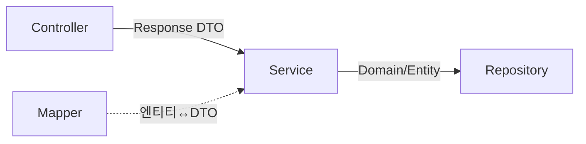

계층 사이로 객체를 옮기는 변환 코드를 정리하는 주였다. 같은 데이터를 엔티티 → DTO → 응답 모델로 세 번 베껴 적는 그 코드 말이다.

## 손매핑이 위험한 이유

수동 매핑은 보통 이렇게 생겼다.

```java
UserResponse toResponse(User u) {
    UserResponse r = new UserResponse();
    r.setId(u.getId());
    r.setName(u.getName());
    r.setEmail(u.getEmail());
    // 나중에 User.phone 추가 → 여기 한 줄 빼먹으면 끝
    return r;
}
```

문제는 **새 필드가 생겨도 컴파일러가 아무 말 안 한다**는 점이다. 엔티티에 `phone`을 추가하고 응답에도 추가했는데 매핑 한 줄을 안 적으면, `phone`은 조용히 null로 나간다. 테스트가 없으면 운영에서야 발견된다. 필드가 20개면 매핑 누락은 시간문제다.

## 컴파일 타임 매핑이 푸는 것

MapStruct 같은 도구는 인터페이스만 선언하면 **컴파일 시점에 매핑 구현체를 생성**한다.

```java
@Mapper(componentModel = "spring")
public interface UserMapper {
    UserResponse toResponse(User user);
}
```

핵심은 리플렉션이 아니라 코드 생성이라는 점이다. 빌드 때 `getName()`/`setName()`을 직접 호출하는 평범한 자바 코드가 만들어진다. 그래서 런타임 오버헤드가 거의 없고, **이름이 맞지 않거나 매핑할 수 없는 필드가 있으면 컴파일이 깨진다.** 누락이 빌드 단계로 당겨진다는 게 핵심 이득이다. 필드 추가를 깜빡하면 빨간 줄이 뜨지 손매핑처럼 null이 새지 않는다.

이름이 다르거나 변환이 필요하면 명시한다.

```java
@Mapping(source = "createdAt", target = "registeredDate")
@Mapping(target = "fullName", expression = "java(u.getFirst() + \" \" + u.getLast())")
UserResponse toResponse(User u);
```

## 매핑 코드를 어디에 둘까

매핑의 위치는 의존성 방향을 결정한다.



원칙은 **도메인 계층이 표현 계층을 모르게 한다**는 것이다.

- 엔티티 ↔ 도메인 DTO 매핑은 서비스 계층 또는 별도 매퍼에 둔다.
- 응답 전용 모델로의 매핑(필드 가공, 마스킹)은 표현 계층 쪽에 둔다. 그래야 도메인이 API 포맷 변경에 흔들리지 않는다.
- 엔티티를 컨트롤러까지 그대로 노출하지 않는다. 그래야 내부 스키마가 API 계약과 분리된다.

## 운영 함정

- **자동 매핑의 과신**: 같은 이름이라고 자동으로 매핑되면, 의도치 않은 필드(비밀번호 해시 등)가 응답에 새어 나갈 수 있다. 노출 필드는 응답 DTO에 명시적으로 정의해 화이트리스트로 관리한다.
- **양방향·중첩 매핑의 N+1**: 엔티티 안의 지연 로딩 연관을 매핑하면, 매핑 중에 추가 쿼리가 줄줄이 나간다. 매핑 전에 필요한 연관을 미리 로딩하거나, 필요한 필드만 골라 받는 조회용 쿼리를 따로 둔다.

## 핵심 요약

- 손매핑의 진짜 비용은 코드량이 아니라 **컴파일러가 못 잡는 필드 누락**이다.
- 컴파일 타임 매핑은 누락을 빌드 단계로 당기고 런타임 오버헤드가 없다.
- 매핑 위치는 의존성 방향을 따라 정한다 — 도메인이 표현 포맷을 모르게.
