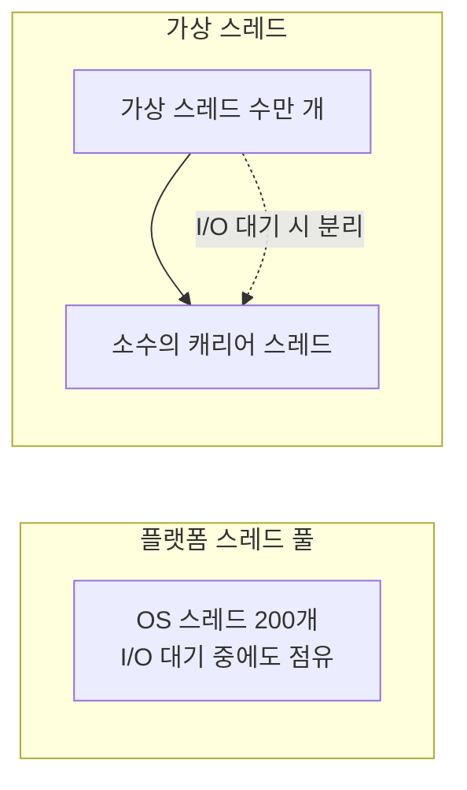

## 스레드가 비싸서 생긴 고민들

전통적인 Spring MVC는 **요청 하나당 스레드 하나**를 씁니다. 그런데 OS 스레드는 비싸서(메모리·컨텍스트 스위칭) 보통 수백 개 수준의 풀로 제한합니다. 외부 API 호출처럼 **I/O 대기**가 길면, 스레드가 일은 안 하고 묶여만 있다가 풀이 고갈되고 요청이 밀립니다. 이걸 피하려고 리액티브(WebFlux)로 가곤 했죠.

Java 21의 **가상 스레드**가 이 고민을 상당 부분 덜어줍니다.

## 가상 스레드란

가상 스레드는 JVM이 관리하는 **아주 가벼운 스레드**입니다. 수백만 개를 만들어도 부담이 적습니다. 블로킹 호출(예: JDBC, HTTP)을 만나면, JVM이 가상 스레드를 **실제 OS 스레드(캐리어)에서 분리(unmount)** 하고 그 OS 스레드로 다른 가상 스레드를 처리합니다.



즉 **익숙한 블로킹 코드(thread-per-request)를 그대로 쓰면서** 높은 동시성을 얻습니다. 리액티브의 복잡함 없이요.

## Spring Boot에서 켜기

Spring Boot 3.2부터 설정 한 줄로 켤 수 있습니다 (Boot 4도 동일).

```yaml
spring:
  threads:
    virtual:
      enabled: true
```

이러면 톰캣의 요청 처리, `@Async`, 일부 실행기가 가상 스레드를 사용합니다. 우리 비즈니스 코드는 바꿀 게 없습니다.

## 주의점

- **피닝(pinning)**: `synchronized` 블록 안에서 블로킹하면 가상 스레드가 캐리어에 묶여(pinned) 이점이 사라질 수 있습니다. 가능하면 `ReentrantLock`을 쓰세요. (이 피닝 문제는 최신 JDK에서 많이 개선됐습니다.)
- **풀링하지 말 것**: 가상 스레드는 싸기 때문에 풀로 재사용하지 않고 **요청마다 새로 만드는** 게 정석입니다.
- **`ThreadLocal`**: 수백만 개 스레드가 각자 ThreadLocal을 들고 있으면 메모리에 영향. 무겁게 쓰지 마세요.
- **CPU 바운드 작업엔 이점이 없습니다.** 가상 스레드는 어디까지나 **I/O 대기**가 많은 워크로드에 유효합니다.

## WebFlux는 이제 필요 없나?

"동시성 때문에 어쩔 수 없이 WebFlux"였던 케이스는 가상 스레드로 상당수 대체됩니다. 다만 **백프레셔, 스트리밍, 전 구간 리액티브 파이프라인**이 필요하면 여전히 WebFlux가 답입니다. ([MVC vs WebFlux 글](/posts/springboot-mvc-vs-webflux/) 참고)

## 정리

- 가상 스레드 = 아주 가벼운 스레드. **블로킹 코드 그대로 고동시성** 달성.
- Spring Boot는 `spring.threads.virtual.enabled=true` 한 줄.
- `synchronized` 피닝 주의, 풀링 금지, CPU 바운드엔 무의미.
- 많은 경우 "고동시성 = WebFlux" 대신 "MVC + 가상 스레드"로 충분.
