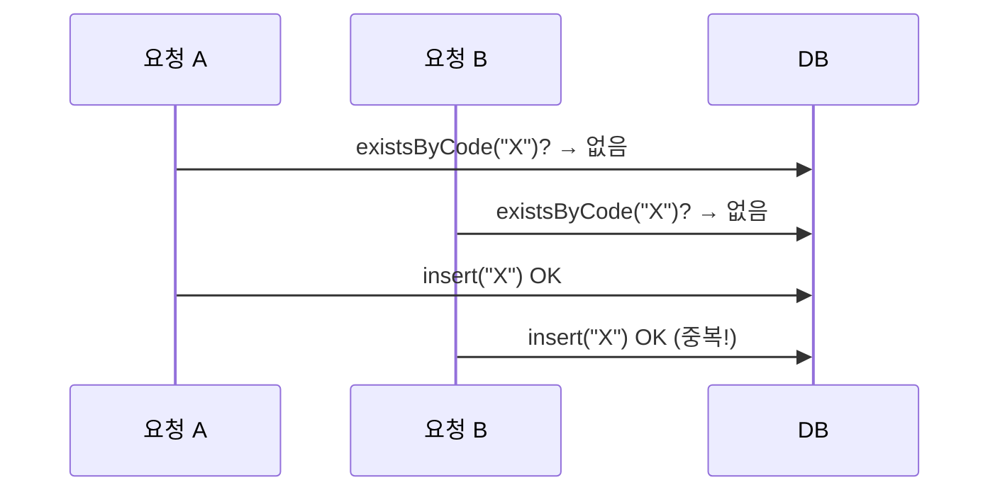

그 주엔 "같은 유형이 이미 있으면 등록을 막는" 중복 검사 기능을 붙였다. 작업을 추상화하면 "어떤 키가 이미 존재하는지 확인하고, 있으면 친절한 에러로 거절한다"는 흔한 요구다. 그런데 이 흔한 기능에 가장 흔한 버그가 숨어 있다. 검사 책임을 어디에 둘 것인가, 그리고 검사와 삽입 사이의 틈을 어떻게 막을 것인가.

## select-then-insert는 왜 뚫리나

가장 직관적인 구현은 "있나 보고, 없으면 넣는다"다.

```java
public void register(String typeCode) {
    if (repository.existsByCode(typeCode)) {     // (1) 검사
        throw new DuplicateTypeException(typeCode);
    }
    repository.insert(new ServiceType(typeCode)); // (2) 삽입
}
```

단일 스레드라면 완벽하다. 문제는 동시에 두 요청이 들어올 때다. 두 요청이 모두 (1)에서 "없음"을 확인한 뒤 둘 다 (2)로 진입하면, 중복이 그대로 두 건 박힌다. 검사와 삽입 사이에 시간 틈이 있고 그 틈을 다른 트랜잭션이 비집고 들어가는 전형적인 TOCTOU(Time-Of-Check to Time-Of-Use) 경쟁 상태다.



## 이중 방어 — 사전 검사 + DB 유니크 제약

진실의 원천은 DB의 유니크 제약이다. 컬럼에 `UNIQUE`를 걸면 두 번째 insert는 무조건 실패한다. 경쟁 상태가 있어도 DB가 최종 방어선이 된다.

```sql
ALTER TABLE service_type ADD CONSTRAINT uq_service_type_code UNIQUE (code);
```

그러면 애플리케이션 사전 검사는 필요 없을까? 아니다. 둘은 역할이 다르다.

- **사전 검사**: 정상 흐름에서 빠르고 친절한 에러 메시지를 준다. 무거운 예외·롤백 없이 거른다.
- **DB 유니크 제약**: 경쟁 상태·동시성에서 데이터 정합성을 *보장*한다. 절대 양보 못 하는 최종 방어선.

핵심은 제약 위반을 도메인 예외로 번역하는 것이다.

```java
public void register(String typeCode) {
    if (repository.existsByCode(typeCode)) {
        throw new DuplicateTypeException(typeCode);   // 친절한 정상 경로
    }
    try {
        repository.insert(new ServiceType(typeCode));
    } catch (DataIntegrityViolationException e) {     // 경쟁 상태가 뚫고 온 경우
        throw new DuplicateTypeException(typeCode);
    }
}
```

## 전용 도메인 예외와 에러 코드 매핑

`RuntimeException`을 그대로 던지면 호출자는 무슨 일인지 모른다. 중복은 중복임을 타입으로 드러내고, 핸들러에서 HTTP 상태·에러 코드로 매핑한다. 중복은 409 Conflict가 의미상 맞다.

```java
public class DuplicateTypeException extends RuntimeException {
    private final String code;
    public DuplicateTypeException(String code) {
        super("type already exists: " + code);
        this.code = code;
    }
    public String getCode() { return code; }
}

@ExceptionHandler(DuplicateTypeException.class)
@ResponseStatus(HttpStatus.CONFLICT)        // 409
public ErrorResponse handle(DuplicateTypeException e) {
    return new ErrorResponse("DUPLICATE_TYPE", e.getMessage());
}
```

## 운영 함정

**유니크 제약 없이 사전 검사만.** 이게 가장 흔하다. 평소엔 멀쩡하다가 트래픽이 몰리거나 더블 클릭 한 번에 중복이 박힌다. 재현이 어려워 한참 헤맨다. 사전 검사는 UX, DB 제약은 정합성 — 둘 다 있어야 한다.

**`DataIntegrityViolationException`을 안 잡고 500으로 흘림.** 제약은 걸어뒀는데 위반 예외를 도메인 예외로 번역하지 않으면, 사용자는 중복 메시지 대신 500 에러를 본다. 정합성은 지켜지지만 UX는 깨진다.

## 핵심 요약

- 중복 검사는 "검사 후 삽입"만으로는 경쟁 상태에 뚫린다.
- DB 유니크 제약이 정합성의 최종 방어선, 애플리케이션 검사는 UX를 위한 빠른 거절.
- 제약 위반을 전용 도메인 예외로 번역해 409 같은 명확한 응답을 준다.

> **면접 한 줄:** "exists 체크 후 insert 하는데 중복이 들어옵니다. 왜?" → "체크와 삽입 사이 경쟁 상태(TOCTOU)다. DB 유니크 제약으로 보장하고, 위반 예외를 도메인 예외로 잡아 응답한다."
