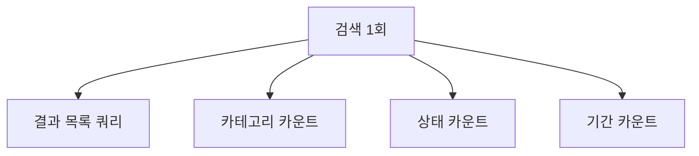

여러 조건을 조합해 거르는 검색을 다룬 주였다. 카테고리, 상태, 기간 같은 패싯(facet)을 켜고 끄며 좁혀 들어가는 그 화면이다.

## 패싯 필터의 본질

패싯 검색은 두 가지를 동시에 한다. **(1) 선택된 조건으로 결과를 거르고, (2) 남은 각 패싯 값이 몇 건인지를 세어 보여준다**("배송중 12, 완료 340"). 사용자는 이 카운트를 보고 다음 클릭을 정한다. 비용은 거의 전부 (2)에서 나온다.

조건 조합이 늘면 가능한 WHERE 경우의 수가 폭발하지만, 쿼리를 경우마다 따로 쓸 필요는 없다. 동적 WHERE 하나로 처리한다.

```xml
<select id="search" resultType="Product">
  SELECT id, name, category, status, created_at
  FROM product
  <where>
    <if test="category != null">    AND category = #{category} </if>
    <if test="status != null">      AND status   = #{status}   </if>
    <if test="fromDate != null">    AND created_at &gt;= #{fromDate} </if>
  </where>
  ORDER BY created_at DESC, id DESC
</select>
```

## 동적 필터와 인덱스

여기서 진짜 문제는 인덱스다. 어떤 조건이 켜질지 모르므로 **모든 조합을 커버하는 인덱스를 만들 수는 없다.** 복합 인덱스 `(category, status, created_at)`는 왼쪽부터 연속으로 쓰일 때만 효율적이다(leftmost prefix 규칙). `status`만 선택하고 `category`를 건너뛰면 이 인덱스의 앞부분을 못 타고 스캔으로 빠진다.

대응은 선택성 기반이다.

- **선택성 높은(값이 다양해 결과가 확 줄어드는) 컬럼**을 인덱스 앞쪽에 둔다.
- 자주 함께 쓰이는 조합을 한두 개로 좁혀 그 조합 위주의 복합 인덱스를 설계한다. 모든 경우가 아니라 **빈도 높은 경로**만 빠르게 만든다.
- 범위 조건(기간)은 복합 인덱스의 맨 뒤에 둔다. 범위 컬럼 뒤쪽 컬럼은 인덱스 정렬을 활용하지 못하기 때문이다.

## 패싯 카운트 비용

카운트는 보통 `GROUP BY`로 한 방에 모은다.

```sql
SELECT status, COUNT(*)
FROM product
WHERE category = 'BOOK' AND created_at >= '2025-11-01'
GROUP BY status;
```

문제는 **패싯이 N개면 카운트 쿼리도 N개 나간다**는 점이다. 상태별 카운트를 셀 때는 상태 조건을 빼고, 카테고리별 카운트를 셀 때는 카테고리 조건을 빼야 하기 때문이다(자기 자신을 제외한 카운트). 패싯이 많아질수록 페이지 한 번에 쿼리가 우수수 나간다. 이게 "필터를 조합할수록 폭발하는" 정체다.



## 운영 함정

- **매 입력마다 카운트 재계산**: 자동완성처럼 타이핑마다 패싯 카운트를 다시 돌리면 DB가 녹는다. 카운트는 디바운스하거나, 잘 안 변하는 패싯은 캐시한다.
- **부정확해도 되는 카운트**: 사용자에게 보이는 패싯 카운트는 1~2분 지연돼도 무방한 경우가 많다. 정확한 실시간 카운트를 고집하면 비용만 든다. 검색 엔진을 쓴다면 집계(aggregation)로 한 요청에 모으는 편이 RDB 다중 카운트보다 낫다.

## 핵심 요약

- 패싯 검색 비용은 결과 필터링이 아니라 **패싯 카운트**에서 나온다.
- 모든 조합을 인덱싱할 수 없으므로 선택성·빈도 높은 경로만 복합 인덱스로 최적화한다.
- 카운트는 정확도를 양보(캐시·디바운스)하면 비용이 급감한다.
