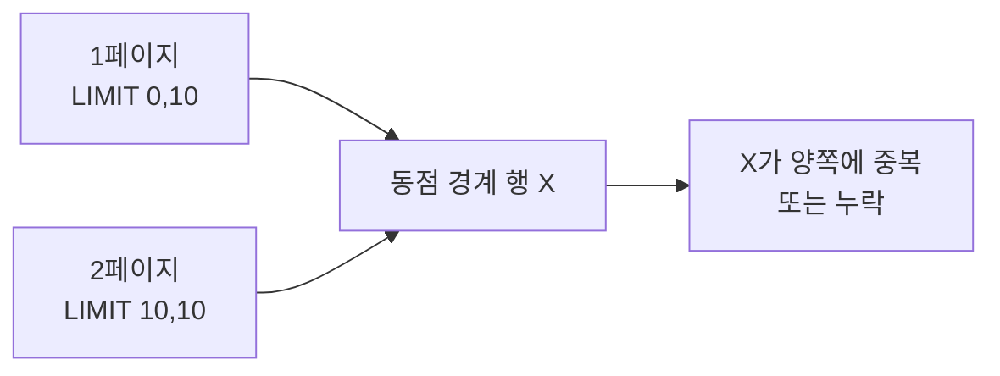

목록 정렬을 다룬 주였다. "최신순으로 정렬했는데 새로고침하면 순서가 미묘하게 바뀐다"는 그 현상의 정체를 짚는다.

## 정렬 안정성과 동일값 문제

`ORDER BY created_at DESC`로 정렬했는데 같은 날짜·시각을 가진 행이 여럿이라면, **그 동점 행들 사이의 순서는 정의되지 않았다.** SQL 표준은 ORDER BY로 지정하지 않은 부분의 순서를 보장하지 않는다.

왜 매번 달라지는가. RDB는 같은 쿼리라도 옵티마이저의 실행 계획, 인덱스 사용 여부, 병렬 처리, 버퍼에 올라온 페이지 순서에 따라 행을 다른 순서로 읽을 수 있다. 동점 구간 안에서는 "읽힌 순서"가 그대로 결과 순서가 되고, 그 읽힌 순서는 실행마다 흔들릴 수 있다. **불안정해서가 아니라, 안정성을 요구한 적이 없어서다.**

## 타이브레이커: PK를 마지막에

해법은 단순하다. 정렬 키가 동점일 때 순서를 확정해 줄 **유일한 보조 키**를 마지막에 붙인다. 보통 PK다.

```sql
-- 흔들린다: created_at 동점 시 순서 미정의
SELECT * FROM orders ORDER BY created_at DESC;

-- 확정된다: 동점이면 id로 결정 → 항상 같은 순서
SELECT * FROM orders ORDER BY created_at DESC, id DESC;
```

`id`는 유일하므로 전체 순서가 완전히 결정된다(total order). 이렇게 하면 같은 데이터에 대해 실행 계획이 무엇이든 결과 순서가 동일하다. 정렬 비용도 거의 늘지 않는다 — 어차피 동점 구간 안에서만 추가 비교가 일어난다.

## 페이징에서 더 치명적이다

타이브레이커가 없으면 페이징에서 **행이 중복되거나 누락된다.** 1페이지와 2페이지를 따로 쿼리하는데, 두 실행 사이에 동점 구간의 순서가 달라지면 경계에 걸친 행이 양쪽에 나오거나 어디에도 안 나온다.



게다가 keyset(커서) 페이징은 타이브레이커가 **필수 전제**다.

```sql
-- 커서 페이징: (created_at, id) 쌍으로 "이 지점 다음"을 집는다
SELECT * FROM orders
WHERE (created_at, id) < (#{lastCreatedAt}, #{lastId})
ORDER BY created_at DESC, id DESC
LIMIT 10;
```

복합 정렬 키 `(created_at, id)`가 유일한 전순서를 만들어야 "마지막으로 본 행의 다음"을 정확히 집을 수 있다. id 없이 created_at만으로 커서를 잡으면 동점 행을 건너뛰거나 무한 반복한다.

## 운영 함정

- **NULL의 정렬 위치**: 정렬 컬럼에 NULL이 섞이면 NULL이 앞이냐 뒤냐가 DBMS마다 다르다. `NULLS LAST` 같은 절을 명시하거나 정렬 전에 처리한다.
- **표현 계층 재정렬**: DB에서 정렬해 놓고 애플리케이션에서 `Map`/`Set`을 거치며 순서가 깨지는 경우가 많다. 순서가 중요하면 `List`로 끝까지 보존한다.

## 면접 한 줄 Q&A

- **Q. ORDER BY를 줬는데 순서가 매번 다른 이유는?** A. 정렬 키가 동점인 구간의 순서는 정의되지 않았고, 실행 계획에 따라 읽힌 순서가 그대로 나오기 때문이다. 유일한 컬럼(PK)을 타이브레이커로 마지막에 붙여 전순서를 만든다.
