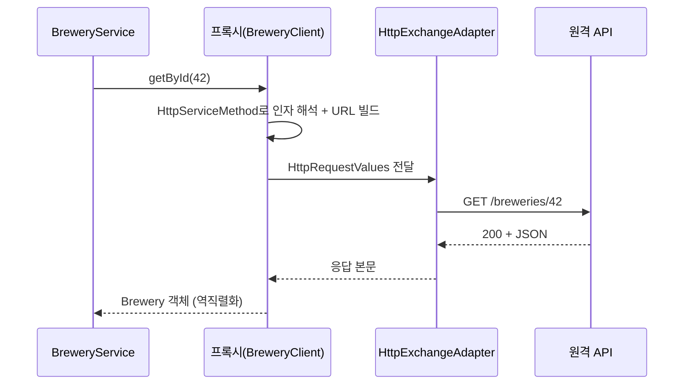

## 인터페이스만 선언했는데 호출이 된다?

외부 API 호출 코드는 계속 진화했습니다.

- `RestTemplate`: 오래 썼지만 이제 유지보수 모드(신규 기능 없음).
- `WebClient`: 논블로킹·리액티브. 강력하지만 MVC 앱에선 다소 과합니다.
- **`RestClient`** (Spring 6.1 / Boot 3.2+): `WebClient`의 친숙한 플루언트 API를 **동기**로 쓰는 클라이언트. MVC 앱의 새 기본값.

그리고 그 위에, 호출 스펙을 **인터페이스에 애너테이션으로만 선언**하면 구현체가 알아서 생기는 `@HttpExchange`가 있습니다. 여기서 자연스럽게 떠오르는 질문이 이 글의 본론입니다 — **"구현 클래스를 한 줄도 안 짰는데 어떻게 호출이 되지?"** 답은 자동 구성 글에서 본 것과 같은 단어, **프록시**입니다.

## 한눈에 보기: 호출 한 번의 왕복

`client.getById(42)` 한 줄이 실제로는 **프록시 → 인자 해석/URL 빌드 → 어댑터 → HTTP → 역직렬화**의 왕복을 거칩니다. <span style="color:#1971c2;font-weight:600">파랑</span>이 나가는 요청, <span style="color:#2f9e44;font-weight:600">초록</span>이 객체로 돌아오는 응답입니다.

<div class="dhc-flow" markdown="0">
<style>
.dhc-flow{margin:1.4rem 0;overflow-x:auto}
.dhc-flow svg{width:100%;max-width:720px;height:auto;display:block;margin:0 auto;font-family:inherit}
.dhc-flow .lbl{fill:currentColor;font-size:12.5px;font-weight:600}
.dhc-flow .sub{fill:currentColor;font-size:9px;opacity:.55}
.dhc-flow .arr{stroke:currentColor;opacity:.3;stroke-width:1.5;fill:none}
.dhc-flow rect.box{fill:none;stroke:currentColor;stroke-width:1.5;opacity:.35}
.dhc-flow rect.d1{animation:dhcpulse 5s ease-in-out infinite}
.dhc-flow rect.d2{animation:dhcpulse 5s ease-in-out infinite .6s}
.dhc-flow rect.d3{animation:dhcpulse 5s ease-in-out infinite 1.2s}
.dhc-flow rect.d4{animation:dhcpulse 5s ease-in-out infinite 1.8s}
.dhc-flow circle.req{fill:#1971c2;animation:dhcreq 5s linear infinite}
.dhc-flow circle.res{fill:#2f9e44;animation:dhcres 5s linear infinite}
@keyframes dhcreq{0%{transform:translateX(0);opacity:0}5%{opacity:1}45%{transform:translateX(516px);opacity:1}50%{transform:translateX(516px);opacity:0}100%{opacity:0}}
@keyframes dhcres{0%,50%{transform:translateX(516px);opacity:0}55%{opacity:1}95%{transform:translateX(0);opacity:1}100%{transform:translateX(0);opacity:0}}
@keyframes dhcpulse{0%,100%{opacity:.3}50%{opacity:.9}}
</style>
<svg viewBox="0 0 700 190" role="img" aria-label="인터페이스 메서드 호출이 프록시와 어댑터를 거쳐 HTTP 요청으로 나가고, 응답이 객체로 역직렬화되어 돌아오는 흐름 애니메이션">
  <rect class="box d1" x="8"   y="52" width="150" height="62" rx="8"/>
  <rect class="box d2" x="190" y="52" width="150" height="62" rx="8"/>
  <rect class="box d3" x="372" y="52" width="150" height="62" rx="8"/>
  <rect class="box d4" x="554" y="52" width="138" height="62" rx="8"/>
  <text class="lbl" x="83"  y="78" text-anchor="middle">인터페이스 호출</text>
  <text class="sub" x="83"  y="94" text-anchor="middle">getById(42)</text>
  <text class="lbl" x="265" y="78" text-anchor="middle">프록시</text>
  <text class="sub" x="265" y="94" text-anchor="middle">HttpServiceMethod</text>
  <text class="lbl" x="447" y="78" text-anchor="middle">어댑터</text>
  <text class="sub" x="447" y="94" text-anchor="middle">RestClientAdapter</text>
  <text class="lbl" x="623" y="78" text-anchor="middle">원격 API</text>
  <text class="sub" x="623" y="94" text-anchor="middle">GET /breweries/42</text>
  <line class="arr" x1="158" y1="83" x2="190" y2="83"/>
  <line class="arr" x1="340" y1="83" x2="372" y2="83"/>
  <line class="arr" x1="522" y1="83" x2="554" y2="83"/>
  <circle class="req" cx="38" cy="83" r="7"/>
  <circle class="res" cx="38" cy="83" r="7"/>
</svg>
</div>



## RestClient: 먼저 명령형부터

선언형으로 가기 전에, 토대인 `RestClient`를 봅니다.

```java
RestClient client = RestClient.create("https://api.example.com");

Brewery brewery = client.get()
        .uri("/breweries/{id}", id)
        .retrieve()
        .body(Brewery.class);
```

플루언트하고 읽기 좋습니다. 하지만 호출이 많아지면 URL·매핑·헤더가 코드 곳곳에 흩어집니다. 그래서 호출 스펙을 한곳에 **선언**하는 방식이 등장합니다.

## @HttpExchange: 인터페이스로 선언

```java
@HttpExchange("/breweries")
public interface BreweryClient {

    @GetExchange("/{id}")
    Brewery getById(@PathVariable Long id);

    @PostExchange
    Brewery create(@RequestBody BreweryRequest request);
}
```

`@PathVariable`·`@RequestBody` 등 **Spring MVC 컨트롤러에서 쓰던 그 애너테이션**을 그대로 씁니다. 다만 의미가 거울처럼 뒤집힙니다 — 컨트롤러에선 "들어오는 요청에서 값 *추출*", HTTP 인터페이스에선 "나가는 요청에 값 *주입*"입니다.

## 소스 한 겹: 구현체는 누가 만드나

핵심은 `HttpServiceProxyFactory`입니다. 동작 원리는 `@Transactional`(AOP 프록시)이나 Spring Data 리포지토리(`RepositoryFactorySupport` 프록시)와 **완전히 같은 계열**입니다 — 인터페이스만 주고 구현은 프록시가 채웁니다.

```java
RestClient restClient = RestClient.create("https://api.example.com");

HttpServiceProxyFactory factory = HttpServiceProxyFactory
        .builderFor(RestClientAdapter.create(restClient))   // 백엔드 어댑터 주입
        .build();

BreweryClient client = factory.createClient(BreweryClient.class);  // 런타임 프록시 생성
```

`createClient()` 내부에서 벌어지는 일:

1. 인터페이스의 메서드를 **부팅(프록시 생성) 시점에 한 번** 파싱해 각각 `HttpServiceMethod`로 만든다. 이때 `@GetExchange`·`@PathVariable` 같은 메타데이터가 분석된다.
2. Spring AOP의 `ProxyFactory`가 인터페이스 기반 프록시를 만들고, `MethodInterceptor`가 모든 호출을 가로챈다.
3. 호출이 들어오면 인터셉터가 미리 만들어 둔 `HttpServiceMethod`로 위임한다. 인자는 `HttpServiceArgumentResolver` 구현들(`PathVariableArgumentResolver`, `RequestParamArgumentResolver`, `RequestHeaderArgumentResolver`, `RequestBodyArgumentResolver`…)이 해석해 **`HttpRequestValues`**(URL·헤더·바디의 집합)를 빌드한다.
4. 완성된 `HttpRequestValues`를 **`HttpExchangeAdapter`**(6.1+, 과거 `HttpClientAdapter`)에 넘겨 실제 전송하고, 응답을 메서드의 반환 타입으로 역직렬화한다.

> 메서드 파싱이 **호출마다가 아니라 프록시 생성 시 한 번**이라는 점이 중요합니다. 자동 구성이 시작 시점에 무거운 일을 끝내 두는 것과 같은 철학 — 런타임 호출은 최대한 가볍게.
{: .prompt-info }

## 어댑터: 동기·비동기 백엔드 교체

위 4단계에서 실제 전송을 맡는 `HttpExchangeAdapter`만 갈아끼우면 같은 인터페이스가 다른 엔진 위에서 돕니다.

| 어댑터 | 백엔드 | 스타일 | 권장 반환 타입 |
|--------|--------|--------|----------------|
| `RestClientAdapter` | RestClient | 동기 | `Brewery`, `List<Brewery>` |
| `WebClientAdapter` | WebClient | 논블로킹 | `Mono<Brewery>`, `Flux<Brewery>` |
| `RestTemplateAdapter` | RestTemplate | 동기(레거시 호환) | `Brewery` |

⚠️ **어댑터와 반환 타입이 맞아야 합니다.** `WebClientAdapter`인데 `Brewery`(블로킹 타입)를 반환하면 프록시가 내부에서 `block()`을 호출합니다 — 이벤트 루프 위에서라면 위험합니다([MVC vs WebFlux]()의 블로킹 함정과 동일). 동기 앱이면 `RestClientAdapter` + 일반 타입이 정답입니다.

## Spring Boot 4 / Framework 7: 자동 등록

위처럼 직접 `factory.createClient(...)`를 호출해 `@Bean`으로 등록할 수도 있지만, **Framework 7**부터는 `@ImportHttpServices`로 그룹을 선언하면 프록시가 **자동으로 Bean 등록**됩니다(Feign의 `@EnableFeignClients`에 대응).

```java
@Configuration
@ImportHttpServices(group = "brewery", types = BreweryClient.class)
public class HttpClientConfig {

    @Bean
    RestClient breweryRestClient(RestClient.Builder builder) {
        return builder.baseUrl("https://api.example.com").build();
    }
}
```

이제 `BreweryClient`를 그냥 주입받아 씁니다.

```java
@Service
@RequiredArgsConstructor
public class BreweryService {
    private final BreweryClient breweryClient;

    public Brewery find(Long id) {
        return breweryClient.getById(id);   // 선언만 했는데 호출됨
    }
}
```

Boot 4는 그룹별로 사용할 클라이언트·`baseUrl`·타임아웃을 설정과 연결해 줍니다. 즉 "프록시를 어떤 어댑터 위에 올릴지"를 자바 코드 대신 설정으로 관리할 수 있습니다.

## Feign과 무엇이 다른가

| | `@HttpExchange` (Spring core) | `@FeignClient` (Spring Cloud OpenFeign) |
|---|---|---|
| 의존성 | **별도 없음**(spring-web 내장) | `spring-cloud-starter-openfeign` |
| 백엔드 | RestClient/WebClient/RestTemplate 교체 | 자체 Feign 엔진 |
| 서비스 디스커버리·LB | **기본 없음**(필요 시 Spring Cloud LoadBalancer 조합) | 통합 제공 |
| 리액티브 | `WebClientAdapter`로 지원 | 제한적 |

마이크로서비스에서 유레카·로드밸런싱이 꼭 필요한 게 아니라면, 의존성 없이 코어로 끝나는 `@HttpExchange`가 점점 기본 선택이 됩니다.

## 타임아웃·에러·인터셉터

클라이언트의 견고함은 어댑터 아래의 `RestClient`/`WebClient` 설정에서 나옵니다.

```java
RestClient.builder()
    .baseUrl("https://api.example.com")
    .requestInterceptor((req, body, ex) -> {        // 공통 헤더·로깅
        req.getHeaders().add("X-Trace", traceId());
        return ex.execute(req, body);
    })
    .defaultStatusHandler(HttpStatusCode::is5xxServerError, (req, res) -> {
        throw new BreweryUnavailableException();      // 5xx 매핑
    })
    .build();
```

- **타임아웃**: Boot에서는 `spring.http.client.connect-timeout` / `read-timeout` 으로 전역 설정(내부적으로 `ClientHttpRequestFactorySettings`).
- **에러**: `retrieve()`는 기본적으로 4xx/5xx에서 `RestClientResponseException`(하위 `HttpClientErrorException`/`HttpServerErrorException`)을 던집니다. 세밀한 제어는 `onStatus(...)` 또는 `.exchange()`로.

## 실무 함정

- **메서드에 교환 애너테이션이 없으면 프록시 생성이 실패**합니다. 보조 메서드가 필요하면 `default` 메서드로 두세요(프록시가 인터페이스 default 구현을 그대로 호출). `Object`의 `equals/hashCode/toString`도 통과됩니다.
- **`baseUrl` 누락**: `@HttpExchange`의 경로는 상대 경로입니다. 밑단 `RestClient`/`WebClient`에 `baseUrl`을 안 주면 `URI is not absolute` 류로 터집니다.
- **예외 변환 잊기**: 호출부는 `getById()`가 평범한 메서드처럼 보여 try-catch를 빼먹기 쉽지만, 4xx/5xx는 런타임 예외로 올라옵니다. 전역 처리는 [예외 처리 글]()의 `@ControllerAdvice`로.
- **블로킹/리액티브 혼동**: 위 어댑터 표 참고. 반환 타입이 곧 실행 모델입니다.

## 테스트: 실제 호출 없이

`MockRestServiceServer`를 `RestClient.Builder`에 바인딩하면 네트워크 없이 프록시까지 검증할 수 있습니다.

```java
RestClient.Builder builder = RestClient.builder();
MockRestServiceServer server = MockRestServiceServer.bindTo(builder).build();
server.expect(requestTo("https://api.example.com/breweries/42"))
      .andRespond(withSuccess("{\"id\":42,\"name\":\"Quokka\"}", MediaType.APPLICATION_JSON));

BreweryClient client = HttpServiceProxyFactory
        .builderFor(RestClientAdapter.create(builder.baseUrl("https://api.example.com").build()))
        .build()
        .createClient(BreweryClient.class);

assertThat(client.getById(42L).name()).isEqualTo("Quokka");
server.verify();
```

## 면접/리뷰 단골 질문

- **Q. `@HttpExchange` 인터페이스의 구현체는 누가, 언제 만드나?** → `HttpServiceProxyFactory`가 **프록시 생성 시점**에 메서드를 `HttpServiceMethod`로 파싱하고, Spring AOP 프록시 + `MethodInterceptor`가 호출을 가로채 어댑터로 위임한다. `@Transactional`·Repository와 같은 프록시 계열.
- **Q. 같은 인터페이스를 동기/비동기로 쓰려면?** → `HttpExchangeAdapter`만 `RestClientAdapter`↔`WebClientAdapter`로 교체. 단 반환 타입을 어댑터에 맞춰야 한다.
- **Q. Feign 대신 `@HttpExchange`를 쓰는 이유는?** → 추가 의존성 없이 코어로 해결되고 백엔드 교체가 자유롭다. 디스커버리·로드밸런싱이 필요하면 Spring Cloud LoadBalancer를 더한다.

## 정리

- `RestTemplate`은 졸업, MVC에선 **RestClient**가 기본. 그 위에 **`@HttpExchange` 인터페이스**로 선언하면 구현체가 자동 생성된다.
- 그 "자동 생성"의 정체는 **`HttpServiceProxyFactory`가 만드는 AOP 프록시** — `@Transactional`·Spring Data와 같은 계열. 메서드는 생성 시 한 번 파싱돼 `HttpServiceMethod`가 된다.
- 실제 전송은 **`HttpExchangeAdapter`**(RestClient/WebClient/RestTemplate)가 담당하므로 백엔드를 자유롭게 교체한다. **반환 타입은 어댑터와 맞춰야** 한다.
- **Boot 4 / Framework 7**의 `@ImportHttpServices`로 Feign 같은 자동 등록이 가능하고, 의존성이 없어 코어만으로 끝난다.
- 함정은 대부분 **baseUrl 누락·예외 변환 누락·블로킹/리액티브 혼동**에서 나온다.

> 관련 글: 이 프록시 메커니즘의 다른 사례는 [@Transactional 함정]()과 [Spring Data JPA 기초]()에서, 호출 에러의 전역 처리는 [REST API 예외 처리]()에서 다룹니다.
