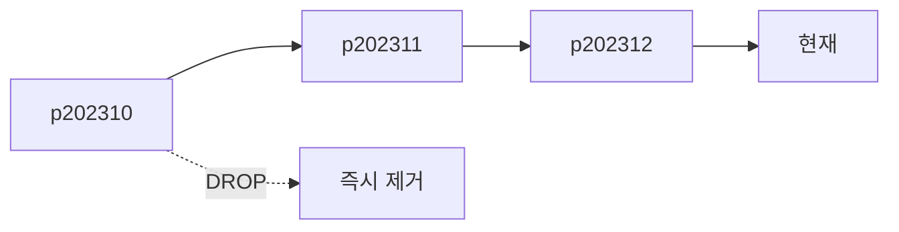

오래된 데이터를 정리하는 주였다. 보존 기간이 지난 로그성 데이터를 지우는 작업인데, 단순한 `DELETE` 한 줄이 운영 DB를 멈출 수 있다.

## 대량 DELETE가 위험한 이유

`DELETE FROM event_log WHERE created_at < '2024-01-01'` 한 줄로 수백만 행을 지운다고 하자. 이건 **하나의 트랜잭션**이다. 그래서 두 가지가 동시에 터진다.

1. **락**: 삭제 대상 행(과 갭)에 락이 걸리고, 트랜잭션이 끝날 때까지 유지된다. 수백만 행을 지우는 동안 다른 쿼리가 그 테이블에서 대기하거나 데드락에 빠진다.
2. **트랜잭션 로그/언두 폭증**: 모든 변경은 롤백 가능해야 하므로 언두/리두 로그에 기록된다. 한 트랜잭션이 수백만 행을 건드리면 로그가 거대해지고, 디스크가 차거나 복제 지연이 발생한다. 중간에 실패하면 그 거대한 트랜잭션을 통째로 롤백하느라 더 오래 걸린다.

핵심은 **삭제량이 아니라 "한 트랜잭션 크기"가 문제**라는 점이다.

## 배치 분할 삭제

그래서 큰 삭제를 작은 트랜잭션 여러 개로 쪼갠다. 한 번에 N건씩, 커밋하며 진행한다.

```sql
-- 한 덩어리: 1000건 지우고 커밋, 반복
DELETE FROM event_log
WHERE created_at < '2024-01-01'
ORDER BY id
LIMIT 1000;
```

```java
int deleted;
do {
    deleted = mapper.deleteOldBatch(threshold, 1000); // 위 쿼리
    // 각 호출이 독립 트랜잭션으로 커밋된다
    sleep(50);  // DB에 숨 쉴 틈을 준다
} while (deleted == 1000);
```

각 배치가 짧은 트랜잭션이므로 락이 금방 풀리고, 로그도 배치 단위로 비워진다. `sleep`으로 다른 트래픽에 양보하고, 가능하면 한가한 시간대에 돌린다. 삭제 대상을 빨리 찾도록 `created_at`에 인덱스가 있어야 매 배치가 풀스캔으로 빠지지 않는다.

## 파티션 드롭: 진짜 빠른 길

테이블을 시간 기준으로 파티셔닝해 두면 정리가 차원이 달라진다. 오래된 데이터를 행 단위로 지우는 대신 **파티션을 통째로 드롭**한다.

```sql
-- 2023년 12월 파티션을 통째로 제거 (행 단위 삭제 아님)
ALTER TABLE event_log DROP PARTITION p202312;
```

`DROP PARTITION`은 데이터 파일을 제거하는 메타데이터 연산에 가까워, 행 하나하나의 언두 로그를 남기지 않는다. 수백만 행 삭제가 거의 즉시 끝난다. 보존 기간이 명확한 로그성 테이블이라면 **월/일 단위 파티션 + 오래된 파티션 드롭**이 정석이다.



## 아카이빙

규정상 지우지 못하고 보관만 해야 하면, 핫 테이블에서 콜드 저장소(아카이브 테이블/파일)로 옮긴 뒤 원본에서 배치 삭제한다. 옮기기 전 삭제하면 안 되므로 **복사 → 검증 → 삭제** 순서를 지킨다.

## 운영 함정

- **인덱스 없는 삭제 조건**: 배치 삭제라도 `WHERE` 조건에 인덱스가 없으면 매 배치가 풀스캔이라 전체가 느려진다.
- **복제 지연**: 큰 삭제는 복제본에 그대로 전파되며 지연을 키운다. 읽기 복제본을 보는 서비스에 영향을 주므로 배치 크기와 시간대를 함께 조절한다.

## 핵심 요약

- 대량 DELETE의 적은 삭제량이 아니라 **트랜잭션 크기**(락·로그)다.
- 배치로 쪼개 짧은 트랜잭션 여러 개로 만들면 락이 금방 풀리고 로그가 안정된다.
- 보존 정책이 명확하면 시간 파티션 + `DROP PARTITION`이 압도적으로 빠르다.
