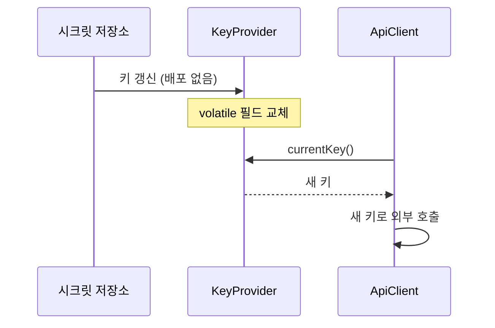

그 주엔 외부 오픈 API 호출이 실패할 때 원인을 추적할 수 없다는 문제를 다뤘다. "외부가 200을 줬는지, 어떤 응답을 줬는지" 로그가 없으니 장애 때 깜깜이였다. 그래서 호출 경계에 요청/응답 로깅을 넣었다. 그런데 여기엔 함정이 있다. 많은 오픈 API는 인증을 **URL 쿼리스트링에 실린 서비스키**로 한다. 요청 URL을 그대로 로그에 찍으면 **비밀값이 로그 파일에 평문으로 남는다.** 관측 가능성과 비밀 보호는 같은 경계에서 동시에 해결해야 한다.

## 호출 경계에 특화된 로깅

일반적인 직렬화/로그 마스킹과 다른 점은, 외부 API 호출은 **요청 URL 자체에 비밀이 박혀 있다**는 것이다. 바디가 아니라 쿼리 파라미터다. 그래서 마스킹 지점도 "URL을 로그로 내보내기 직전"이어야 한다.

```java
public class ExternalApiClient {

    private static final Logger log = LoggerFactory.getLogger(ExternalApiClient.class);

    public OpenApiResponse fetch(String identifier) {
        URI uri = buildUri(identifier);   // 쿼리에 serviceKey가 들어 있다
        long start = System.currentTimeMillis();
        try {
            OpenApiResponse res = restTemplate.getForObject(uri, OpenApiResponse.class);
            log.info("외부 API 호출 성공 url={} took={}ms resultCode={}",
                     mask(uri), System.currentTimeMillis() - start,
                     res != null ? res.getResultCode() : "null");
            return res;
        } catch (RestClientException e) {
            // 실패 시에도 마스킹된 URL을 남긴다
            log.warn("외부 API 호출 실패 url={} took={}ms",
                     mask(uri), System.currentTimeMillis() - start, e);
            throw e;
        }
    }
}
```

## 쿼리스트링의 키를 마스킹한다

마스킹은 쿼리 파라미터 단위로 한다. 키 이름 목록을 정해 두고, 해당 파라미터의 값만 가린다.

```java
private static final Set<String> SECRET_PARAMS = Set.of("serviceKey", "apiKey", "token");

static String mask(URI uri) {
    String query = uri.getQuery();
    if (query == null) return uri.toString();

    String masked = Arrays.stream(query.split("&"))
        .map(pair -> {
            int eq = pair.indexOf('=');
            if (eq < 0) return pair;
            String name = pair.substring(0, eq);
            return SECRET_PARAMS.contains(name)
                 ? name + "=****"
                 : pair;
        })
        .collect(Collectors.joining("&"));

    // 스킴+호스트+경로는 보존, 쿼리만 교체
    return uri.getScheme() + "://" + uri.getAuthority()
         + uri.getPath() + "?" + masked;
}
```

전체 URL을 정규식으로 통째로 가리는 대신 **파라미터 이름 기준 화이트리스트**로 비밀만 골라 가린다. 그래야 디버깅에 필요한 나머지 파라미터(식별자, 페이지 등)는 로그에 남아 추적이 가능하다.

## 무중단 키 회전

서비스키는 만료되거나 유출 의심 시 교체해야 한다. 키를 코드나 빌드 아티팩트에 박으면 교체할 때마다 재배포가 필요하다. 키를 **런타임에 다시 읽을 수 있는 설정 소스**(외부 설정/시크릿 저장소)에 두고, 클라이언트가 호출 시점마다 현재 키를 조회하게 만들면 배포 없이 바꿀 수 있다.

```java
public class RotatableKeyProvider {
    private volatile String currentKey;

    // 설정 갱신 이벤트나 주기적 폴링으로 호출된다
    public void refresh(String newKey) {
        this.currentKey = newKey;   // volatile — 다른 스레드에 즉시 가시화
    }
    public String currentKey() {
        return currentKey;
    }
}
```



무중단의 핵심은 **겹침 구간(overlap)** 이다. 외부 시스템이 구키와 신키를 동시에 받아주는 기간을 두고 그 안에 교체를 마쳐야 진행 중이던 요청이 깨지지 않는다. `volatile` 필드 교체는 락 없이 즉시 모든 스레드에 보이므로, 교체 순간에도 호출이 멈추지 않는다.

## 운영 함정

- **로그뿐 아니라 예외 메시지·트레이스도 새는 통로다.** `RestClientException`의 메시지에 요청 URL이 그대로 담겨 스택트레이스로 출력되는 경우가 있다. 예외를 다시 던질 때 URL을 마스킹해 메시지를 재구성하라.
- **POST 바디·헤더 인증도 잊지 마라.** 키를 쿼리가 아닌 `Authorization` 헤더나 바디에 싣는 API라면 마스킹 지점이 달라진다. 인증 정보가 어디에 실리는지부터 확인하고 그 위치를 가린다.

## 핵심 요약

- 외부 API 호출 경계에서 요청/응답을 로깅하되, **쿼리 파라미터의 서비스키는 이름 화이트리스트로 마스킹**한다.
- 키를 런타임 설정 소스에서 읽고 `volatile`로 교체하면 **재배포 없이 무중단 회전**이 가능하다 — 단, 외부의 구·신키 겹침 구간 안에서.
- **면접 Q.** 외부 API 호출 로그에서 키 노출을 막으려면? **A.** URL을 통째로 찍지 말고 파라미터 단위로 비밀값만 가린다. 디버깅용 비-비밀 파라미터는 남겨 추적성을 유지한다.
