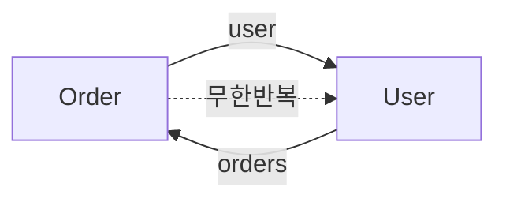

객체를 JSON 응답으로 내보내는 작업을 다룬 주였다. 직렬화는 평소엔 보이지 않다가 null·날짜·연관관계에서 갑자기 사고를 낸다.

## null 필드를 포함할 것인가

Jackson은 기본적으로 **null 필드도 키와 함께 출력**한다. `{"name":"A","phone":null}` 처럼. 응답 크기가 커지고, 클라이언트가 "필드 없음"과 "값이 null"을 구분하기 애매해진다.

null을 빼고 싶으면 포함 정책을 바꾼다.

```java
@JsonInclude(JsonInclude.Include.NON_NULL)
public class UserResponse {
    private String name;
    private String phone;   // null이면 출력에서 제외
}
```

다만 이건 API 계약 문제다. **있던 필드가 사라지면** 클라이언트 파싱이 깨질 수 있으니 팀과 합의해 전역으로 일관되게 가야 한다. 일부 응답만 NON_NULL이면 더 헷갈린다.

## 날짜: 타임스탬프 vs ISO 문자열

`LocalDateTime`을 그냥 직렬화하면 환경에 따라 배열(`[2025,12,14,10,30]`)이나 의미 불명한 숫자로 나가기도 한다. 자바 8 시간 타입은 별도 모듈(`jackson-datatype-jsr310`)이 등록돼야 제대로 처리된다.

```java
public class OrderResponse {
    @JsonFormat(shape = JsonFormat.Shape.STRING,
                pattern = "yyyy-MM-dd'T'HH:mm:ss")
    private LocalDateTime createdAt;   // "2025-12-14T10:30:00"
}
```

원칙: **타임존을 명시할 수 있는 타입(`OffsetDateTime`/`Instant`)으로 내보내고 포맷을 고정**한다. `LocalDateTime`은 타임존 정보가 없어, 서버와 클라이언트가 다른 시간대면 같은 문자열을 다르게 해석한다. 글로벌 서비스라면 UTC `Instant`로 내보내고 표시 시점에 변환하는 게 안전하다.

## 순환참조: 무한루프의 정체

가장 위험한 건 양방향 연관이다. `Order`가 `User`를 참조하고 `User`가 `List<Order>`를 참조하면, Jackson은 직렬화하다 둘 사이를 무한히 오간다.



결과는 `StackOverflowError` 또는 거대한 JSON이다. 메커니즘은 단순하다 — Jackson은 객체 그래프를 깊이 우선으로 따라가며 직렬화하는데, 그래프에 사이클이 있으면 종료 조건이 없어진다.

대응:

- **`@JsonIgnore`**: 한쪽 방향을 직렬화에서 끊는다. 가장 단순.

```java
public class User {
    @JsonIgnore
    private List<Order> orders;   // User → Order 방향을 끊음
}
```

- **`@JsonManagedReference` / `@JsonBackReference`**: 부모-자식 관계를 명시해 자식→부모 방향만 끊는다.
- **가장 권장**: 엔티티를 직접 직렬화하지 말고 **응답 전용 DTO**로 변환해 내보낸다. 그러면 어떤 필드가 나가는지 명시적으로 통제되고, 연관관계가 따라붙는 사고 자체가 없다.

## 운영 함정

- **엔티티 직접 노출 + 지연 로딩**: 지연 로딩 프록시를 직렬화하려다 세션이 닫혀 예외가 나거나, 직렬화 시점에 추가 쿼리가 줄줄이 나간다. DTO 변환으로 끊는다.
- **알 수 없는 필드 역직렬화 실패**: 요청을 받을 때 모르는 필드가 오면 기본 설정은 예외를 던진다. 외부 입력에는 `FAIL_ON_UNKNOWN_PROPERTIES`를 꺼서 호환성을 확보하되, 무엇을 무시하는지는 인지하고 있어야 한다.

## 핵심 요약

- null 포함 여부·날짜 포맷은 **API 계약**이므로 전역 일관 정책으로 고정한다.
- 날짜는 타임존을 가진 타입 + 고정 포맷(가능하면 UTC)으로 내보낸다.
- 순환참조의 근본 해법은 엔티티 대신 **응답 DTO** 직렬화다.
