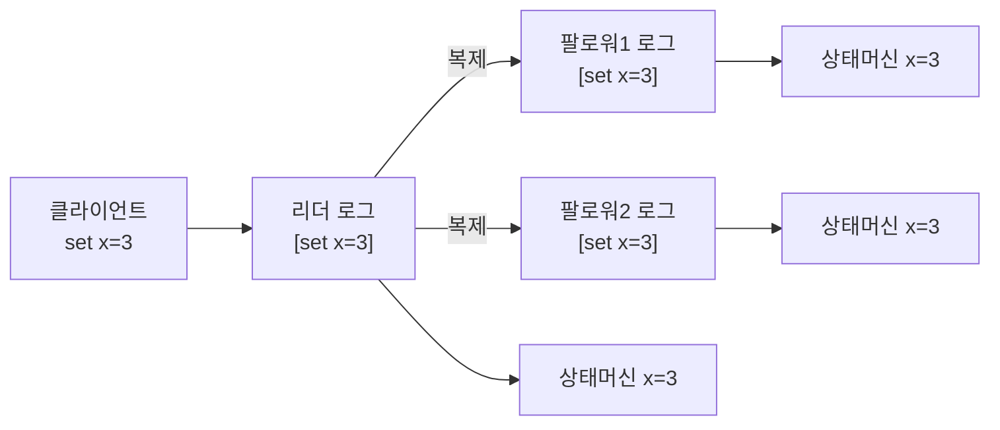

## 왜 "합의"가 분산 시스템의 심장인가

서버 하나는 진실을 정하기 쉽습니다. 자기가 곧 진실이니까요. 문제는 그 서버가 죽으면 진실도 같이 죽는다는 것입니다. 그래서 같은 데이터를 여러 서버에 **복제**합니다. 그런데 복제하는 순간 새 질문이 생깁니다 — **"누구 말이 맞나?"** 노드 A는 `x=3`이라 하고 노드 B는 `x=5`라 할 때, 네트워크가 끊기고 서버가 죽고 메시지가 늦게 도착하는 와중에 **모두가 동의하는 단 하나의 값**을 어떻게 정할까요?

이걸 푸는 게 **합의(consensus) 알고리즘**입니다. 합의는 거의 모든 분산 인프라의 바닥에 깔려 있습니다 — etcd(쿠버네티스의 두뇌), ZooKeeper(Kafka·HBase의 코디네이터), Consul, 그리고 AWS의 DynamoDB 글로벌 테이블·Aurora의 스토리지 복제까지. 한 줄로: **합의는 분산 시스템이 단일 장애점 없이도 "하나의 상태"를 유지하게 해주는 기술**입니다.

## 복제 상태 머신 — 합의의 진짜 목적

합의의 응용은 보통 **복제 상태 머신(replicated state machine)** 입니다. 핵심 아이디어는 단순합니다: 모든 노드가 **똑같은 명령 로그**를 **똑같은 순서**로 적용하면, 모든 노드는 결국 **똑같은 상태**에 도달한다. 결정론적 상태 머신이니까요.

그래서 합의 문제는 사실 **"로그의 각 칸에 어떤 명령을 넣을지 모두가 동의하기"** 로 환원됩니다. 값 하나에 대한 합의(single-decree)를 로그 칸마다 반복하면 전체가 됩니다.

## FLP 불가능성 — 완벽한 합의는 없다

먼저 냉정한 사실 하나. **FLP 정리**(Fischer-Lynch-Paterson, 1985)는 이렇게 말합니다:

> 비동기 네트워크에서 노드가 단 하나라도 죽을 수 있다면, **항상 종료하면서도 항상 올바른** 결정론적 합의 알고리즘은 **존재하지 않는다.**

"메시지가 늦은 건지 노드가 죽은 건지" 비동기 세계에서는 구분할 수 없기 때문입니다. 그래서 현실의 합의 알고리즘들은 이 벽을 **타임아웃(부분 동기성 가정)** 과 **무작위성**으로 우회합니다 — 안전성(safety, 틀린 결정은 절대 안 함)은 항상 지키되, 활성(liveness, 언젠가 결정함)은 "네트워크가 충분히 안정되면"이라는 조건을 답니다. 이 분리를 기억하면 Raft가 왜 그렇게 설계됐는지가 보입니다.

## 과반수 정족수(quorum) — 충돌을 원천 봉쇄하는 산수

합의의 모든 마법은 **과반수(majority)** 라는 단순한 산수에서 나옵니다. 노드가 $2f+1$개일 때 과반은 $f+1$개. 핵심 성질은 이것입니다:

$$\text{어떤 두 과반수 집합도 반드시 한 노드 이상에서 겹친다.}$$

5개 노드 중 과반 3개를 모은 두 결정이 있다면, 그 둘은 적어도 한 노드를 공유합니다. 그 노드가 "나는 이미 다른 값에 투표했다"고 증언하므로 **상충하는 두 결정이 동시에 성립할 수 없습니다.** 그래서 $2f+1$개 노드는 **최대 $f$개의 동시 고장**을 견딥니다(5개면 2개까지). 짝수가 아니라 홀수를 쓰는 이유도 여기 있습니다 — 4개나 6개나 견디는 고장 수는 똑같이 1·2개인데 비용만 늘죠.

## Raft — "이해 가능한 합의"를 목표로 설계된 알고리즘

Paxos가 악명 높게 어려웠기에, Raft(2014)는 **이해 가능성(understandability)** 을 1차 설계 목표로 삼았습니다. Raft는 합의를 세 하위 문제로 쪼갭니다: **리더 선출 · 로그 복제 · 안전성.** 모든 노드는 세 상태 중 하나입니다 — **팔로워 / 후보자 / 리더.**

### 리더 선출 — 타임아웃이 민주주의를 굴린다

평상시엔 리더 1명, 나머지는 팔로워. 리더는 주기적으로 **하트비트**를 보냅니다. 팔로워가 일정 시간(election timeout, 보통 150~300ms 무작위) 동안 하트비트를 못 받으면 "리더가 죽었나?" 하고 **후보자**로 전환해 **term(임기)** 번호를 올리고 자신에게 투표한 뒤 다른 노드에 투표를 요청합니다. **과반수 표**를 모으면 리더가 됩니다. 무작위 타임아웃이 표 분산(split vote)을 깨뜨려 대개 한 번에 리더가 정해집니다.

<svg viewBox="0 0 640 260" role="img" aria-label="팔로워가 타임아웃으로 후보자가 되어 다른 노드에 투표를 요청하고 과반의 찬성표를 모아 리더가 되는 Raft 리더 선출 애니메이션">
  <circle class="node" cx="320" cy="130" r="34"/>
  <circle class="node cand" cx="320" cy="130" r="34"/>
  <circle class="node leadring" cx="320" cy="130" r="40"/>
  <text class="lbl" x="320" y="128" text-anchor="middle">C</text>
  <text class="sub" x="320" y="144" text-anchor="middle">후보→리더</text>
  <circle class="node" cx="150" cy="60" r="26"/><text class="lbl" x="150" y="64" text-anchor="middle">F1</text>
  <circle class="node" cx="490" cy="60" r="26"/><text class="lbl" x="490" y="64" text-anchor="middle">F2</text>
  <circle class="node" cx="150" cy="220" r="26"/><text class="lbl" x="150" y="224" text-anchor="middle">F3</text>
  <circle class="node" cx="490" cy="220" r="26"/><text class="lbl" x="490" y="224" text-anchor="middle">F4</text>
  <rect class="ball v1" x="312" y="122" width="16" height="16" rx="3"/>
  <rect class="ball v2" x="312" y="122" width="16" height="16" rx="3"/>
  <rect class="ball v3" x="312" y="122" width="16" height="16" rx="3"/>
  <rect class="yes y1" x="170" y="80" width="14" height="14" rx="3"/>
  <rect class="yes y2" x="456" y="80" width="14" height="14" rx="3"/>
  <rect class="yes y3" x="170" y="172" width="14" height="14" rx="3"/>
  <text class="sub" x="320" y="246" text-anchor="middle">RequestVote(주황) 발송 → 과반 찬성(초록) 수집 → 리더 확정(초록 링)</text>
</svg>

같은 term에 한 노드는 **한 표만** 행사하므로(투표 후 디스크에 기록), 한 term에 리더는 최대 1명. 이게 안전성의 출발점입니다.

### 로그 복제 — 리더가 쓰고, 과반이 받으면 커밋

리더가 정해지면 모든 클라이언트 쓰기는 리더로 갑니다. 리더는 명령을 **자기 로그에 append**한 뒤 `AppendEntries` RPC로 팔로워들에 복제합니다. **과반수**가 그 엔트리를 디스크에 기록하면 리더는 그 엔트리를 **커밋(commit)** 으로 표시하고 상태 머신에 적용한 뒤 클라이언트에 성공을 응답합니다. 커밋된 엔트리는 절대 사라지지 않습니다.

<svg viewBox="0 0 660 230" role="img" aria-label="리더가 새 로그 엔트리를 팔로워들에게 복제하고 과반이 기록하면 초록색으로 커밋되는 Raft 로그 복제 애니메이션">
  <text class="sub" x="40" y="34">리더 로그</text>
  <rect class="slot" x="40" y="42" width="34" height="26"/><rect class="entry" x="42" y="44" width="30" height="22"/>
  <rect class="slot" x="76" y="42" width="34" height="26"/><rect class="entry" x="78" y="44" width="30" height="22"/>
  <rect class="slot" x="112" y="42" width="34" height="26"/><rect class="entry commit" x="114" y="44" width="30" height="22"/>
  <text class="lbl" x="129" y="60" text-anchor="middle" fill="#fff">new</text>
  <text class="sub" x="40" y="120">팔로워1</text>
  <rect class="slot" x="40" y="128" width="34" height="26"/><rect class="entry" x="42" y="130" width="30" height="22"/>
  <rect class="slot" x="76" y="128" width="34" height="26"/><rect class="entry" x="78" y="130" width="30" height="22"/>
  <rect class="slot" x="112" y="128" width="34" height="26"/><rect class="land l1" x="114" y="130" width="30" height="22"/>
  <text class="sub" x="40" y="196">팔로워2</text>
  <rect class="slot" x="40" y="204" width="34" height="26"/><rect class="entry" x="42" y="206" width="30" height="22"/>
  <rect class="slot" x="76" y="204" width="34" height="26"/><rect class="entry" x="78" y="206" width="30" height="22"/>
  <rect class="slot" x="112" y="204" width="34" height="26"/><rect class="land l2" x="114" y="206" width="30" height="22"/>
  <rect class="pkt p1" x="114" y="44" width="30" height="22" rx="2"/>
  <rect class="pkt p2" x="114" y="44" width="30" height="22" rx="2"/>
  <text class="lbl" x="430" y="60" fill="#1971c2">① append</text>
  <text class="lbl" x="430" y="140" fill="#1971c2">② 과반 복제</text>
  <text class="lbl" x="430" y="220" fill="#2f9e44">③ 커밋 → 상태머신 적용</text>
</svg>

만약 팔로워의 로그가 리더와 어긋나면(이전 리더가 복제 중 죽은 경우), 리더는 일치하는 지점까지 되돌아가 자기 로그로 **덮어씁니다.** 그래서 Raft의 불변식은 **"리더는 절대 자기 로그를 지우거나 덮어쓰지 않고, 충돌은 항상 리더 쪽이 이긴다(Leader Append-Only)"** 입니다.

### 안전성 — 왜 옛 리더가 새 진실을 못 뒤엎나

Raft가 흔들리지 않는 비결은 **선출 제약**입니다. 후보자는 자기 로그가 투표자보다 **최신이 아니면** 표를 못 받습니다(최신 = 더 높은 term의 마지막 엔트리, 같으면 더 긴 로그). 따라서 **커밋된 엔트리를 가진 노드만** 과반의 표를 모아 리더가 될 수 있습니다. 결과적으로 한번 커밋된 명령은 이후 모든 리더의 로그에 반드시 존재합니다 — 이것이 **Leader Completeness**, 복제 상태 머신이 영원히 갈라지지 않는 이유입니다.

## Paxos — 먼저 나온 정답, 그러나 난해한

Paxos(Lamport, 1998)는 합의의 원조이자 정확성의 기준입니다. 두 단계로 돕니다: **Prepare/Promise**(제안번호 n으로 과반에게 "더 큰 번호 본 적 있나?"를 묻고 약속을 받음) → **Accept/Accepted**(약속받은 값을 과반에 확정). 단일 값 합의가 **Basic Paxos**, 이를 로그처럼 연속 적용하는 게 **Multi-Paxos**입니다.

| | Paxos (Multi-Paxos) | Raft |
|---|---|---|
| 설계 목표 | 최소·일반성 | **이해 가능성** |
| 리더 | 선택적(있으면 빠름) | 명시적·필수(강한 리더) |
| 로그 일관성 | 구멍(gap) 허용, 복잡 | 연속·강제, 단순 |
| 구현 난도 | 악명 높게 높음 | 상대적으로 낮음 |
| 실제 사용 | Chubby, Spanner | etcd, Consul, TiKV |

둘은 **본질적으로 같은 힘**을 갖습니다(둘 다 과반수 정족수가 핵심). Raft는 "강한 리더 + 연속 로그"라는 제약을 추가해 이해와 구현을 쉽게 한 것이고, ZooKeeper의 **ZAB**도 사실상 같은 가족입니다.

## CAP과 합의 — 무엇을 포기했는가

[일관된 해싱]()이 다루는 Dynamo 계열이 **AP**(가용성 우선, 결과적 일관성)를 택한다면, 합의 기반 시스템은 보통 **CP**입니다 — 네트워크가 분단되면 **과반을 못 모은 쪽은 쓰기를 거부**합니다. 일관성을 위해 가용성을 포기하는 것이죠. etcd가 과반 노드를 잃으면 읽기는 되어도 쓰기가 멈추는 게 이 때문입니다. "리더가 둘(split-brain)이 되어 둘 다 쓰기를 받는" 참사를 정족수가 원천 차단합니다.

## 실무에서 마주치는 합의

- **etcd / 쿠버네티스**: 클러스터 전체 상태(파드·서비스·시크릿)를 Raft로 복제. 컨트롤 플레인의 단일 진실.
- **ZooKeeper(ZAB)**: Kafka(구버전)·HBase의 리더 선출·메타데이터.
- **Consul / Nomad**: Raft로 서비스 디스커버리·KV.
- **AWS**: DynamoDB는 파티션마다 복제 그룹이 **Multi-Paxos 변형**으로 리더를 뽑아 강한 일관성 읽기를 제공하고, Aurora는 6벌 복제에 **4/6 쿼럼**(쓰기 4, 읽기 3)으로 빠르고 견고한 복제를 합니다.

## 프로덕션에서 마주치는 함정

| 함정 | 증상 | 해법 |
|------|------|------|
| 짝수 노드 클러스터 | 4노드는 3노드와 내고장성 동일한데 비용↑, split 위험 | **홀수**(3·5·7)로 구성 |
| 과반 상실 | 노드 절반 이상 죽으면 쓰기 전면 중단 | 다중 AZ 분산, 빠른 교체, 5노드 |
| 디스크 fsync 누락 | 투표/로그 미영속화 → 재시작 후 안전성 붕괴 | 커밋 전 fsync 보장 |
| 클록 의존 리스(lease) | 시계 어긋나면 stale read | 단조 클록·여유 마진 |
| 거대 로그 | 재시작·신규노드 따라잡기 지연 | 주기적 **스냅샷** + 로그 압축 |

## 면접/리뷰 단골 질문

- **Q. 합의에 왜 과반수인가?** → 두 과반은 반드시 겹쳐 한 노드가 상충을 증언 → 모순 결정 불가. $2f+1$로 $f$ 고장 견딤.
- **Q. FLP가 말하는 한계는?** → 비동기+1고장이면 "항상 종료+항상 정확"한 결정론적 합의는 불가. 그래서 타임아웃/무작위로 우회(안전성은 사수, 활성은 조건부).
- **Q. Raft가 split-brain을 막는 법?** → term당 1표 + 과반 득표라야 리더 → 동시 두 리더 불가. 최신 로그 후보만 당선(선출 제약).
- **Q. Raft vs Paxos?** → 힘은 동등. Raft는 강한 리더+연속 로그로 이해/구현 단순화. Paxos는 일반적이지만 난해.
- **Q. 커밋의 의미?** → 과반이 로그에 기록한 순간. 이후 어떤 리더에도 보존(Leader Completeness)되어 절대 유실 안 됨.

## 정리

- 합의는 **죽는 노드·끊기는 네트워크** 속에서 모두가 동의하는 하나의 상태(복제 상태 머신)를 유지하는 기술.
- 모든 안전성은 **과반수 정족수**의 겹침에서 나온다 — $2f+1$ 노드가 $f$ 고장을 견딘다.
- **Raft** = 리더 선출 + 로그 복제 + 선출 제약으로 안전성 보장, 이해 가능하게 설계. **Paxos**는 원조이자 동등한 힘.
- 합의 기반 시스템은 대개 **CP** — 분단 시 소수파는 쓰기를 거부해 일관성을 사수한다(etcd·DynamoDB·Aurora).

> 「알고리즘 A-Z」 현대 편을 이어갑니다. 앞 글 [일관된 해싱]()이 데이터를 *어디에* 둘지를 정했다면, 합의는 그 복제본들이 *무엇이 진실인지*에 동의하게 합니다. 다음 글은 폭주하는 트래픽을 제어하는 [레이트 리미팅과 스트리밍 알고리즘]()입니다.
</content>
