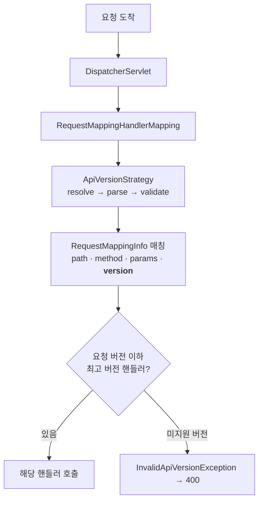

## API를 고치고 싶은데 기존 클라이언트가 무섭다

운영 중인 API의 응답 구조를 바꿔야 할 때가 옵니다. 그런데 이미 그 API를 쓰는 앱·외부 연동이 있으면 함부로 바꿨다간 다 깨지죠. 그래서 **버전을 나눠서** 구버전은 그대로 두고 새 버전을 추가로 제공합니다.

예전엔 이걸 직접 구현했습니다 — 경로를 `/v1`, `/v2`로 쪼개거나, 인터셉터에서 헤더를 읽어 분기하거나. 매번 비슷한 보일러플레이트였죠. **Spring Framework 7**부터는 이게 **프레임워크 1급 기능**이 됐습니다. 단순히 "`version` 속성 생겼다"가 아니라, 버전 **해석 → 파싱 → 검증 → 매칭**이 `RequestMappingHandlerMapping` 매칭 파이프라인 안으로 들어왔다는 게 핵심입니다. 이 글은 그 내부까지 봅니다.

## 한눈에: 같은 경로, 갈라지는 핸들러

같은 `/products`로 들어온 요청이라도, 버전 해석기가 읽어낸 버전에 따라 다른 핸들러로 라우팅됩니다. <span style="color:#1971c2;font-weight:600">v1</span> 요청과 <span style="color:#2f9e44;font-weight:600">v2</span> 요청이 하나의 해석기를 거쳐 갈라지는 모습입니다.

<div class="apiv-anim" markdown="0">
<style>
.apiv-anim{margin:1.4rem 0;overflow-x:auto}
.apiv-anim svg{width:100%;max-width:720px;height:auto;display:block;margin:0 auto;font-family:inherit}
.apiv-anim .lbl{fill:currentColor;font-size:12.5px;font-weight:600}
.apiv-anim .sub{fill:currentColor;font-size:9.5px;opacity:.55}
.apiv-anim .arr{stroke:currentColor;opacity:.3;stroke-width:1.5;fill:none}
.apiv-anim rect.box{fill:none;stroke:currentColor;stroke-width:1.5;opacity:.4}
.apiv-anim rect.res{animation:apivpulse 4s ease-in-out infinite}
.apiv-anim circle.v1{fill:#1971c2;animation:apivone 4s ease-in-out infinite}
.apiv-anim circle.v2{fill:#2f9e44;animation:apivtwo 4s ease-in-out infinite 1.6s}
@keyframes apivone{0%{transform:translate(0,0);opacity:0}7%{opacity:1}36%{transform:translate(210px,0)}48%{transform:translate(210px,0)}88%{transform:translate(560px,48px);opacity:1}100%{transform:translate(560px,48px);opacity:0}}
@keyframes apivtwo{0%{transform:translate(0,0);opacity:0}7%{opacity:1}36%{transform:translate(210px,0)}48%{transform:translate(210px,0)}88%{transform:translate(560px,-48px);opacity:1}100%{transform:translate(560px,-48px);opacity:0}}
@keyframes apivpulse{0%,100%{opacity:.35}50%{opacity:.95}}
</style>
<svg viewBox="0 0 700 190" role="img" aria-label="같은 경로로 들어온 v1/v2 요청이 버전 해석기를 거쳐 서로 다른 핸들러로 라우팅되는 애니메이션">
  <rect class="box res" x="200" y="65" width="170" height="60" rx="8"/>
  <rect class="box" x="500" y="22" width="180" height="46" rx="8"/>
  <rect class="box" x="500" y="122" width="180" height="46" rx="8"/>
  <text class="lbl" x="285" y="90"  text-anchor="middle">ApiVersionStrategy</text>
  <text class="sub" x="285" y="107" text-anchor="middle">resolve → parse → validate</text>
  <text class="lbl" x="590" y="42"  text-anchor="middle">getV2()</text>
  <text class="sub" x="590" y="58"  text-anchor="middle">version = "2"</text>
  <text class="lbl" x="590" y="142" text-anchor="middle">getV1()</text>
  <text class="sub" x="590" y="158" text-anchor="middle">version = "1"</text>
  <text class="sub" x="40" y="90" text-anchor="middle">GET</text>
  <text class="sub" x="40" y="104" text-anchor="middle">/products</text>
  <line class="arr" x1="80" y1="95" x2="200" y2="95"/>
  <line class="arr" x1="370" y1="88" x2="500" y2="48"/>
  <line class="arr" x1="370" y1="102" x2="500" y2="145"/>
  <circle class="v1" cx="60" cy="95" r="7"/>
  <circle class="v2" cx="60" cy="95" r="7"/>
</svg>
</div>

## `version` 속성과 baseline 매칭

`@RequestMapping`과 그 변형들(`@GetMapping` 등)에 **`version`** 속성이 생겼습니다. 같은 경로라도 버전별로 다른 핸들러를 둘 수 있습니다.

```java
@RestController
@RequestMapping("/products")
public class ProductController {

    @GetMapping(version = "1")
    public ProductV1 getV1(@PathVariable Long id) {
        return service.findV1(id);
    }

    @GetMapping(version = "2")          // 새 응답 구조
    public ProductV2 getV2(@PathVariable Long id) {
        return service.findV2(id);
    }
}
```

여기서 그냥 지나치기 쉬운 핵심이 **버전 매칭은 "정확히 같은 버전"이 아니라 "가장 가까운 하위 버전(baseline)"** 이라는 점입니다. 매핑된 버전 중 **요청 버전 이하에서 가장 높은 것**이 선택됩니다.

```java
@GetMapping(version = "1.2+")   // 1.2 이상 요청을 이 핸들러가 받는다
```

- `version = "1"`만 있고 클라이언트가 `1.5`를 요청 → 더 높은 매핑이 없으니 `"1"` 핸들러가 받습니다.
- `"1"`과 `"2"`가 있고 `1.5` 요청 → `2`는 요청보다 높으므로 제외, `1`이 선택됩니다.

이 덕분에 **버전을 올릴 때마다 모든 핸들러를 복제할 필요가 없습니다.** 바뀐 엔드포인트만 새 버전으로 추가하면, 나머지는 직전 버전 핸들러가 그대로 흡수합니다. 수동 분기 방식이 절대 못 주던 이점입니다.

## 버전을 어디서 읽을지: `ApiVersionConfigurer`

클라이언트가 버전을 어떻게 전달하는지를 정해야 합니다. `WebMvcConfigurer#configureApiVersioning`에서 전략을 등록합니다.

```java
@Configuration
public class WebConfig implements WebMvcConfigurer {

    @Override
    public void configureApiVersioning(ApiVersionConfigurer configurer) {
        configurer
            .useRequestHeader("X-API-Version")    // 헤더에서 읽기
            // .usePathSegment(0)                 // /v1/products 의 첫 세그먼트
            // .useQueryParam("version")          // ?version=1
            // .useMediaTypeParameter(MediaType.APPLICATION_JSON, "version")
            .setVersionRequired(false)            // 버전 없는 요청 허용 여부
            .setDefaultVersion("1")               // 미지정 시 기본 버전
            .addSupportedVersions("1", "2");      // 허용 버전 화이트리스트
    }
}
```

설정한 값들은 내부적으로 `DefaultApiVersionStrategy`로 묶입니다. 이게 세 부품을 조립합니다.

| 부품 | 역할 |
|------|------|
| `ApiVersionResolver` | 요청에서 버전 **문자열**을 꺼냄(헤더/경로/쿼리/미디어타입) |
| `ApiVersionParser` | 문자열을 비교 가능한 버전 객체로 파싱(`SemanticApiVersionParser` → `1.2.0`) |
| 검증 | `addSupportedVersions` 화이트리스트와 대조, 미지원이면 `InvalidApiVersionException`(400) |

`detectSupportedVersions(true)`로 두면 컨트롤러에 선언된 `version` 값들을 자동으로 지원 버전 집합에 넣어줘서, `addSupportedVersions`를 일일이 안 적어도 됩니다.

## 내부 동작: 매칭 파이프라인 어디에 끼어드나

버저닝이 "1급 기능"이라는 말의 실체가 여기 있습니다. 버전 조건은 경로·HTTP 메서드·`produces`/`consumes`와 **같은 레벨의 매칭 조건**으로 들어갑니다.



각 핸들러의 `version` 속성은 `RequestMappingInfo` 안의 **버전 조건(version condition)** 으로 등록됩니다. 요청이 오면 전략이 버전을 해석·파싱·검증한 뒤, 이 조건이 다른 매칭 조건들과 함께 평가되어 최종 핸들러가 선택됩니다. 즉 **별도 인터셉터나 if 분기가 아니라, 라우팅 그 자체**입니다.

## 수동 방식과 비교

| | 예전(수동) | Framework 7 네이티브 |
|---|---|---|
| 선언 | 경로 분리/인터셉터 분기 | `@GetMapping(version=...)` |
| 전략 변경 | 코드 대수술 | `ApiVersionConfigurer` 한 곳 |
| 미변경 엔드포인트 | 버전마다 복제 | baseline 매칭으로 자동 흡수 |
| 미지원 버전 처리 | 직접 검증 | 자동 400 + 예외 |
| 일관성 | 팀마다 제각각 | 프레임워크 표준 |

## 전략별 장단점

| 전략 | 예시 | 장점 | 단점 |
|------|------|------|------|
| 경로(Path) | `/v1/products` | 직관적, 캐싱·로깅·브라우저 테스트 쉬움 | URL이 리소스+버전 혼재, 링크 깨짐 |
| 헤더(Header) | `X-API-Version: 1` | URL이 리소스 식별에만 집중, 깔끔 | 눈에 안 보임, 캐시 키에 `Vary` 필요 |
| 쿼리 파라미터 | `?version=1` | 간편, 브라우저로 테스트 가능 | 캐싱/리소스 의미 혼탁 |
| 미디어 타입 | `Accept: application/json;version=1` | 콘텐츠 협상과 정합, REST 순수주의 | 클라이언트 작성 난이도↑ |

정답은 없지만, **하나를 골라 전사적으로 일관되게** 가는 게 핵심입니다. 공개 API는 경로, 내부 서비스 간 호출은 헤더가 무난한 출발점입니다.

## 폐기(Deprecation)는 헤더로 알린다

새 버전을 내면 구버전을 한동안 유지하며 단계적으로 폐기합니다. Framework 7은 폐기 신호를 응답 헤더로 자동 부착하는 핸들러(`StandardApiVersionDeprecationHandler`)를 제공합니다 — `Deprecation`, `Sunset`, 안내 문서 `Link`(RFC 8594/9745 계열). 클라이언트가 "이 버전 곧 닫힌다"를 코드로 감지하고 이전할 수 있게 됩니다.

## 실무 함정

- **버전 무한 증식**: baseline 매칭을 안 쓰고 버전마다 전 핸들러를 복제하면 코드가 기하급수로 늘어납니다. *바뀐 것만* 새 버전으로 올리세요.
- **헤더 버저닝 + 캐싱**: 같은 URL이 버전마다 다른 응답을 내므로, 캐시·CDN이 버전을 구분하도록 `Vary: X-API-Version`을 반드시 내보내야 합니다. 안 그러면 v1 캐시가 v2 클라이언트에 나갑니다.
- **버전 누락 동작**: `setVersionRequired(true)`면 버전 없는 요청은 거부, `false`+`setDefaultVersion`이면 기본으로 흡수. 이 정책을 명시 안 하면 "옛날 클라이언트가 갑자기 깨졌어요"가 됩니다.
- **클라이언트 마이그레이션**: 서버에서 버전을 끊기 전에, 폐기 헤더 + 사용량 모니터링(어떤 클라가 아직 구버전을 쓰는지)을 먼저 깔아두세요.

## 디버깅

- 라우팅이 의심되면 `logging.level.org.springframework.web=TRACE`로 매핑 평가 로그를 켜고, 어떤 `RequestMappingInfo`가 매칭됐는지 확인합니다.
- 400이 뜨면 십중팔구 `addSupportedVersions`/`detectSupportedVersions` 누락으로 요청 버전이 화이트리스트에 없는 경우입니다.

## 면접/리뷰 단골 질문

- **Q. `version="1"`만 있는데 클라가 `1.7`을 요청하면?** → baseline 매칭으로 요청 이하 최고 버전인 `"1"` 핸들러가 받는다. 그래서 버전마다 전부 복제 안 해도 된다.
- **Q. API 버저닝이 인터셉터로 하는 것과 뭐가 다른가?** → 버전 조건이 `RequestMappingInfo` 매칭 단계로 들어가, 경로/메서드와 동급의 라우팅 조건이 된다(별도 분기 아님).
- **Q. 헤더 버저닝에서 캐시가 꼬이는 이유와 해법은?** → URL이 같아 캐시 키가 충돌 → `Vary: X-API-Version` 헤더로 버전을 캐시 키에 포함.

## 정리

- Framework 7부터 `@GetMapping(version="...")`으로 **버저닝이 라우팅에 내장**됐다.
- 매칭은 정확 일치가 아니라 **요청 이하 최고 버전(baseline)** → 바뀐 엔드포인트만 새 버전으로 추가.
- 버전 전달 방식은 `ApiVersionConfigurer`에서 선택(`DefaultApiVersionStrategy` = resolver + parser + 검증).
- 헤더 방식은 `Vary`로 캐시 분리, 폐기는 `Deprecation`/`Sunset` 헤더로 알린다.

> 관련 글: 이 기능이 포함된 [Spring Boot 4 / Framework 7의 변화](), 그리고 버전별 응답·오류 표준화는 [REST API 예외 처리]()와 함께 보면 좋습니다.
