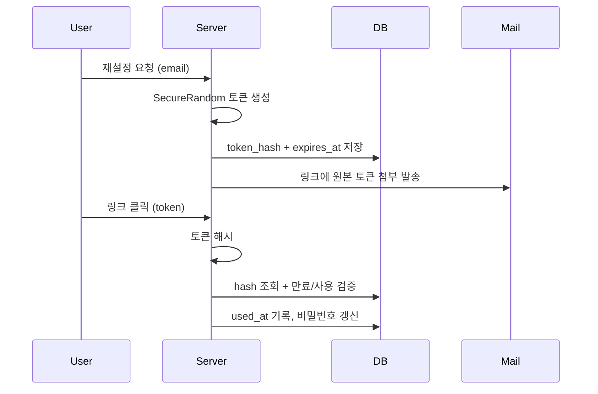

계정 복구 기능을 다룬 주가 있었다. 사용자가 비밀번호를 잊었을 때 메일로 재설정 링크를 보내는, 어디에나 있는 그 흐름이다. 그런데 이 평범한 기능은 인증 체계 전체에서 가장 공격받기 쉬운 약한 고리다. 로그인 비밀번호를 아무리 강하게 해시해도, 재설정 링크 하나가 허술하면 그 모든 노력이 무의미해진다. 핵심은 메일로 보내는 링크 안에 들어가는 **토큰**의 설계에 있다.

## 재설정 토큰이 만족해야 하는 세 가지 성질

재설정 토큰은 사실상 "이 토큰을 가진 사람은 곧 계정 주인이다"라는 일시적 자격증명이다. 그래서 세 가지를 동시에 만족해야 한다.

- **추측 불가(unpredictable)**: 토큰 공간이 충분히 크고 암호학적으로 안전한 난수여야 한다. 순번이나 타임스탬프 기반은 즉시 탈락이다.
- **만료(expiry)**: 발급 후 짧은 시간(보통 15분~1시간)만 유효해야 한다. 메일함이 털리거나 링크가 로그에 남아도 시간이 지나면 무력화된다.
- **일회용(one-time)**: 한 번 사용하면 즉시 폐기. 재설정에 성공했거나 새 토큰을 발급하면 기존 토큰은 죽어야 한다.

왜 이 셋이 전부 필요한가. 추측 불가만 있으면 유출 시 무한정 유효하고, 만료만 있으면 만료 전까지 재사용이 가능하다. 세 성질은 서로의 빈틈을 메운다.

### 추측 불가의 정체 — 엔트로피

토큰을 `UUID.randomUUID()`로 만드는 코드를 흔히 본다. UUID v4는 122비트 엔트로피라 추측 자체는 어렵지만, UUID는 본래 "충돌하지 않는 식별자"이지 "예측 불가능한 비밀"을 목표로 설계된 규격이 아니다. 비밀로 쓸 값은 의도를 명확히 하기 위해 `SecureRandom`으로 직접 만드는 것이 정석이다. `SecureRandom`은 OS의 CSPRNG(예: `/dev/urandom`)에서 시드를 받아 예측 불가능한 바이트를 내놓는다. 일반 `Random`은 48비트 선형 합동 생성기라 출력 몇 개만 보면 내부 상태가 복원되므로 절대 쓰면 안 된다.

```java
public String issueResetToken() {
    byte[] raw = new byte[32];            // 256비트
    new SecureRandom().nextBytes(raw);
    return Base64.getUrlEncoder()
                 .withoutPadding()
                 .encode(raw);            // URL-safe 토큰
}
```

### DB에는 토큰의 해시를 저장한다

여기서 가장 자주 놓치는 부분. 토큰 원본을 그대로 테이블에 저장하면 안 된다. DB가 유출되면 그 안의 모든 활성 토큰이 그대로 노출되어, 공격자가 임의 계정의 비밀번호를 바꿀 수 있다. 토큰은 비밀번호와 동급의 비밀이므로 **해시해서 저장**한다. 메일에는 원본을, DB에는 해시를 담고, 검증 시 들어온 토큰을 해시해 비교한다.

```sql
CREATE TABLE password_reset_token (
    id          BIGINT PRIMARY KEY AUTO_INCREMENT,
    user_id     BIGINT NOT NULL,
    token_hash  CHAR(64) NOT NULL,        -- SHA-256 hex
    expires_at  DATETIME NOT NULL,
    used_at     DATETIME NULL,            -- NULL이면 미사용
    UNIQUE KEY uk_token_hash (token_hash)
);
```

토큰은 비밀번호와 달리 고엔트로피 난수이므로 bcrypt 같은 느린 해시가 아니라 SHA-256으로 충분하다. 느린 해시의 목적은 사전 공격 방어인데, 256비트 난수는 사전 자체가 성립하지 않는다.



검증 로직은 만료·사용 여부를 한 번에 확인하고, 성공 시 즉시 `used_at`을 찍어 일회성을 보장한다.

```java
@Transactional
public void resetPassword(String rawToken, String newPassword) {
    String hash = sha256(rawToken);
    ResetToken t = repo.findByTokenHash(hash)
        .orElseThrow(() -> new InvalidTokenException());
    if (t.getUsedAt() != null || t.getExpiresAt().isBefore(now())) {
        throw new InvalidTokenException();   // 사용됨 or 만료
    }
    t.setUsedAt(now());                      // 일회성 확정
    userRepo.updatePassword(t.getUserId(), encoder.encode(newPassword));
}
```

## 운영 함정

**1. 이메일 존재 여부 노출(user enumeration).** "재설정 메일을 보냈습니다" 대신 "등록되지 않은 이메일입니다"라고 응답하면, 공격자가 가입 여부를 알아내는 통로가 된다. 가입 여부와 무관하게 **항상 동일한 성공 문구**를 반환하고, 메일은 가입자에게만 실제로 보낸다.

**2. 링크가 Referer로 새는 문제.** 토큰을 URL 쿼리스트링에 담으면 그 페이지가 외부 리소스를 부를 때 `Referer` 헤더에 토큰이 실려 나갈 수 있다. 재설정 페이지에는 외부 스크립트·이미지를 두지 말고, `Referrer-Policy: no-referrer`를 설정한다. 또한 재설정 성공 시 기존 모든 세션을 무효화해, 탈취된 세션이 살아남지 못하게 한다.

## 면접 한 줄 Q&A

- **Q. 재설정 토큰을 DB에 평문으로 저장하면 안 되는 이유는?** DB 유출 시 모든 활성 토큰이 그대로 노출되어 임의 계정 탈취가 가능하다. 토큰은 비밀번호급 비밀이므로 해시해 저장하고, 고엔트로피 난수라 SHA-256으로 충분하다.
- **Q. 토큰 생성에 UUID 대신 SecureRandom을 쓰는 이유는?** UUID는 충돌 방지용 식별자 규격이지 예측 불가 비밀을 목표로 하지 않는다. 비밀 값은 OS CSPRNG 기반 `SecureRandom`으로 의도를 명확히 한다. 일반 `Random`은 내부 상태가 복원되므로 금지다.
