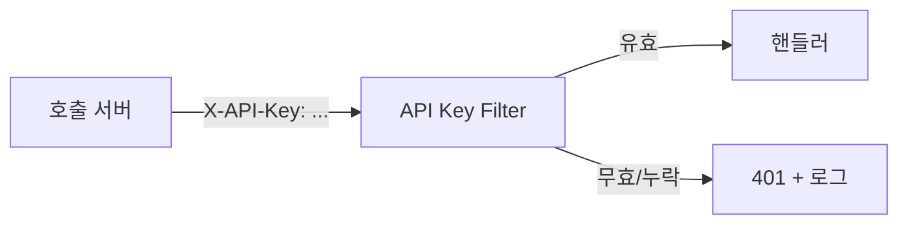

그 주엔 서버가 서버를 부르는 엔드포인트에 API 키 인증을 붙였다. 추상화하면 "사람의 세션이 없는 호출자를 어떻게 신뢰할 것인가"다. 브라우저 세션·쿠키는 사람이 로그인해 쓰는 모델이고, 배치·외부 시스템·내부 서비스가 부르는 머신 호출엔 맞지 않는다. 머신에는 머신의 자격증명, 즉 API 키가 필요하다.

## 왜 세션이 아니라 키인가

세션은 상태가 있다. 서버가 세션 저장소를 들고 만료를 관리하고, 호출자는 쿠키를 물고 다닌다. 머신 호출자는 로그인 화면이 없고 쿠키 jar도 없다. 매 요청에 자신을 증명할 무상태 자격증명, 곧 헤더에 실어 보내는 키가 자연스럽다. 키는 "이 호출자가 누구이며 무엇을 할 수 있는가"를 한 줄로 표현한다.



## 인증 필터로 가장 앞단에서 거른다

키 검증은 컨트롤러에 들어오기 전, 필터(또는 인터셉터)에서 한다. 인증되지 않은 요청이 비즈니스 로직 근처에도 못 오게 하는 것이 보안의 기본이다.

```java
public class ApiKeyAuthFilter extends OncePerRequestFilter {

    private final ApiKeyService apiKeyService;

    @Override
    protected void doFilterInternal(HttpServletRequest req,
                                    HttpServletResponse res,
                                    FilterChain chain) throws IOException, ServletException {
        String key = req.getHeader("X-API-Key");
        if (key == null || key.isBlank()) {
            reject(res, "MISSING_API_KEY", req);
            return;
        }
        ApiClient client = apiKeyService.resolve(key);   // 조회 + 만료 검사
        if (client == null) {
            reject(res, "INVALID_API_KEY", req);
            return;
        }
        // 인증 컨텍스트에 호출자 식별 정보를 실어 다음 단계로
        req.setAttribute("apiClient", client);
        chain.doFilter(req, res);
    }

    private void reject(HttpServletResponse res, String code, HttpServletRequest req)
            throws IOException {
        log.warn("api key auth failed: code={}, path={}, ip={}",
                 code, req.getRequestURI(), req.getRemoteAddr());   // 키 값은 안 찍는다
        res.setStatus(HttpServletResponse.SC_UNAUTHORIZED);         // 401
        res.getWriter().write("{\"error\":\"" + code + "\"}");
    }
}
```

## 키를 저장·검증하는 법

평문 키를 그대로 DB에 넣지 않는다. 비밀번호처럼 키도 해시해서 저장하고, 들어온 키를 해시해 비교한다. DB가 유출돼도 키 원본이 새지 않는다. 만료 시각·활성 플래그를 함께 두어 로테이션과 폐기를 지원한다.

```sql
CREATE TABLE api_client (
    id          BIGINT PRIMARY KEY,
    name        VARCHAR(100) NOT NULL,
    key_hash    CHAR(64)     NOT NULL,   -- SHA-256 등으로 해시한 키
    active      BOOLEAN      NOT NULL DEFAULT TRUE,
    expires_at  TIMESTAMP,
    UNIQUE (key_hash)
);
```

```java
public ApiClient resolve(String rawKey) {
    String hash = sha256(rawKey);
    ApiClient c = repository.findByKeyHash(hash);
    if (c == null || !c.isActive()) return null;
    if (c.getExpiresAt() != null && c.getExpiresAt().isBefore(Instant.now())) {
        return null;   // 만료
    }
    return c;
}
```

## 키 오류를 추적 가능하게 로깅

키 누락·불일치·만료는 각각 다른 코드로 구분해 로그에 남긴다. 사고 조사 때 "어느 호출자가, 어느 경로로, 왜 거절됐는가"를 추적할 수 있어야 한다. 단 **로그에 키 원본을 절대 찍지 않는다.** 로그는 종종 평문으로 장기 보관되며, 키가 로그에 박히는 순간 그 키는 유출된 것으로 간주해야 한다. 식별이 필요하면 키의 마지막 4자리나 client 식별자만 남긴다.

## 운영 함정

**키가 URL 쿼리스트링에 실림.** `?apiKey=...`로 보내면 액세스 로그·프록시 로그·브라우저 히스토리에 그대로 남는다. 키는 항상 헤더로 보낸다.

**로테이션 없는 영구 키.** 한 번 발급하고 영원히 쓰면, 유출돼도 폐기할 방법이 없다. 만료·활성 플래그를 두고, 새 키 발급 → 양쪽 모두 유효한 겹침 기간 → 구 키 폐기 순으로 무중단 로테이션한다.

## 핵심 요약

- 머신 호출은 세션이 아니라 무상태 API 키로 인증하고, 검증은 가장 앞단 필터에서 한다.
- 키는 해시해 저장하고 만료·활성 플래그로 로테이션·폐기를 지원한다.
- 키 오류는 코드로 구분해 로깅하되 키 원본은 절대 로그·URL에 남기지 않는다.

> **면접 한 줄:** "API 키를 DB에 어떻게 저장하나?" → "평문이 아니라 해시로. 들어온 키를 같은 방식으로 해시해 비교하고, 만료·활성 플래그로 폐기·로테이션을 관리한다."
