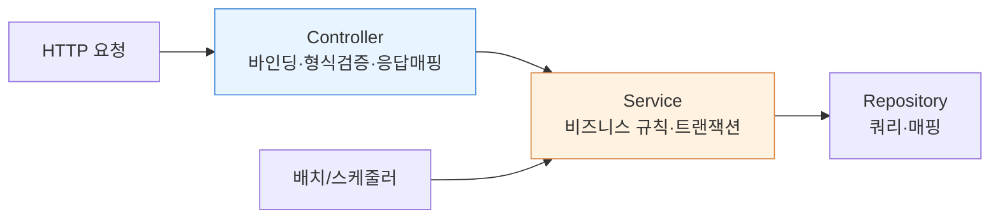

코드가 누적된 모듈의 로직을 정리하던 주가 있었다. 컨트롤러가 비대해지고, 같은 검증과 분기가 여러 화면에 복사되어 있고, 테스트는 매번 HTTP 요청을 띄워야만 돌아가는 상태. 증상은 다양하지만 원인은 하나였다. **비즈니스 로직이 있어야 할 곳에 있지 않았다.** "컨트롤러는 얇게, 서비스는 두껍게"라는 격언은 단순한 스타일 취향이 아니라 테스트 용이성과 재사용성을 좌우하는 구조적 원칙이다.

## 계층은 왜 나누는가 — 책임의 분리

전형적인 3계층은 다음 책임을 가진다.

- **Controller**: HTTP 세계와 도메인 세계의 번역기. 요청 파라미터 바인딩, 형식 검증, 호출, 응답/상태코드 매핑. 그게 전부다.
- **Service**: 비즈니스 규칙과 트랜잭션 경계. "무엇을 해야 하는가"의 핵심 로직.
- **Repository**: 영속성. 쿼리와 매핑만.

핵심은 **컨트롤러가 HTTP에 의존하는 유일한 계층**이라는 점이다. 비즈니스 로직을 컨트롤러에 두면 그 로직은 영원히 HTTP 요청 컨텍스트에 묶인다. 배치 작업에서, 스케줄러에서, 다른 서비스에서 같은 규칙을 재사용하고 싶어도 `HttpServletRequest` 없이는 호출할 수 없게 된다. 반대로 로직이 서비스에 있으면 어디서든 평범한 메서드 호출로 재사용된다.



배치와 스케줄러가 서비스를 직접 가리키는 것에 주목하라. 로직이 서비스에 응집되어 있을 때만 가능한 그림이다.

## 잘못된 예 — 컨트롤러로 새는 로직

```java
@PostMapping("/orders")
public ResponseEntity<?> create(@RequestBody OrderRequest req) {
    if (req.getItems().isEmpty()) {                 // 비즈니스 규칙
        return ResponseEntity.badRequest().build();
    }
    int total = 0;
    for (Item i : req.getItems()) {                 // 금액 계산 = 도메인 로직
        Product p = productRepo.findById(i.getProductId());
        if (p.getStock() < i.getQty()) {            // 재고 검증 = 도메인 로직
            return ResponseEntity.badRequest().build();
        }
        total += p.getPrice() * i.getQty();
    }
    Order o = new Order(req.getUserId(), total);
    orderRepo.save(o);                              // 트랜잭션 경계 모호
    return ResponseEntity.ok(o);
}
```

문제는 명확하다. 재고 검증·금액 계산이라는 핵심 규칙이 컨트롤러에 박혀 있다. 이 주문 생성 로직을 관리자 일괄 등록 배치에서 재사용하려면 코드를 통째로 복사해야 한다. 게다가 `orderRepo.save` 하나만 트랜잭션이라 중간에 실패하면 정합성이 깨진다. 단위 테스트도 HTTP 계층을 끌어와야만 가능하다.

## 올바른 예 — 컨트롤러는 위임만

```java
@PostMapping("/orders")
public ResponseEntity<OrderResponse> create(@Valid @RequestBody OrderRequest req) {
    Order order = orderService.place(req.toCommand());   // 위임이 전부
    return ResponseEntity.status(CREATED).body(OrderResponse.from(order));
}
```

```java
@Service
public class OrderService {
    @Transactional
    public Order place(PlaceOrderCommand cmd) {
        int total = 0;
        for (OrderLine line : cmd.getLines()) {
            Product p = productRepo.findForUpdate(line.getProductId());
            p.decreaseStock(line.getQty());      // 재고·검증이 도메인 안으로
            total += p.getPrice() * line.getQty();
        }
        return orderRepo.save(new Order(cmd.getUserId(), total));
    }
}
```

차이는 두 가지다. 첫째, 비즈니스 규칙이 한 곳에 **응집(cohesion)**되어 배치든 다른 서비스든 `place()` 한 줄로 재사용된다. 둘째, `@Transactional`이 서비스 메서드에 붙어 **메서드 전체가 한 트랜잭션**이 된다. 재고 감소·주문 저장이 원자적으로 묶여 중간 실패 시 전부 롤백된다. 형식 검증(`@Valid`, 필수값·길이)은 컨트롤러 경계에서, 의미 검증(재고가 충분한가)은 서비스에서 — 검증의 종류도 계층에 맞게 나뉜다.

## 운영 함정

**1. @Transactional을 컨트롤러에 붙이는 실수.** 스프링의 트랜잭션은 AOP 프록시로 동작한다. 컨트롤러는 보통 프록시 대상에서 빠지거나 디스패처 구조상 의도대로 적용되지 않을 수 있고, 무엇보다 트랜잭션 경계가 HTTP에 종속되어 재사용이 막힌다. 트랜잭션은 비즈니스 단위인 **서비스 메서드**에 둔다.

**2. "얇게"를 오해해 빈약한 서비스를 만드는 것.** 컨트롤러를 비웠는데 서비스가 단순히 리포지토리를 그대로 호출하는 패스스루(pass-through)면, 로직은 결국 어딘가로 다시 샌다. 보통 컨트롤러나 매퍼로. 서비스는 "두껍게" — 도메인 규칙을 실제로 담아야 의미가 있다.

## 핵심 요약

- 컨트롤러는 HTTP↔도메인 번역기다. 바인딩·형식검증·응답매핑만 하고 비즈니스 로직은 두지 않는다.
- 비즈니스 규칙은 서비스에 응집시켜야 배치·스케줄러 등 비HTTP 경로에서 재사용되고, 단위 테스트가 HTTP 없이 가능해진다.
- 트랜잭션 경계는 비즈니스 단위인 서비스 메서드에 둔다. 형식 검증은 컨트롤러, 의미 검증은 서비스.
