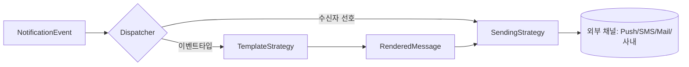

## 도입 — 알림 코드가 분기 지옥이 되는 이유

알림은 처음엔 간단해 보인다. "주문이 완료되면 문자를 보낸다." 그런데 요구가 쌓인다. 같은 주문 완료 이벤트를 어떤 사용자는 푸시로, 어떤 사용자는 메일로, 운영자는 사내 채널로 받고 싶어 한다. 동시에 알림 종류도 는다. 가입 환영, 비밀번호 변경, 결제 실패…

이걸 분기로 짜면 `if (eventType == ORDER && channel == SMS) { ... }`가 종류×채널만큼 폭발한다. 이 주의 핵심은 알림을 **두 개의 독립적인 축**으로 본 것이다. **무엇을 보낼지(템플릿 렌더링)** 와 **어디로 어떻게 보낼지(채널별 발송)** 는 서로 직교한다. 이 둘을 각각 전략으로 분리하면, 종류×채널의 곱이 종류+채널의 합으로 줄어든다.

## 핵심 개념 — 두 축의 전략과 디스패치



- **TemplateStrategy**: 이벤트 타입별로 "어떤 내용을 만들지"를 안다. 주문 완료 템플릿, 결제 실패 템플릿이 각각 하나의 전략이다. 입력은 이벤트의 데이터, 출력은 채널 무관한 `RenderedMessage`(제목/본문/변수).
- **SendingStrategy**: 채널별로 "그 메시지를 어떻게 실제 전송하는지"를 안다. 푸시 전략, 문자 전략, 메일 전략. 입력은 `RenderedMessage`, 출력은 발송 결과.
- **Dispatcher**: 컨슈머가 받은 이벤트의 타입으로 템플릿 전략을 고르고, 수신자의 채널 선호로 발송 전략(들)을 골라 **조합**한다.

핵심은 두 전략이 `RenderedMessage`라는 공통 계약으로만 만난다는 점이다. 템플릿은 채널을 모르고, 채널은 이벤트 타입을 모른다. 그래서 새 채널을 추가해도 템플릿 코드는 안 바뀌고, 새 알림 종류를 추가해도 채널 코드는 안 바뀐다.

## 코드 — 두 전략과 디스패처

```java
public interface TemplateStrategy {
    EventType eventType();
    RenderedMessage render(NotificationEvent event);
}

public interface SendingStrategy {
    Channel channel();
    SendResult send(RenderedMessage msg, Recipient to);
}

public record RenderedMessage(String title, String body, Map<String,String> meta) {}
```

각 전략 구현은 자기 일만 한다.

```java
@Component
class OrderCompletedTemplate implements TemplateStrategy {
    public EventType eventType() { return EventType.ORDER_COMPLETED; }
    public RenderedMessage render(NotificationEvent e) {
        var name = e.data().get("productName");
        return new RenderedMessage(
            "주문 완료",
            name + " 주문이 정상 접수되었습니다.",
            Map.of("orderId", e.data().get("orderId")));
    }
}

@Component
class SmsSending implements SendingStrategy {
    public Channel channel() { return Channel.SMS; }
    public SendResult send(RenderedMessage msg, Recipient to) {
        // 문자는 본문만, 길이 제한 고려
        return smsClient.send(to.phone(), msg.body());
    }
}
```

디스패처는 스프링이 주입한 전략 맵에서 골라 조합한다.

```java
@Component
public class NotificationDispatcher {
    private final Map<EventType, TemplateStrategy> templates;
    private final Map<Channel, SendingStrategy> senders;

    public NotificationDispatcher(List<TemplateStrategy> t, List<SendingStrategy> s) {
        this.templates = t.stream().collect(toMap(TemplateStrategy::eventType, x -> x));
        this.senders   = s.stream().collect(toMap(SendingStrategy::channel, x -> x));
    }

    public void dispatch(NotificationEvent event, Recipient to) {
        RenderedMessage msg = templates.get(event.type()).render(event);
        for (Channel ch : to.preferredChannels()) {     // 수신자가 고른 채널들
            senders.get(ch).send(msg, to);              // 같은 메시지를 채널별로
        }
    }
}
```

새 채널(`InAppSending`)을 더하면 클래스 하나만 추가된다. 새 알림 종류(`PasswordChangedTemplate`)도 마찬가지. 디스패처는 손대지 않는다.

## 운영 함정

**1) 부분 실패를 한 묶음으로 다룬다.** 한 사용자에게 푸시·메일을 동시에 보낼 때, 푸시는 성공했는데 메일이 실패했다고 전체를 재시도하면 푸시가 **중복 발송**된다. 채널별 발송 결과를 개별 추적하고, 실패한 채널만 재시도해야 한다. 알림은 보통 멱등 처리가 어렵기 때문에 채널 단위로 결과를 기록하는 게 안전하다.

**2) 템플릿 변수 누락이 런타임에 터진다.** 템플릿이 기대하는 변수(`productName`)가 이벤트에 없으면 `null`이 본문에 박히거나 NPE가 난다. 이벤트 발행 측과 템플릿 측이 **변수 계약**을 공유해야 한다. 렌더 단계에서 필수 변수를 검증하고, 누락 시 명확히 실패시켜 잘못된 알림이 나가는 것을 막는다.

## 핵심 요약 / 면접 Q&A

- **Q. 왜 채널과 템플릿을 분리하나?** A. 둘은 직교하는 관심사다. 분리하면 종류×채널의 분기 폭발이 종류+채널의 합으로 줄고, 한쪽 확장이 다른 쪽 코드를 건드리지 않는다.
- **Q. 둘을 잇는 계약은?** A. 채널 무관한 `RenderedMessage`. 템플릿은 이걸 만들고 채널은 이걸 소비한다. 서로의 내부를 모른다.
- **Q. 멀티채널 발송의 위험은?** A. 부분 실패. 채널별 결과를 따로 추적해 실패 채널만 재시도해야 중복을 막는다.
- **한 줄 정리:** "무엇을"과 "어디로"를 두 축의 전략으로 가르고 디스패처가 조합하면, 알림은 곱이 아니라 합으로 자란다.
