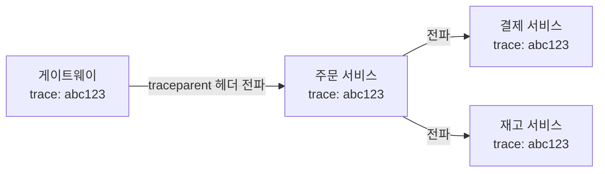

## 장애가 났는데 어디서 느린지 모르겠다

서비스가 커지고 호출 경로가 길어지면, "느리다"는 건 알겠는데 **어디서** 느린지를 모르는 상황이 옵니다. 로그만으로는 한 요청이 여러 서비스를 거치는 흐름을 따라가기 어렵죠. 이때 필요한 게 **Observability(관측 가능성)** 입니다. 보통 **메트릭 · 추적 · 로그** 세 축으로 봅니다.

Spring Boot는 **Micrometer**와 **Actuator**로 이걸 표준화해서 제공합니다.

## Actuator + Micrometer 메트릭

`spring-boot-starter-actuator`를 추가하면 헬스체크, 메트릭 등의 엔드포인트가 열립니다. Micrometer가 JVM·HTTP·DB 풀 등의 메트릭을 수집하고, Prometheus 같은 백엔드로 내보냅니다.

```gradle
implementation 'org.springframework.boot:spring-boot-starter-actuator'
implementation 'io.micrometer:micrometer-registry-prometheus'
```

```yaml
management:
  endpoints:
    web:
      exposure:
        include: [health, info, metrics, prometheus]
```

`/actuator/prometheus`를 Prometheus가 긁어가고, Grafana로 대시보드를 만드는 게 전형적인 구성입니다.

## Observation API: 메트릭과 추적을 하나로

Spring Boot 3부터 Micrometer **Observation API**가 들어왔습니다. 한 번 "관측"을 선언하면 **메트릭과 추적(trace)을 동시에** 만들어줍니다.

```java
@Service
@RequiredArgsConstructor
public class OrderService {
    private final ObservationRegistry registry;

    public Order place(OrderRequest req) {
        return Observation.createNotStarted("order.place", registry)
            .observe(() -> doPlace(req));   // 이 구간이 메트릭+추적으로 기록
    }
}
```

메서드 단위라면 `@Observed`로 더 간단히 할 수도 있습니다.

## 분산 추적(Distributed Tracing)

요청이 여러 서비스를 거칠 때, **하나의 trace id**로 전체 흐름을 이어 보는 게 분산 추적입니다. Micrometer Tracing(브리지: OpenTelemetry/Brave)이 trace/span을 만들고, 서비스 간 호출 시 헤더로 컨텍스트를 전파합니다.



```gradle
implementation 'io.micrometer:micrometer-tracing-bridge-otel'
implementation 'io.opentelemetry:opentelemetry-exporter-otlp'
```

수집된 trace는 Zipkin/Tempo/Jaeger 같은 백엔드에서 **하나의 요청이 각 서비스에서 얼마나 걸렸는지** 타임라인으로 보여줍니다. "어디서 느린가"가 한눈에 보이죠.

## 로그에 trace id 끼워넣기

추적과 로그를 연결하려면 로그 패턴에 trace/span id를 넣습니다. Spring Boot는 이를 MDC로 자동 채워주므로, 패턴만 잡으면 됩니다.

```yaml
logging:
  pattern:
    level: "%5p [${spring.application.name},%X{traceId:-},%X{spanId:-}]"
```

이러면 특정 trace id로 여러 서비스의 로그를 모아서 볼 수 있습니다.

## 정리

- 관측은 **메트릭 · 추적 · 로그** 세 축. Spring Boot는 **Actuator + Micrometer**로 표준 제공.
- **Observation API** 하나로 메트릭과 추적을 동시에 기록.
- **분산 추적**은 trace id를 서비스 간 전파해 전체 흐름을 잇는다(OpenTelemetry 등).
- 로그 패턴에 trace id를 넣어 추적과 로그를 연결하자.
