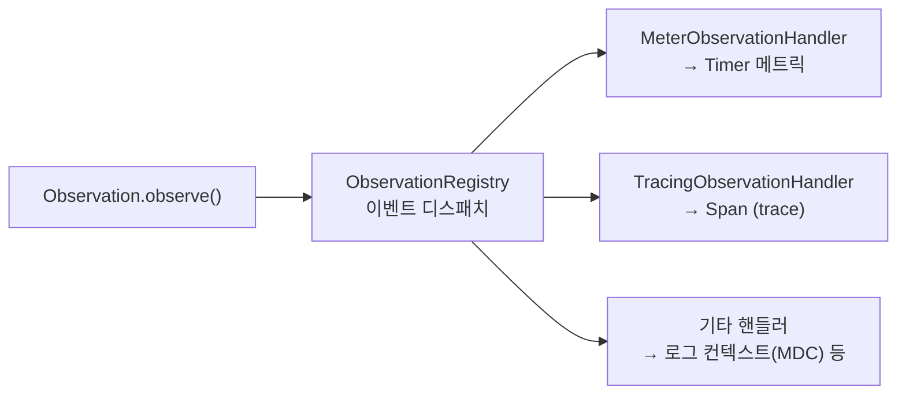
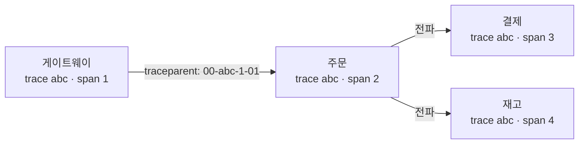

## 장애가 났는데 어디서 느린지 모르겠다

서비스가 커지고 호출 경로가 길어지면, "느리다"는 건 알겠는데 **어디서** 느린지를 모르는 상황이 옵니다. 로그를 grep해도 한 요청이 게이트웨이→주문→결제→재고를 거치는 흐름이 흩어져 있어 따라가기 어렵죠.

핵심은 단순히 메트릭·로그·추적을 *수집*하는 게 아닙니다. **세 신호를 같은 요청 단위로 잇는 것**이 관측성의 본질입니다. "이 느린 요청(trace)의 그 순간 로그가 이거고, 그때 CPU 메트릭이 이랬다"가 한 번에 연결돼야 합니다. 이 글은 Spring Boot가 그 연결을 *어떻게* 만들어내는지 — `Observation` 한 번이 어떻게 메트릭과 추적을 동시에 낳는지 — 그 메커니즘까지 내려갑니다.

| 신호 | 답하는 질문 | 대표 도구 | 카디널리티 |
|------|------------|----------|-----------|
| **메트릭(Metrics)** | "얼마나? 몇 번? 평균/p99는?" | Micrometer → Prometheus | 낮아야 함(집계값) |
| **추적(Tracing)** | "이 요청이 어디서 시간을 썼나?" | Micrometer Tracing → OTel/Zipkin | 높음(요청별) |
| **로그(Logs)** | "그 순간 정확히 무슨 일이?" | SLF4J/Logback + MDC | 높음(이벤트별) |

세 줄을 잇는 끈이 **traceId**입니다. 아래는 하나의 요청에 traceId가 부여돼 서비스를 지나며 span으로 이어지고, 같은 id가 로그·메트릭에까지 박히는 모습입니다.

<div class="obs-anim" markdown="0">
<style>
.obs-anim{margin:1.4rem 0;overflow-x:auto}
.obs-anim svg{width:100%;max-width:720px;height:auto;display:block;margin:0 auto;font-family:inherit}
.obs-anim .lbl{fill:currentColor;font-size:12px;font-weight:600}
.obs-anim .sub{fill:currentColor;font-size:9.5px;opacity:.6}
.obs-anim .box{fill:none;stroke:currentColor;stroke-width:1.5;opacity:.32}
.obs-anim .box.s1{animation:obspulse 5s ease-in-out infinite .2s}
.obs-anim .box.s2{animation:obspulse 5s ease-in-out infinite 1.2s}
.obs-anim .box.s3{animation:obspulse 5s ease-in-out infinite 2.2s}
.obs-anim .arr{stroke:currentColor;opacity:.3;stroke-width:1.5;fill:none}
.obs-anim .span{fill:#1971c2;opacity:.85;transform-box:fill-box;transform-origin:left center;transform:scaleX(0)}
.obs-anim .sp1{animation:obsgrow 5s ease-out infinite .2s}
.obs-anim .sp2{animation:obsgrow 5s ease-out infinite 1.2s}
.obs-anim .sp3{animation:obsgrow 5s ease-out infinite 2.2s}
.obs-anim .trace{animation:obsride 5s linear infinite}
.obs-anim .tracebadge{fill:#1971c2}
.obs-anim .traceid{fill:#fff;font-size:9px;font-weight:700}
.obs-anim .stamp{fill:currentColor;font-size:9px;font-weight:700;opacity:0}
.obs-anim .stamp.st1{animation:obsstamp 5s ease-out infinite 3.2s}
.obs-anim .stamp.st2{animation:obsstamp 5s ease-out infinite 3.6s}
@keyframes obspulse{0%,100%{opacity:.28}50%{opacity:.85}}
@keyframes obsgrow{0%{transform:scaleX(0)}30%{transform:scaleX(1)}100%{transform:scaleX(1);opacity:.85}}
@keyframes obsride{0%{transform:translateX(0);opacity:0}5%{opacity:1}80%{opacity:1}100%{transform:translateX(560px);opacity:0}}
@keyframes obsstamp{0%{opacity:0}40%{opacity:1}100%{opacity:1}}
</style>
<svg viewBox="0 0 700 250" role="img" aria-label="요청에 부여된 traceId가 게이트웨이·주문·결제 서비스를 지나며 span으로 이어지고 같은 id가 로그와 메트릭에 박히는 흐름 애니메이션">
  <!-- service boxes -->
  <rect class="box s1" x="20"  y="20" width="150" height="46" rx="8"/>
  <rect class="box s2" x="275" y="20" width="150" height="46" rx="8"/>
  <rect class="box s3" x="530" y="20" width="150" height="46" rx="8"/>
  <text class="lbl" x="95"  y="40" text-anchor="middle">게이트웨이</text>
  <text class="sub" x="95"  y="55" text-anchor="middle">span A</text>
  <text class="lbl" x="350" y="40" text-anchor="middle">주문 서비스</text>
  <text class="sub" x="350" y="55" text-anchor="middle">span B</text>
  <text class="lbl" x="605" y="40" text-anchor="middle">결제 서비스</text>
  <text class="sub" x="605" y="55" text-anchor="middle">span C</text>
  <line class="arr" x1="170" y1="43" x2="275" y2="43"/>
  <line class="arr" x1="425" y1="43" x2="530" y2="43"/>
  <!-- traveling trace token -->
  <g class="trace">
    <rect class="tracebadge" x="20" y="78" width="86" height="18" rx="9"/>
    <text class="traceid" x="63" y="91" text-anchor="middle">trace 3f9a…</text>
  </g>
  <!-- span timeline -->
  <text class="sub" x="20" y="128">분산 추적 타임라인 (한 trace = 여러 span)</text>
  <rect class="span sp1" x="20"  y="138" width="560" height="14" rx="4"/>
  <rect class="span sp2" x="120" y="158" width="320" height="14" rx="4"/>
  <rect class="span sp3" x="300" y="178" width="170" height="14" rx="4"/>
  <text class="sub" x="588" y="149">A: 전체</text>
  <text class="sub" x="448" y="169">B: 주문</text>
  <text class="sub" x="478" y="189">C: 결제</text>
  <!-- same id stamped into logs & metrics -->
  <line class="arr" x1="20" y1="208" x2="680" y2="208"/>
  <text class="lbl"   x="20" y="230">로그</text>
  <text class="stamp st1" x="60" y="230">[traceId=3f9a, spanId=…] payment timeout</text>
  <text class="lbl"   x="400" y="230">메트릭</text>
  <text class="stamp st2" x="448" y="230">http.server.requests · exemplar→3f9a</text>
</svg>
</div>

## Observation API: "한 번 계측 → 메트릭·추적 동시 생성"

예전엔 메트릭(`Timer`)과 추적(`Span`)을 *따로* 계측했습니다. 같은 구간을 두 번 감싸야 했고, 둘이 어긋나기 일쑤였죠. Spring Boot 3 / Micrometer 1.10부터 들어온 **Observation API**는 이걸 하나로 합칩니다 — 구간을 **한 번** "관측"으로 선언하면, 등록된 핸들러들이 그 하나의 이벤트로 메트릭도, span도, 로그 컨텍스트도 만들어 줍니다.

```java
@Service
@RequiredArgsConstructor
public class OrderService {
    private final ObservationRegistry registry;

    public Order place(OrderRequest req) {
        return Observation.createNotStarted("order.place", registry)
            .lowCardinalityKeyValue("order.type", req.type())   // 메트릭 태그 + span 태그
            .highCardinalityKeyValue("order.id", req.id())       // span에만 (메트릭 X)
            .observe(() -> doPlace(req));   // 이 구간이 Timer + Span으로 동시 기록
    }
}
```

### 왜 하나가 둘이 되나 — `ObservationHandler`

이 마법의 정체는 **`ObservationRegistry`에 등록된 `ObservationHandler` 목록**입니다. `observe()`가 호출되면 라이프사이클 이벤트(`onStart` → `onStop` 등)가 발생하고, 등록된 모든 핸들러가 그 이벤트를 받습니다.

- `DefaultMeterObservationHandler` → 이 관측을 **`Timer`/`LongTaskTimer` 메트릭**으로 만든다.
- `TracingObservationHandler` (Micrometer Tracing) → 이 관측을 **`Span`**으로 만든다(start=span 시작, stop=span 종료).



여기서 **핵심 설계 결정**이 보입니다. 계측 코드는 "무엇을 관측하는가"(`order.place`)만 선언하고, "그걸 메트릭으로 낼지 추적으로 낼지"는 핸들러가 정합니다. 그래서 추적 의존성을 빼면 자동으로 span은 안 생기고 메트릭만 남습니다 — 계측 코드는 한 줄도 안 바뀝니다. 이게 자동 구성([관련 글]())과 만나는 지점입니다. `ObservationAutoConfiguration`이 클래스패스에 있는 것에 맞춰 핸들러를 조건부로 등록합니다.

### `@Observed`는 공짜가 아니다

메서드 단위라면 애너테이션이 더 깔끔합니다.

```java
@Observed(name = "order.place", contextualName = "place-order")
public Order place(OrderRequest req) { ... }
```

⚠️ 단, `@Observed`는 **AOP 프록시**(`ObservedAspect`)로 동작하므로 그 Bean을 직접 등록해야 작동합니다. 안 그러면 애너테이션이 조용히 무시됩니다(자주 빠지는 함정).

```java
@Bean
ObservedAspect observedAspect(ObservationRegistry registry) {
    return new ObservedAspect(registry);
}
```

그리고 AOP 프록시라서 **self-invocation**(같은 클래스 내부 호출)엔 안 걸립니다 — [`@Transactional`의 그 함정]()과 똑같은 원리입니다.

## 분산 추적: traceId를 서비스 경계로 전파하기

> 참고: Spring Boot 2.x의 **Spring Cloud Sleuth**는 Boot 3부터 단종되고 **Micrometer Tracing**으로 대체됐습니다. 지금 글은 Boot 3/4 기준입니다.

Micrometer Tracing은 추적 API의 *얇은 추상화*이고, 실제 구현은 **브리지**로 갈아끼웁니다.

```gradle
// 택1: OpenTelemetry 브리지 (요즘 표준)
implementation 'io.micrometer:micrometer-tracing-bridge-otel'
implementation 'io.opentelemetry:opentelemetry-exporter-otlp'
// 또는 Brave(Zipkin) 브리지
// implementation 'io.micrometer:micrometer-tracing-bridge-brave'
```

서비스 간 전파는 **W3C `traceparent` 헤더**(또는 B3) 표준으로 이뤄집니다. 보내는 쪽 `RestClient`/`WebClient`와 받는 쪽 서버 필터에 자동 계측이 붙어, `Propagator`가 헤더를 주입·추출합니다.



수집된 trace는 Zipkin/Tempo/Jaeger에서 **요청 하나가 각 서비스에서 얼마나 걸렸는지** 타임라인(위 애니메이션의 span 막대들)으로 보여줍니다. "어디서 느린가"가 그래프로 답해집니다.

## 로그 상관관계: MDC 자동 주입

추적과 로그를 잇는 마지막 끈. Micrometer Tracing이 현재 trace/span id를 **MDC**(SLF4J `MDC`)에 자동으로 넣어주므로, 로그 패턴에 끼우기만 하면 됩니다.

```yaml
logging:
  pattern:
    level: "%5p [${spring.application.name:},%X{traceId:-},%X{spanId:-}]"
```

이제 Loki/ELK에서 `traceId=3f9a…`로 검색하면 **네 서비스에 흩어진 그 요청의 로그가 한 줄에 모입니다.** 추적 UI에서 본 느린 span의 그 순간 로그를 바로 펼쳐볼 수 있죠.

## 프로덕션 함정 ①: 컨텍스트가 스레드를 건너면 끊긴다

trace 컨텍스트는 본질적으로 **`ThreadLocal`** 기반입니다. 그래서 작업이 다른 스레드로 넘어가면(비동기 `@Async`, `CompletableFuture`, 리액티브 `Flux`, [가상 스레드]() 경계) traceId가 **유실**되어 span이 끊기고 로그의 `%X{traceId}`가 비어버립니다.

해법은 **컨텍스트 전파**입니다.

```java
// 명령형 비동기: 현재 컨텍스트를 캡처해 다른 스레드에서 복원
ExecutorService traced = ContextExecutorService.wrap(
        Executors.newVirtualThreadPerTaskExecutor(),
        ContextSnapshotFactory.builder().build()::captureAll);
```

리액터에서는 `Hooks.enableAutomaticContextPropagation()`(Reactor 3.5+)을 켜면 됩니다. 핵심은 "스레드 경계마다 컨텍스트를 명시적으로 옮겨야 한다"는 것.

## 프로덕션 함정 ②: 카디널리티 폭발

메트릭 태그에 **요청마다 다른 값**(userId, orderId, UUID, 전체 URL의 path variable)을 넣으면, Prometheus의 시계열(time series) 수가 폭증해 메모리·쿼리가 무너집니다. 이게 모니터링 시스템을 죽이는 1순위 사고입니다.

- 메트릭 태그(`lowCardinalityKeyValue`)에는 **유한한 값**만(상태코드, 메서드, 라우트 템플릿 `"/orders/{id}"`).
- 요청별 고유값은 **`highCardinalityKeyValue`** 로 — 이건 span(추적)에만 들어가고 메트릭 태그는 안 만든다.
- URI 태깅은 `path`(실제 경로)가 아니라 **`uri`(템플릿)** 로 기록되는지 확인. `/orders/1`, `/orders/2`가 각각 시계열이 되면 끝장입니다.

## 디버깅 / 운영 체크리스트

- `/actuator/metrics/http.server.requests` — 특정 메트릭의 태그·값 확인. 엔드포인트 전반은 [Actuator 글]() 참고.
- `/actuator/prometheus` — Prometheus가 긁어가는 raw 출력. 태그 카디널리티를 눈으로 점검.
- `management.tracing.sampling.probability` — 기본 `0.1`(10%만 추적). 운영에선 비용 때문에 전수 추적을 안 한다. "로컬에선 trace가 보이는데 운영에선 안 보임"의 흔한 원인.
- **Exemplar**: 메트릭 그래프의 한 점에서 그 순간의 trace로 점프하는 기능. 메트릭↔추적 연결의 끝판왕.

## 면접/리뷰 단골 질문

- **Q. Observation 하나가 메트릭과 trace를 동시에 만드는 원리는?** → `ObservationRegistry`에 등록된 `ObservationHandler`들(Meter용·Tracing용)이 같은 라이프사이클 이벤트를 각자 소비하기 때문. 계측 코드는 신호 종류를 모른다.
- **Q. `@Observed`를 붙였는데 아무 일도 안 일어난다.** → `ObservedAspect` Bean 미등록, 또는 self-invocation(프록시 우회).
- **Q. 운영에서 일부 요청만 trace가 보인다.** → 샘플링(`sampling.probability` 기본 0.1). 카디널리티/비용 때문에 의도된 동작.

## 정리

- 관측성의 본질은 수집이 아니라 **메트릭·추적·로그를 같은 요청(traceId)으로 잇는 것**.
- **Observation API**: 한 번 계측 → 등록된 `ObservationHandler`들이 메트릭(Timer)과 추적(Span)을 동시 생성. 계측 코드는 신호 종류를 모른다.
- 분산 추적은 **Micrometer Tracing**(구 Sleuth) + OTel/Brave 브리지, `traceparent` 헤더로 전파. MDC로 로그에 trace id 자동 주입.
- **함정 1**: 스레드 경계(비동기/리액티브/가상스레드)에서 컨텍스트 유실 → 컨텍스트 전파로 해결.
- **함정 2**: 메트릭 태그 카디널리티 폭발 → low/high cardinality 구분, URI는 템플릿으로.
