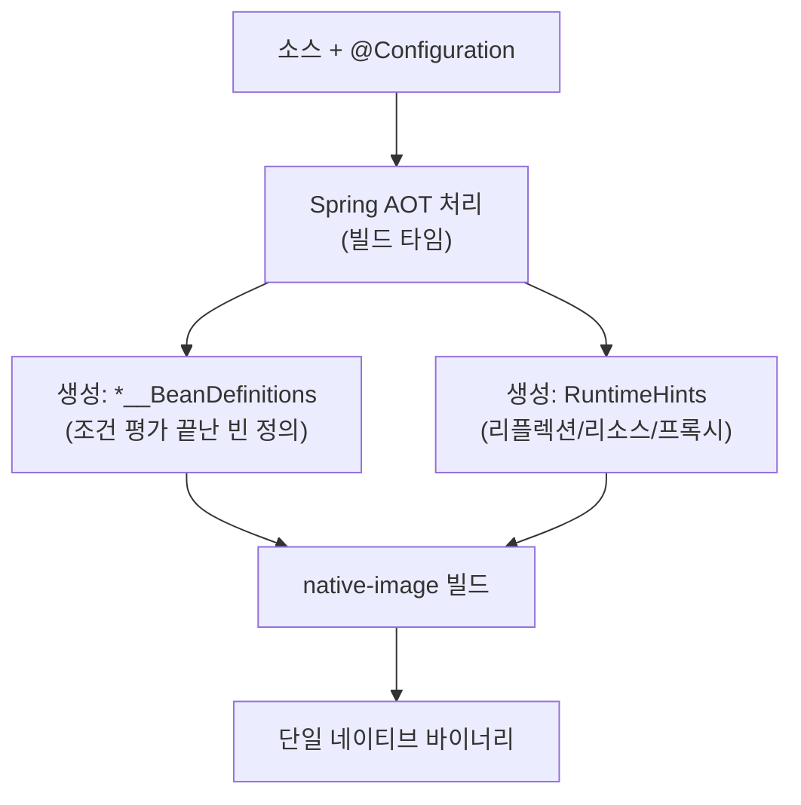

## 서버리스에서 JVM 시작이 너무 느리다

JVM 앱은 시작할 때 클래스 로딩 → 바이트코드 검증 → 인터프리터 실행 → JIT 워밍업을 거칩니다. 평소엔 괜찮지만 **서버리스(짧게 떴다 사라짐)**, **빠른 오토스케일링**, **CLI 도구**에선 이 수 초의 시작 지연과 큰 힙이 그대로 비용입니다. 콜드 스타트가 과금되고, 트래픽 급증 시 새 인스턴스가 0.05초가 아니라 5초 만에 뜨면 그 5초 동안 장애가 납니다.

그래서 발상을 뒤집습니다. **"런타임에 하던 일을 빌드 타임으로 당긴다."** 이게 GraalVM 네이티브 이미지와 Spring AOT의 본질이고, 이 글의 목표는 "빠르다더라"에서 멈추지 않고 **무엇이 빌드 타임으로 옮겨가는지, 그래서 무엇을 포기하는지**까지 내려가는 것입니다.

## 핵심 발상: 런타임을 빌드 타임으로 — closed-world

일반 JVM은 **열린 세계(open-world)** 를 가정합니다. 실행 중에 클래스를 새로 로딩하고, 리플렉션으로 임의의 멤버에 접근하고, 동적 프록시를 만들 수 있죠. 유연하지만, 그래서 시작할 때마다 "무엇이 있는지" 다시 알아내야 합니다.

GraalVM `native-image`는 정반대인 **닫힌 세계(closed-world)** 를 가정합니다.

> **빌드 시점에 도달 가능한(reachable) 모든 코드가 결정되어 있어야 한다.** 빌드 후에 클래스패스에 없던 클래스를 로딩하거나, 힌트 없이 리플렉션으로 접근하는 일은 허용되지 않는다.

빌더는 `main`에서 출발해 정적 도달 가능성 분석(points-to analysis)으로 실제로 쓰이는 코드만 추려 바이너리에 넣고, 나머지는 버립니다(dead code elimination). 그 결과:

- **시작 시간**: 수 초 → **수십 밀리초** (할 일을 이미 다 해뒀으니까)
- **메모리(RSS)**: 대폭 감소 (JIT·메타데이터·클래스로더 부담이 없음)
- **이미지 크기**: 작은 단일 실행 파일

대가도 분명합니다. **빌드가 길고(수 분), 리플렉션·프록시 같은 동적 기능은 빌드 타임에 미리 선언해야 하며, 장시간 고부하의 피크 처리량은 프로파일 기반으로 최적화하는 JIT를 못 따라갈 수 있습니다(PGO로 일부 만회).**

## 전체 파이프라인을 움직임으로

소스가 **Spring AOT 처리 → native-image 빌드(오래 걸리는 분석) → 즉시 부팅되는 단일 바이너리**로 흘러갑니다. <span style="color:#f08c00;font-weight:600">주황</span> 토큰이 긴 빌드 구간에서 한참 머무는 게 핵심이고, 그 대가로 마지막 바이너리는 <span style="color:#2f9e44;font-weight:600">초록</span>으로 번쩍 — 거의 즉시 뜹니다.

<div class="gn-pipeline" markdown="0">
<style>
.gn-pipeline{margin:1.4rem 0;overflow-x:auto}
.gn-pipeline svg{width:100%;max-width:720px;height:auto;display:block;margin:0 auto;font-family:inherit}
.gn-pipeline .lbl{fill:currentColor;font-size:13px;font-weight:600}
.gn-pipeline .sub{fill:currentColor;font-size:9.5px;opacity:.55}
.gn-pipeline .arr{stroke:currentColor;opacity:.35;stroke-width:1.5;fill:none}
.gn-pipeline rect.box{fill:none;stroke:currentColor;stroke-width:1.5;opacity:.35}
.gn-pipeline rect.g1{animation:gnpulse 5s ease-in-out infinite}
.gn-pipeline rect.g2{animation:gnpulse 5s ease-in-out infinite .6s}
.gn-pipeline rect.g3{animation:gnboot 5s ease-in-out infinite}
.gn-pipeline circle.tok{fill:#f08c00;animation:gnflow 5s ease-in-out infinite}
.gn-pipeline text.spark{fill:#2f9e44;font-size:11px;font-weight:700;animation:gnspark 5s ease-in-out infinite}
@keyframes gnflow{0%{transform:translateX(0);opacity:0}5%{opacity:1}16%{transform:translateX(150px)}24%{transform:translateX(250px)}74%{transform:translateX(430px)}86%{transform:translateX(560px);opacity:1}92%{opacity:0}100%{transform:translateX(560px);opacity:0}}
@keyframes gnpulse{0%,100%{opacity:.3}50%{opacity:.85}}
@keyframes gnboot{0%,80%{opacity:.3}88%{opacity:1;stroke:#2f9e44}100%{opacity:.45;stroke:#2f9e44}}
@keyframes gnspark{0%,82%{opacity:0}90%{opacity:1}100%{opacity:.9}}
</style>
<svg viewBox="0 0 700 180" role="img" aria-label="소스가 Spring AOT 처리와 native-image 빌드를 거쳐 즉시 부팅되는 단일 바이너리가 되는 파이프라인 애니메이션">
  <rect class="box g1" x="8"   y="46" width="190" height="64" rx="8"/>
  <rect class="box g2" x="238" y="46" width="220" height="64" rx="8"/>
  <rect class="box g3" x="498" y="46" width="194" height="64" rx="8"/>
  <text class="lbl" x="103" y="74" text-anchor="middle">소스 + Spring AOT</text>
  <text class="sub" x="103" y="90" text-anchor="middle">Bean 정의·힌트 생성</text>
  <text class="lbl" x="348" y="74" text-anchor="middle">native-image 빌드</text>
  <text class="sub" x="348" y="90" text-anchor="middle">closed-world 분석 (수 분)</text>
  <text class="lbl" x="595" y="74" text-anchor="middle">네이티브 바이너리</text>
  <text class="sub" x="595" y="90" text-anchor="middle">JVM 불필요</text>
  <text class="spark" x="595" y="36" text-anchor="middle">⚡ Started in 0.05s</text>
  <line class="arr" x1="198" y1="78" x2="238" y2="78"/>
  <line class="arr" x1="458" y1="78" x2="498" y2="78"/>
  <circle class="tok" cx="28" cy="78" r="7"/>
</svg>
</div>

## Spring AOT — 자동 구성을 "빌드 타임"에 끝내기

문제는 Spring이 런타임 리플렉션·동적 프록시·조건부 Bean 등록을 대량으로 쓴다는 점입니다. closed-world에선 이게 전부 걸림돌이죠. 그래서 **Spring AOT 엔진**이 빌드 타임에 다음을 미리 처리합니다.

- `@Configuration`·컴포넌트 스캔·`@Conditional`을 **빌드 타임에 평가**해, 최종적으로 등록될 Bean 정의를 Java 코드(`*__BeanDefinitions`)로 생성한다.
- 즉 [자동 구성]()의 `@Conditional` 평가가 **런타임이 아니라 빌드 타임에 한 번** 일어난다. 그래서 네이티브 이미지에선 자동 구성 후보 탐색·조건 평가 비용이 0이고, `--debug` 리포트 같은 동적 평가도 사라진다.
- 필요한 **리플렉션/리소스/프록시/직렬화 힌트**를 `RuntimeHints`로 수집해 `native-image`에 넘긴다.



핵심 차이를 한 줄로: **JVM에선 자동 구성이 매 부팅마다 돌고, 네이티브에선 빌드 때 딱 한 번 돌고 결과만 박제된다.** 그래서 시작이 빠른 것이지, 마법이 아닙니다.

## 빌드하기 — 두 경로

```bash
# 1) GraalVM(native-image)로 직접 컴파일 — 로컬에 GraalVM 필요
./gradlew nativeCompile
./build/native/nativeCompile/demo
# Started DemoApplication in 0.048 seconds

# 2) Buildpacks로 컨테이너 이미지 — 로컬 GraalVM 설치 불필요
./gradlew bootBuildImage
```

테스트도 네이티브로 돌려 힌트 누락을 빌드 단계에서 잡을 수 있습니다.

```bash
./gradlew nativeTest   # AOT 적용 상태로 테스트 실행
```

## 가장 흔한 함정: 런타임 리플렉션 → "빌드는 됐는데 실행하면 죽는다"

네이티브에서 가장 자주 데는 지점입니다. 라이브러리가 **문자열로 클래스를 찾아 리플렉션**하거나, JSON 바인딩 대상 DTO를 리플렉션으로 인스턴스화하는데 힌트가 없으면 — **빌드는 멀쩡히 끝나고, 런타임에야** 터집니다.

```text
com.oracle.svm.core.jdk.UnsupportedFeatureError:
  No instances of com.example.ExternalDto are allowed in the image heap ...
Caused by: java.lang.ClassNotFoundException: com.example.ExternalDto
```

JVM에선 잘 되던 코드라 더 헷갈립니다. 닫힌 세계에선 **"선언하지 않은 동적 접근은 존재하지 않는 것"** 이기 때문입니다.

해결은 힌트를 명시하는 것입니다. 간단한 바인딩 대상은 애너테이션으로:

```java
@Configuration
@RegisterReflectionForBinding({ ExternalDto.class, ApiResponse.class })
class NativeHintsConfig { }
```

복잡하면 `RuntimeHintsRegistrar`로 리플렉션·리소스·프록시를 직접 등록합니다.

```java
class MyHints implements RuntimeHintsRegistrar {
    @Override
    public void registerHints(RuntimeHints hints, ClassLoader cl) {
        hints.reflection().registerType(ExternalDto.class,
            MemberCategory.INVOKE_DECLARED_CONSTRUCTORS,
            MemberCategory.DECLARED_FIELDS);
        hints.resources().registerPattern("templates/*.json");
        hints.proxies().registerJdkProxy(MyInterface.class);
    }
}
// @ImportRuntimeHints(MyHints.class) 로 연결
```

손으로 다 찾기 어렵다면 **GraalVM Tracing Agent**로 JVM에서 한 번 돌려 실제 동적 접근을 수집합니다.

```bash
java -agentlib:native-image-agent=config-output-dir=src/main/resources/META-INF/native-image \
     -jar app.jar
# 앱의 주요 경로를 실제로 한 번 태운 뒤 종료 → reachability-metadata(json) 생성
```

요즘은 인기 라이브러리들이 **reachability-metadata 저장소**에 힌트를 함께 배포해, 직접 등록할 일이 줄었습니다. 그래도 "내가 만든 리플렉션/직렬화 경로"는 여전히 내 책임입니다.

## build-time vs run-time 초기화

`native-image`는 일부 클래스의 정적 초기화(static initializer)를 **빌드 타임에 실행해 그 상태를 이미지에 박제**할 수 있습니다(시작 더 빨라짐). 하지만 **빌드 머신의 환경값·난수 시드·열린 파일 핸들**이 박제되면 런타임에 엉뚱하게 동작합니다. 그래서 "빌드 타임 초기화" 대상은 신중히 골라야 하고, 시간/난수/네트워크에 의존하는 클래스는 런타임 초기화로 남겨야 합니다. Spring/GraalVM이 기본값을 잘 잡아주지만, 직접 `--initialize-at-build-time`을 넓게 거는 건 위험합니다.

## 트레이드오프 — 언제 쓰나

| 기준 | 네이티브 이미지 | 기존 JVM |
|------|----------------|----------|
| 시작 시간 | ⚡ 수십 ms | 수 초 |
| 메모리(RSS) | 작다 | 크다 |
| 빌드 시간 | 길다(수 분) | 짧다 |
| 피크 처리량(장시간) | JIT보다 낮을 수 있음(PGO로 만회) | 워밍업 후 최상 |
| 동적 기능(리플렉션/프록시) | 힌트 필요 | 자유 |
| 디버깅/관측 | 도구 제약 있음 | 성숙 |

**서버리스·짧은 수명·빠른 스케일·CLI**라면 네이티브가 강력합니다. 반대로 **장시간 고처리량 서버**라면, [가상 스레드]()를 얹은 일반 JVM이 여전히 합리적인 선택입니다 — 동시성 처리량은 가상 스레드로 끌어올리고, JIT 피크 성능은 유지하면서 네이티브의 빌드·동적 기능 제약을 피할 수 있으니까요.

## 면접/리뷰 단골 질문

- **Q. 네이티브 이미지가 빠른 근본 이유는?** → closed-world 가정으로 도달 가능 코드가 빌드 타임에 확정되고, 클래스 로딩·JIT 워밍업·자동 구성 평가 같은 *런타임 작업이 빌드 타임으로 이동*했기 때문.
- **Q. JVM에선 되던 코드가 네이티브에선 런타임에 죽는 전형적 원인은?** → 힌트 없는 리플렉션/리소스/프록시 접근. closed-world라 선언 안 한 동적 접근은 금지된다. → `@RegisterReflectionForBinding`/`RuntimeHintsRegistrar`/Tracing Agent.
- **Q. Spring AOT는 자동 구성을 어떻게 바꾸나?** → `@Conditional` 평가를 빌드 타임에 한 번 끝내 확정된 Bean 정의 코드를 생성한다. 런타임 조건 평가가 사라져 시작이 빨라진다.
- **Q. 빌드 타임 초기화의 위험은?** → 빌드 환경값/시드가 박제되어 런타임과 어긋날 수 있어, 시간·난수·네트워크 의존 클래스는 런타임 초기화로 남겨야 한다.

## 정리

- 네이티브 이미지 = GraalVM `native-image`가 **closed-world** 가정으로 도달 가능 코드만 모아 만든 OS 단일 실행 파일. **시작 수십 ms·메모리 적음**.
- Spring은 **Spring AOT**로 `@Conditional`·Bean 정의·리플렉션 힌트를 **빌드 타임에** 확정한다 → 자동 구성이 매 부팅 도는 JVM과 근본적으로 다르다.
- 최대 함정은 **힌트 없는 리플렉션** → 빌드는 통과하고 런타임에 사망. `@RegisterReflectionForBinding`·`RuntimeHintsRegistrar`·**Tracing Agent**로 해결.
- 빌드 타임 초기화는 신중히. 시간/난수/네트워크 의존 클래스는 런타임 초기화로.
- 서버리스·CLI엔 강력, 장시간 고처리량엔 가상 스레드 얹은 JVM이 여전히 유효 — 트레이드오프로 선택한다.
