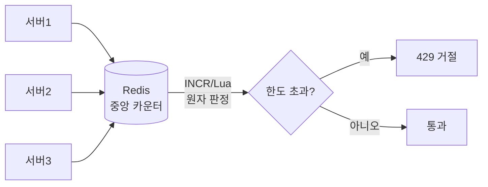

## 흐르는 데이터, 멈출 수 없는 트래픽

지금까지 다룬 알고리즘은 대부분 **유한한 입력**을 가정했습니다. 정렬할 배열, 탐색할 트리처럼요. 그런데 현대 시스템이 마주하는 데이터는 다릅니다 — API로 초당 수만 건씩 쏟아지는 요청, 끝을 모르는 로그 스트림, 무한히 흐르는 이벤트. 두 가지 질문이 생깁니다.

1. **어떻게 막을까?** 한 사용자가 초당 10만 번 때려도 시스템이 안 죽게 — **레이트 리미팅**.
2. **어떻게 요약할까?** 전체를 저장할 수 없는 무한 스트림에서 의미를 뽑아내기 — **스트리밍 알고리즘**.

둘 다 "전부 가질 수 없다"는 제약에서 출발합니다. 이 글은 폭주를 제어하는 네 가지 리미터와, 무한 스트림에서 공정한 표본을 뽑는 reservoir sampling을 다룹니다.

## 토큰 버킷 — 평소엔 너그럽게, 폭주는 단호하게

가장 널리 쓰이는 리미터. **버킷에 토큰이 일정 속도(refill rate)로 차오르고**, 요청은 토큰을 1개 소비합니다. 토큰이 있으면 통과, 비었으면 거절(또는 대기). 버킷 용량(capacity)이 곧 **버스트 허용량**입니다 — 한동안 안 쓰면 토큰이 가득 차서, 갑자기 몰리는 정당한 트래픽을 한 번에 받아줄 수 있습니다.

<div class="rate19-tb" markdown="0">
<style>
.rate19-tb{margin:1.4rem 0;overflow-x:auto}
.rate19-tb svg{width:100%;max-width:600px;height:auto;display:block;margin:0 auto;font-family:inherit}
.rate19-tb .lbl{fill:currentColor;font-size:11px;font-weight:600}
.rate19-tb .sub{fill:currentColor;font-size:9.5px;opacity:.6}
.rate19-tb .bkt{fill:none;stroke:currentColor;stroke-width:1.8;opacity:.55}
.rate19-tb .drop{fill:#1971c2;opacity:0}
.rate19-tb .d1{animation:rate19drop 5s linear infinite}
.rate19-tb .d2{animation:rate19drop 5s linear infinite;animation-delay:1.6s}
.rate19-tb .d3{animation:rate19drop 5s linear infinite;animation-delay:3.2s}
@keyframes rate19drop{0%{opacity:0;transform:translateY(0)}4%{opacity:1}24%{opacity:1;transform:translateY(60px)}30%{opacity:0;transform:translateY(60px)}100%{opacity:0;transform:translateY(60px)}}
.rate19-tb .tok{fill:#f08c00}
.rate19-tb .lvl{animation:rate19lvl 5s ease-in-out infinite}
@keyframes rate19lvl{0%{transform:scaleY(.4)}40%{transform:scaleY(1)}55%{transform:scaleY(.3)}70%{transform:scaleY(.7)}100%{transform:scaleY(.4)}}
.rate19-tb .req{fill:#2f9e44;opacity:0}
.rate19-tb .ok{animation:rate19ok 5s linear infinite}
@keyframes rate19ok{0%,52%{opacity:0;transform:translate(0,0)}56%{opacity:1}70%{opacity:1;transform:translate(120px,0)}76%,100%{opacity:0}}
.rate19-tb .rej{fill:#e03131;opacity:0;animation:rate19rej 5s linear infinite}
@keyframes rate19rej{0%,80%{opacity:0;transform:translate(0,0)}84%{opacity:1}94%{opacity:1;transform:translate(40px,40px) rotate(20deg)}100%{opacity:0}}
</style>
<svg viewBox="0 0 600 220" role="img" aria-label="토큰이 일정 속도로 버킷에 차오르고 요청이 토큰을 소비하며 통과하고 토큰이 비면 요청이 거절되는 토큰 버킷 애니메이션">
  <text class="sub" x="130" y="22" text-anchor="middle">refill (일정 속도로 토큰 보충)</text>
  <rect class="drop d1" x="122" y="30" width="14" height="14" rx="3"/>
  <rect class="drop d2" x="122" y="30" width="14" height="14" rx="3"/>
  <rect class="drop d3" x="122" y="30" width="14" height="14" rx="3"/>
  <rect class="bkt" x="80" y="100" width="100" height="90" rx="6"/>
  <rect class="tok lvl" x="84" y="104" width="92" height="82" rx="4" style="transform-origin:130px 186px;opacity:.8"/>
  <text class="lbl" x="130" y="150" text-anchor="middle" fill="#fff">tokens</text>
  <text class="sub" x="130" y="206" text-anchor="middle">capacity = 버스트 허용</text>
  <text class="sub" x="340" y="60" text-anchor="middle">요청 도착</text>
  <rect class="req ok" x="320" y="100" width="18" height="18" rx="3"/>
  <rect class="req rej" x="320" y="150" width="18" height="18" rx="3"/>
  <text class="lbl" x="470" y="113" fill="#2f9e44">통과 (토큰 소비)</text>
  <text class="lbl" x="430" y="200" fill="#e03131">429 거절 (토큰 없음)</text>
</svg>
</div>

의사코드는 놀랍도록 짧습니다. 매 요청마다 "지난 시각 이후 흐른 시간 × rate"만큼 토큰을 보충하고, 1개를 쓸 수 있는지 봅니다.

```python
def allow(self):
    now = time()
    self.tokens = min(self.capacity,
                      self.tokens + (now - self.last) * self.rate)
    self.last = now
    if self.tokens >= 1:
        self.tokens -= 1
        return True          # 통과
    return False             # 429 Too Many Requests
```

**리키 버킷(leaky bucket)** 은 사촌입니다. 요청이 큐에 쌓이고 **일정 속도로 새어나가(처리)** 출력 속도를 매끄럽게 만듭니다. 토큰 버킷이 버스트를 *허용*한다면, 리키 버킷은 버스트를 *평탄화*합니다 — 트래픽 셰이핑에 적합하죠.

## 윈도우 기반 — 고정 윈도우의 함정과 슬라이딩의 해법

더 직관적인 접근: "1분에 100건"처럼 시간 창에서 카운트. 하지만 **고정 윈도우(fixed window)** 엔 고약한 경계 문제가 있습니다. 12:00:59에 100건, 12:01:00에 100건을 쏘면 **2초 사이에 200건** — 한도의 2배가 통과합니다. 창이 칼같이 리셋되기 때문입니다.

<div class="rate19-win" markdown="0">
<style>
.rate19-win{margin:1.4rem 0;overflow-x:auto}
.rate19-win svg{width:100%;max-width:660px;height:auto;display:block;margin:0 auto;font-family:inherit}
.rate19-win .lbl{fill:currentColor;font-size:11px;font-weight:600}
.rate19-win .sub{fill:currentColor;font-size:9.5px;opacity:.6}
.rate19-win .axis{stroke:currentColor;opacity:.3;stroke-width:1.2}
.rate19-win .win{fill:#1971c2;opacity:.12;stroke:#1971c2;stroke-width:1.4}
.rate19-win .slide{animation:rate19slide 6s linear infinite}
@keyframes rate19slide{0%{transform:translateX(0)}100%{transform:translateX(360px)}}
.rate19-win .ev{fill:#2f9e44}
.rate19-win .old{animation:rate19old 6s linear infinite}
@keyframes rate19old{0%,40%{fill:#2f9e44;opacity:.9}55%{fill:#e03131}70%,100%{opacity:.2;fill:currentColor}}
</style>
<svg viewBox="0 0 660 170" role="img" aria-label="슬라이딩 윈도우가 시간축을 따라 오른쪽으로 이동하며 창을 벗어난 옛 요청은 흐려지고 창 안의 요청만 카운트되는 애니메이션">
  <line class="axis" x1="20" y1="120" x2="640" y2="120"/>
  <text class="sub" x="640" y="140" text-anchor="end">시간 →</text>
  <rect class="win slide" x="20" y="50" width="200" height="70" rx="6"/>
  <text class="lbl slide" x="120" y="44" text-anchor="middle" fill="#1971c2">슬라이딩 윈도우 (최근 1분)</text>
  <circle class="ev old" cx="60"  cy="95" r="8"/>
  <circle class="ev old" cx="110" cy="95" r="8" style="animation-delay:.4s"/>
  <circle class="ev old" cx="170" cy="95" r="8" style="animation-delay:1s"/>
  <circle class="ev" cx="250" cy="95" r="8"/>
  <circle class="ev" cx="320" cy="95" r="8"/>
  <circle class="ev" cx="400" cy="95" r="8"/>
  <text class="sub" x="330" y="158" text-anchor="middle">창이 지나가면 옛 요청은 카운트에서 빠진다 — 경계 폭주 없음</text>
</svg>
</div>

**슬라이딩 윈도우 로그**는 각 요청의 타임스탬프를 저장하고 "지금-60초" 이전 것을 버린 뒤 남은 개수를 셉니다 — 정확하지만 메모리가 요청 수에 비례합니다. **슬라이딩 윈도우 카운터**는 현재·직전 고정 윈도우의 카운트를 **가중 평균**해 근사합니다 — 정확도와 메모리의 절충으로, 실무에서 가장 많이 쓰입니다.

| 방식 | 정확도 | 메모리 | 버스트 | 비고 |
|------|--------|--------|--------|------|
| 고정 윈도우 | 낮음(경계 2배) | O(1) | 경계서 폭주 | 가장 단순 |
| 슬라이딩 로그 | 정확 | O(요청수) | 없음 | 메모리 비쌈 |
| 슬라이딩 카운터 | 근사 | O(1) | 거의 없음 | **실무 표준** |
| 토큰 버킷 | — | O(1) | **제어된 허용** | API 게이트웨이 |

## 분산 환경 — 리미터는 어디에 사나

서버가 여러 대면 "내 서버에서만 100건"은 의미가 없습니다. 그래서 카운터를 **중앙 저장소**(보통 Redis)에 둡니다. `INCR` + `EXPIRE`로 원자적 카운트를 하거나, Lua 스크립트로 토큰 버킷 로직을 원자 실행하죠. AWS **API Gateway**는 토큰 버킷 기반 쓰로틀링(rate·burst)을 관리형으로 제공하고, ALB·CloudFront·WAF도 비슷한 레이트 기반 규칙을 둡니다.



## 스트리밍 — 전부 저장할 수 없을 때

이제 두 번째 질문. 무한 스트림에서 표본을 뽑되, **언제 끝날지 모르고 다 저장할 수도 없다**면? 가령 오늘 들어온 로그 중 정확히 1,000개를 **균등 확률로** 뽑고 싶은데, 전체 개수 $N$을 미리 모른다면요.

### Reservoir Sampling — 한 번 훑고 공정하게 k개

**Algorithm R**(Vitter)이 우아하게 풉니다. 크기 $k$의 저수지(reservoir)를 앞 $k$개로 채운 뒤, $i$번째($i>k$) 원소가 오면 $[1,i]$에서 난수 $j$를 뽑아 $j \le k$이면 저수지의 $j$번째를 새 원소로 교체합니다.

```python
def reservoir(stream, k):
    res = []
    for i, x in enumerate(stream):
        if i < k:
            res.append(x)
        else:
            j = randint(0, i)        # 0..i 균등
            if j < k:
                res[j] = x           # 확률 k/(i+1)로 교체
    return res
```

왜 공정할까요? $i$번째 원소가 최종 저수지에 살아남을 확률을 따져보면, 임의의 원소가 들어올 확률 $\frac{k}{i}$ 과 이후 모든 원소에 의해 쫓겨나지 *않을* 확률의 곱이 됩니다:

$$P(\text{원소 } i \text{ 생존}) = \frac{k}{i} \times \prod_{t=i+1}^{N}\left(1 - \frac{k}{t}\cdot\frac{1}{k}\right) = \frac{k}{N}$$

모든 원소가 정확히 $\frac{k}{N}$ — 완벽히 균등합니다. **단 한 번의 패스, $O(N)$ 시간, $O(k)$ 공간**, 그리고 $N$을 몰라도 됩니다. 무한 스트림 표본추출의 정석입니다.

이 글에서 다룬 [확률적 자료구조]()(Bloom·HyperLogLog·Count-Min)도 같은 철학입니다 — **전부 저장하는 대신, 적은 메모리로 충분히 좋은 근사**. AWS **Kinesis**·**Managed Service for Apache Flink** 같은 스트림 처리 서비스가 바로 이런 한 패스 알고리즘 위에서 집계·표본·이상탐지를 굴립니다.

## 프로덕션에서 마주치는 함정

| 함정 | 증상 | 해법 |
|------|------|------|
| 고정 윈도우 경계 | 한도의 2배가 순간 통과 | 슬라이딩 카운터로 |
| 분산 리미터 경쟁 | read-modify-write 레이스로 한도 초과 | Redis Lua/INCR 원자 연산 |
| 클라 시계 신뢰 | 위조된 타임스탬프로 우회 | 서버 시각 기준 |
| 429에 재시도 폭주 | 거절이 더 큰 폭주를 부름 | `Retry-After` + 지수 백오프+지터 |
| 전역 단일 한도 | 큰손이 모두를 굶김 | 사용자/키별 버킷, 공정 큐잉 |

## 면접/리뷰 단골 질문

- **Q. 토큰 버킷 vs 리키 버킷?** → 토큰=버스트 허용(쌓인 토큰 한 번에 소비), 리키=출력 속도 평탄화(큐에서 일정 속도 누출).
- **Q. 고정 윈도우의 문제와 해법?** → 경계에서 한도 2배 통과. 슬라이딩 윈도우 카운터(현재·직전 가중평균)로 O(1) 메모리에 근사 해결.
- **Q. 분산 레이트 리미팅 핵심?** → 카운터를 중앙(Redis)에 두고 **원자 연산**(Lua/INCR). 서버별 카운트는 무의미.
- **Q. Reservoir sampling이 균등한 이유?** → $i$번째가 $k/i$로 들어오고 이후 교체를 견뎌 최종 생존확률이 모두 $k/N$. 한 패스 O(N) 시간·O(k) 공간, N 몰라도 됨.
- **Q. 429 받은 클라이언트의 올바른 행동?** → `Retry-After` 존중 + 지수 백오프 + 지터. 즉시 재시도는 폭주 가중.

## 정리

- **레이트 리미팅**은 "전부 받을 수 없다"의 해법 — **토큰 버킷**(버스트 허용)이 사실상 표준, 윈도우 방식은 고정→슬라이딩으로 경계 폭주를 잡는다.
- 분산 환경에선 카운터를 **중앙에 두고 원자 연산**으로 판정한다(Redis·API Gateway).
- **스트리밍 알고리즘**은 "전부 저장할 수 없다"의 해법 — **reservoir sampling**은 한 패스·O(k) 공간으로 무한 스트림에서 균등 표본을 뽑는다.
- 두 주제 모두 **유한한 자원으로 무한한 흐름을 다루는** 현대 시스템의 공통 과제다.

> [확률적 자료구조]()에서 시작한 "근사로 충분하다"의 철학이 스트림으로 확장됐습니다. 시리즈 마지막 글은 임베딩과 그래프로 의미를 검색하는 [벡터 검색(ANN/HNSW)과 PageRank]()입니다.
</content>
