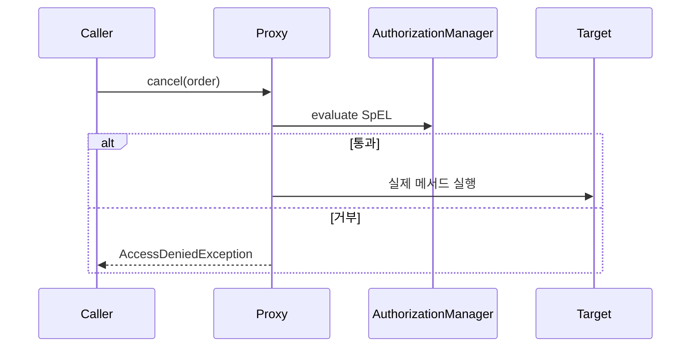

## URL 패턴만으로는 부족할 때

URL 기반 인가는 "어떤 경로를 누가 호출하는가"는 막지만, 서비스 메서드가 여러 경로·스케줄러·이벤트에서 재사용되면 경로 단위 규칙이 흩어진다. **메서드 시큐리티**는 권한 규칙을 그 로직 바로 옆에 선언한다.

## 동작 — 애너테이션은 AOP 프록시가 가로챈다

`@EnableMethodSecurity`를 켜면 Spring은 `@PreAuthorize`가 붙은 빈을 **프록시**로 감싼다. 호출이 프록시를 지날 때 `AuthorizationManager`가 SpEL 식을 평가하고, 실패하면 본문 실행 전에 `AccessDeniedException`을 던진다.

```java
@PreAuthorize("hasRole('ADMIN') or #order.ownerId == authentication.name")
public void cancel(Order order) { ... }
```



## SpEL로 무엇을 검사하나

- `hasRole`/`hasAuthority` — 권한 보유
- `#param` — 메서드 인자 참조(위 `#order`)
- `authentication` — 현재 인증 주체
- `@PostAuthorize`는 **반환값**(`returnObject`)을 검사한다. 단, 이미 실행된 뒤라 부수효과는 되돌릴 수 없다.

## 운영 함정

- **self-invocation**: 같은 클래스 내부에서 `this.cancel()`로 호출하면 프록시를 거치지 않아 **권한 검사가 통째로 건너뛰어진다**. 다른 빈을 통해 호출해야 한다.
- **@PostAuthorize의 비용**: 대량 컬렉션을 반환한 뒤 거부하면 이미 DB·메모리를 다 쓴 후다. 가능하면 조회 단계에서 소유권을 WHERE로 거른다.

## 면접 한 줄 Q&A

- Q. `@PreAuthorize`가 안 먹는다? → 내부 self-invocation이거나 `@EnableMethodSecurity` 누락. 프록시를 경유하는지부터 본다.
