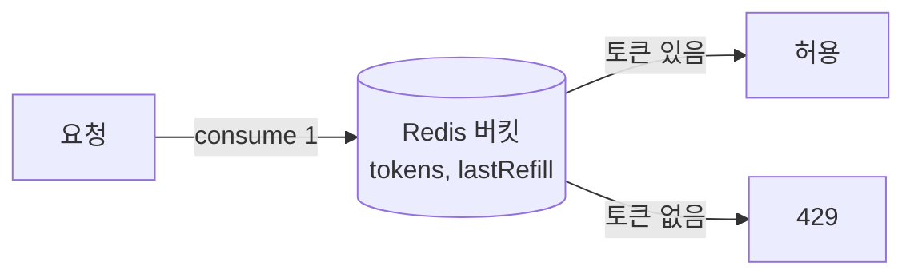

## 인스턴스가 늘면 한도가 N배로 샌다

토큰 버킷을 각 서버의 메모리에 두면, 서버가 3대일 때 "분당 100" 한도가 실제로는 300이 된다. 한도는 **사용자/키 단위 전역**이어야 하므로, 버킷 상태를 모든 인스턴스가 공유하는 한 곳(Redis)에 둬야 한다.

## 토큰 버킷의 본질

버킷에 토큰이 일정 속도로 차고, 요청은 토큰을 1개 소비한다. 토큰이 없으면 거부. 누적 허용(버스트)과 평균 속도를 동시에 표현하는 게 장점이다.



## 왜 원자 연산이어야 하나

"읽고 → 계산하고 → 쓰기"를 세 번의 왕복으로 하면, 두 요청이 동시에 같은 잔량을 읽어 둘 다 통과하는 경합이 생긴다. 그래서 **읽기+리필+소비를 하나의 원자 단위**(Redis Lua 스크립트나 전용 라이브러리)로 실행한다.

```lua
-- KEYS[1]=bucket, ARGV=now, rate, capacity
-- 리필량 계산 → 소비 가능하면 차감하고 1, 아니면 0  (전체가 원자적으로 실행)
```

## 리필은 서버 시각이 아니라 저장된 타임스탬프로

각 인스턴스의 벽시계는 미세하게 다르다. 마지막 리필 시각을 **버킷 안에 저장**하고 경과 시간으로 토큰을 채워야, 어느 인스턴스가 처리해도 결과가 같다.

## 운영 함정

- **Redis 왕복 지연**이 모든 요청에 더해진다 → 같은 키에 대한 호출은 파이프라인/로컬 캐시로 완화.
- **키 카디널리티 폭발**: 사용자×엔드포인트로 키를 쪼개면 Redis 메모리가 늘어난다. TTL로 유휴 버킷을 회수한다.

## 핵심 요약

분산 레이트리밋의 핵심은 "상태 공유 + 원자적 consume + 시각 독립 리필"이다. 로컬 버킷은 구현은 쉽지만 인스턴스 수만큼 한도가 새어 운영에서 무의미하다.
