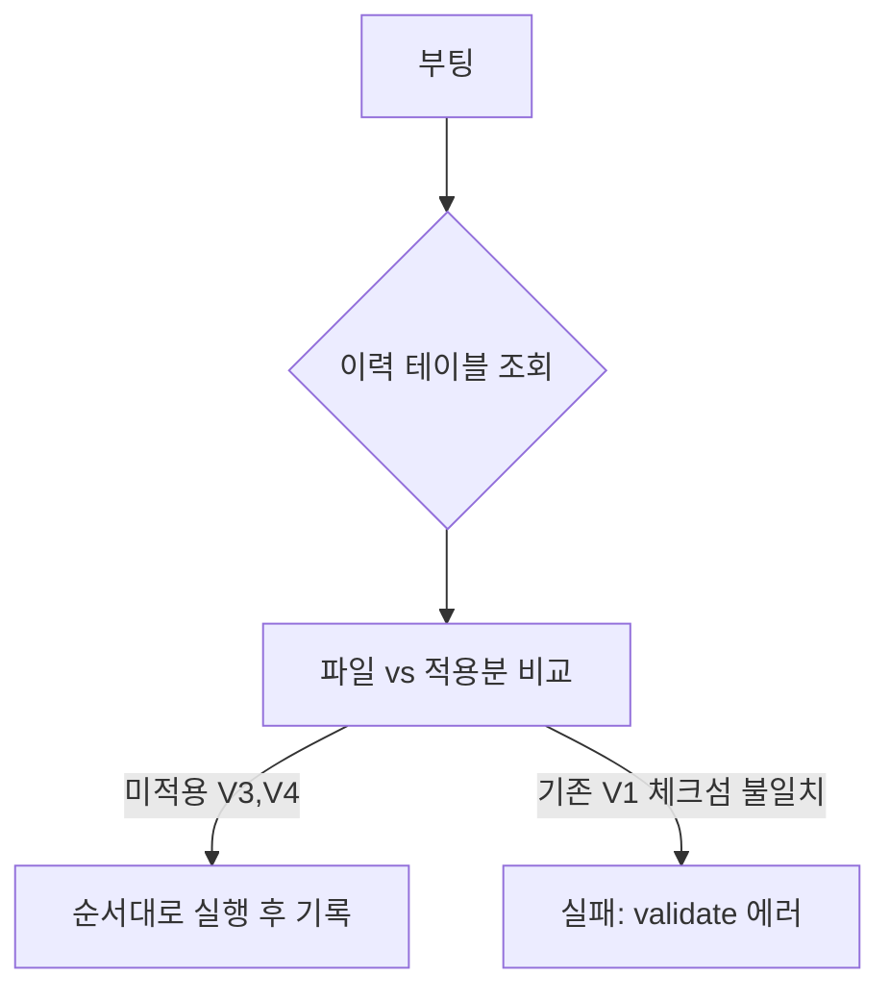

## 코드는 git, 그럼 스키마는?

애플리케이션 코드는 버전 관리하면서 DB 스키마는 누군가 콘솔에서 직접 바꾸면, 환경마다 스키마가 갈라진다. 마이그레이션 도구는 **스키마 변경을 버전이 매겨진 파일**로 만들어 코드처럼 추적한다.

## 동작 — 이력 테이블과 체크섬

도구는 전용 이력 테이블(예: `flyway_schema_history`)에 적용한 마이그레이션의 버전·체크섬·성공 여부를 기록한다. 부팅 시 디렉터리의 마이그레이션 파일과 이력을 대조해 **아직 적용 안 된 버전만** 순서대로 실행한다.

## 왜 적용된 파일을 수정하면 안 되나

각 파일은 내용 해시(체크섬)가 이력에 저장된다. 이미 적용된 `V1__init.sql`을 나중에 고치면 체크섬이 어긋나 `validate`가 실패한다. 이는 **"운영에 적용된 과거를 바꾸지 말라"**는 강제다. 변경이 필요하면 항상 새 버전(`V5__...`)을 추가한다 — forward-only.

## baseline과 repeatable

- **baseline**: 이미 운영 중인 기존 DB에 도구를 도입할 때, 현재 상태를 기준점으로 찍어 그 이전 버전을 적용 대상에서 제외한다.
- **repeatable(`R__`)**: 뷰·함수처럼 매번 덮어써도 되는 객체는 체크섬이 바뀔 때마다 재실행된다.

## 운영 함정

- **롤백은 기본 제공이 아니다**(상용 기능). 잘못된 마이그레이션은 "되돌리는 새 마이그레이션"으로 전진 복구한다.
- **장시간 DDL**(대형 테이블 인덱스 추가)이 부팅을 막고 락을 잡을 수 있다 → 무중단 변경은 별도 절차로 분리.

## 핵심 요약

마이그레이션 도구의 안전성은 "이력 테이블 + 체크섬 + forward-only"에서 나온다. 적용된 과거는 불변으로 두고, 변경은 항상 새 버전으로 쌓는다.
