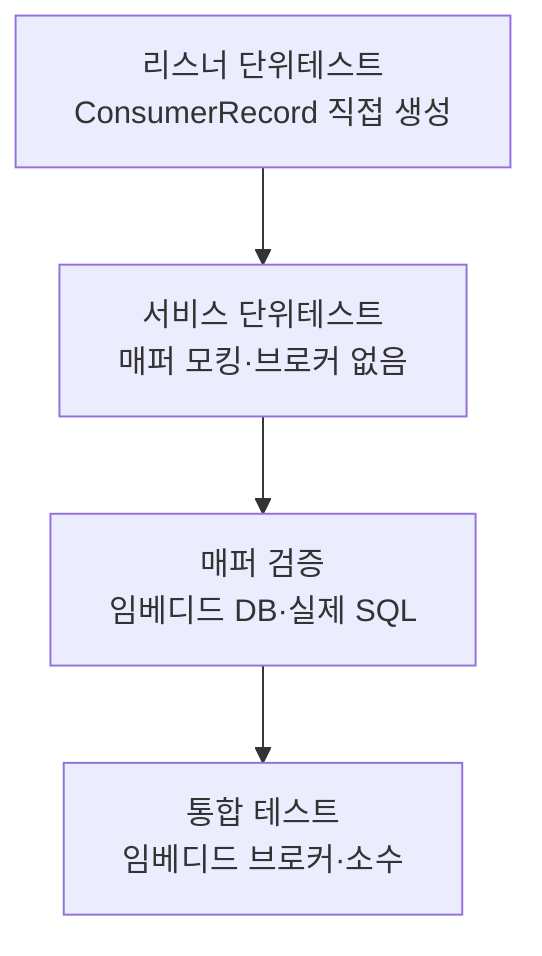

그 주엔 메시지 소비 코드와 함께 리스너·서비스·리포지토리 테스트를 대거 보강했다. 그러다 마주친 질문은 단순하다. **"브로커를 안 띄우고 컨슈머를 어떻게 테스트하지?"** 답은 테스트 기법이 아니라 설계에 있다. 컨슈머를 제대로 나눠두면 대부분의 검증에 카프카가 필요 없다.

## 컨슈머는 세 가지 일을 한다

하나의 `@KafkaListener` 메서드 안에는 보통 세 책임이 뒤섞여 있다.

1. **수신·역직렬화** — 브로커에서 레코드를 받아 객체로 푼다.
2. **비즈니스 처리** — 받은 데이터로 도메인 로직을 수행한다.
3. **영속화** — DB에 쓰거나 읽는다.

이 셋이 한 메서드에 붙어 있으면 테스트하려고 브로커, 직렬화기, DB가 전부 필요해진다. 핵심은 **얇은 리스너, 두꺼운 서비스**다. 리스너는 역직렬화와 디스패치만 하고 비즈니스 로직은 서비스로 밀어낸다. 그러면 서비스는 그냥 평범한 빈이고, 평범한 단위 테스트의 대상이 된다.

```java
@Component
@RequiredArgsConstructor
public class OrderEventListener {
    private final OrderService orderService;

    @KafkaListener(topics = "order-events", groupId = "order-worker")
    public void onMessage(OrderEvent event) {
        // 리스너는 디스패치만. 로직 없음.
        orderService.handle(event);
    }
}

@Service
@RequiredArgsConstructor
public class OrderService {
    private final OrderMapper orderMapper;

    public void handle(OrderEvent event) {
        Order order = Order.from(event);
        orderMapper.upsert(order);
    }
}
```

## 피라미드를 메시징에 적용한다



대부분의 케이스는 **서비스 단위 테스트**로 잡는다. 매퍼를 모킹하고 입력에 따른 분기·예외·필드 매핑을 검증한다. 빠르고 결정적이다.

```java
@ExtendWith(MockitoExtension.class)
class OrderServiceTest {
    @Mock OrderMapper orderMapper;
    @InjectMocks OrderService service;

    @Test
    void 신규주문이면_upsert를_호출한다() {
        OrderEvent event = new OrderEvent(1L, "NEW", 5000);
        service.handle(event);
        verify(orderMapper).upsert(argThat(o -> o.getId() == 1L));
    }
}
```

리스너 자체도 브로커 없이 검증할 수 있다. `ConsumerRecord`를 직접 만들거나 역직렬화된 객체를 넘겨 호출하면 된다.

```java
@Test
void 리스너는_서비스로_위임만_한다() {
    OrderService service = mock(OrderService.class);
    OrderEventListener listener = new OrderEventListener(service);

    OrderEvent event = new OrderEvent(1L, "NEW", 5000);
    listener.onMessage(event);

    verify(service).handle(event);
}
```

매퍼는 H2 같은 임베디드 DB에 실제 SQL을 날려 `resultMap` 매핑과 동적 쿼리를 검증한다. 마지막으로 **임베디드 브로커 통합 테스트**는 직렬화·컨테이너 설정·groupId가 실제로 맞물리는지 확인하는 용도로 소수만 둔다. 통합 테스트는 비싸므로 "배선 검증"으로 범위를 좁힌다.

## 운영 함정

**ack/예외 경로를 빼먹는다.** 정상 케이스만 테스트하면 정작 운영에서 터지는 곳을 못 막는다. 서비스가 예외를 던졌을 때 리스너가 그걸 삼키는지(메시지 유실) 재전파하는지(재시도 유발)는 단위 테스트로 명시해야 한다.

```java
@Test
void 처리실패시_예외를_재전파해_재시도되게_한다() {
    OrderService service = mock(OrderService.class);
    doThrow(new RuntimeException("db down")).when(service).handle(any());
    OrderEventListener listener = new OrderEventListener(service);

    assertThatThrownBy(() -> listener.onMessage(new OrderEvent(1L, "NEW", 5000)))
        .isInstanceOf(RuntimeException.class);
}
```

또 하나, **수동 ack를 쓰는데 ack 호출을 테스트하지 않으면** 오프셋이 커밋되지 않아 같은 메시지를 영원히 다시 받는 사고가 난다. `Acknowledgment`를 모킹해 `verify(ack).acknowledge()`로 확인한다.

## 핵심 요약

- 리스너는 얇게(디스패치만), 서비스는 두껍게. 그러면 로직은 브로커 없이 테스트된다.
- 서비스 단위 테스트로 대부분을 잡고, 임베디드 브로커 통합 테스트는 배선 검증용 소수로 제한한다.
- 정상 경로뿐 아니라 예외 재전파·ack 호출까지 명시적으로 검증한다.

**면접 한 줄 Q&A.** "카프카 컨슈머를 어떻게 테스트하나?" → "리스너에서 비즈니스 로직을 분리해 서비스 단위 테스트로 대부분 커버하고, 직렬화·컨테이너 배선만 임베디드 브로커 통합 테스트로 검증한다. 예외 재전파와 ack 호출은 반드시 단위 테스트로 못 박는다."
