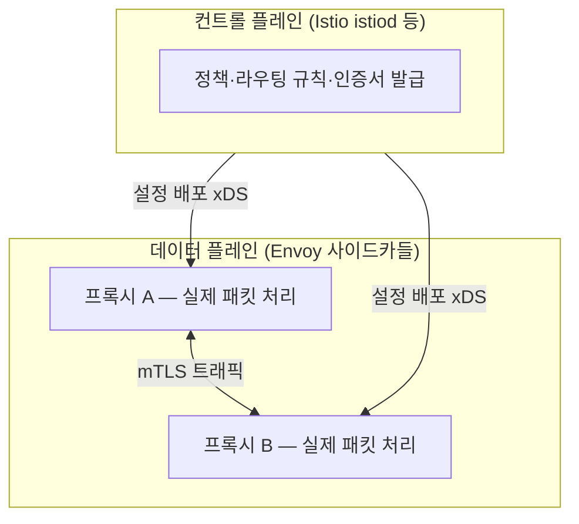

## 네트워크가 애플리케이션 안으로 들어오다

지금까지 이 시리즈는 패킷·라우팅·TCP·TLS처럼 **OS와 네트워크 장비가 책임지던 계층**을 다뤘습니다. 그런데 마이크로서비스 시대가 되면서 질문이 바뀌었습니다. 서비스 수백 개가 서로 호출할 때 **재시도·타임아웃·암호화·관측·트래픽 분할**을 누가 책임지나? 매 서비스 코드에 넣자니 언어마다 중복되고 버전이 어긋납니다.

현대 네트워킹의 답은 세 갈래입니다. **(1) 사이드카 프록시**(서비스 메시)로 네트워크 로직을 앱 옆으로 빼고, **(2) eBPF**로 커널 자체를 프로그래밍 가능하게 만들고, **(3) zero trust**로 "내부망은 안전"이라는 전제를 폐기합니다. 이 글은 이 셋이 각각 무엇을 해결하는지, 그 대가는 무엇인지를 다룹니다.

## 서비스 메시 — 트래픽을 가로채는 사이드카

서비스 메시는 각 애플리케이션 파드 **옆에 프록시(Envoy)를 붙이고**, 그 서비스의 모든 인/아웃 트래픽이 프록시를 거치게 만듭니다. 앱은 평소처럼 `localhost`로 호출할 뿐인데, 프록시가 **mTLS 암호화·재시도·서킷브레이커·메트릭 수집**을 투명하게 대신합니다. 앱 코드는 한 줄도 안 바뀝니다.

아래는 핵심입니다. 앱 A가 보낸 평문 요청을 **사이드카가 가로채(intercept)** mTLS로 감싸 상대 사이드카로 보내고, 받는 쪽 사이드카가 풀어 앱 B에 평문으로 전달합니다. 네트워크 로직이 앱 *밖*으로 빠졌습니다.

<div class="mesh-sc" markdown="0">
<style>
.mesh-sc{margin:1.4rem 0;overflow-x:auto}
.mesh-sc svg{width:100%;max-width:720px;height:auto;display:block;margin:0 auto;font-family:inherit}
.mesh-sc .lbl{fill:currentColor;font-size:11.5px;font-weight:600}
.mesh-sc .sub{fill:currentColor;font-size:9.5px;opacity:.6}
.mesh-sc .app{fill:none;stroke:currentColor;stroke-width:1.6;opacity:.5}
.mesh-sc .car{fill:none;stroke:#1971c2;stroke-width:1.8;opacity:.7}
.mesh-sc .arr{stroke:currentColor;opacity:.3;stroke-width:1.3;fill:none}
.mesh-sc .plain{fill:#f08c00}
.mesh-sc .enc{fill:#2f9e44}
.mesh-sc .s1{animation:meshseg 5s linear infinite}
.mesh-sc .s2{animation:meshseg 5s linear infinite}
.mesh-sc .s3{animation:meshseg 5s linear infinite}
@keyframes meshseg{0%{opacity:0}100%{opacity:0}}
.mesh-sc .leg1{animation:meshl1 5s linear infinite}
.mesh-sc .leg2{animation:meshl2 5s linear infinite}
.mesh-sc .leg3{animation:meshl3 5s linear infinite}
@keyframes meshl1{0%{transform:translateX(0);opacity:0}3%{opacity:1}28%{transform:translateX(95px);opacity:1}33%{opacity:0}100%{opacity:0}}
@keyframes meshl2{0%{opacity:0}33%{opacity:0;transform:translateX(0)}36%{opacity:1}64%{transform:translateX(300px);opacity:1}69%{opacity:0}100%{opacity:0}}
@keyframes meshl3{0%{opacity:0}69%{opacity:0;transform:translateX(0)}72%{opacity:1}97%{transform:translateX(95px);opacity:1}100%{opacity:0}}
</style>
<svg viewBox="0 0 720 180" role="img" aria-label="앱이 보낸 평문 요청을 사이드카가 가로채 mTLS로 암호화해 상대 사이드카로 보내고 받는 쪽이 복호화해 앱에 전달하는 서비스 메시 애니메이션">
  <rect class="car" x="20"  y="50" width="320" height="90" rx="10"/>
  <rect class="car" x="380" y="50" width="320" height="90" rx="10"/>
  <text class="sub" x="180" y="44">파드 A</text>
  <text class="sub" x="540" y="44">파드 B</text>
  <rect class="app" x="36"  y="70" width="120" height="54" rx="8"/>
  <rect class="app" x="204" y="70" width="120" height="54" rx="8"/>
  <rect class="app" x="396" y="70" width="120" height="54" rx="8"/>
  <rect class="app" x="564" y="70" width="120" height="54" rx="8"/>
  <text class="lbl" x="96"  y="101" text-anchor="middle">앱 A</text>
  <text class="lbl" x="264" y="95" text-anchor="middle">사이드카</text>
  <text class="sub" x="264" y="111" text-anchor="middle">Envoy</text>
  <text class="lbl" x="456" y="95" text-anchor="middle">사이드카</text>
  <text class="sub" x="456" y="111" text-anchor="middle">Envoy</text>
  <text class="lbl" x="624" y="101" text-anchor="middle">앱 B</text>
  <line class="arr" x1="156" y1="97" x2="204" y2="97"/>
  <line class="arr" x1="324" y1="97" x2="396" y2="97"/>
  <line class="arr" x1="516" y1="97" x2="564" y2="97"/>
  <text class="sub" x="360" y="166" text-anchor="middle">평문(주황)은 파드 안에서만 · 파드 사이는 mTLS(초록)</text>
  <rect class="plain leg1" x="160" y="90" width="16" height="14" rx="2"/>
  <rect class="enc leg2"   x="328" y="90" width="16" height="14" rx="2"/>
  <rect class="plain leg3" x="520" y="90" width="16" height="14" rx="2"/>
</svg>
</div>

이 가로채기는 보통 iptables(또는 eBPF)가 파드의 트래픽을 사이드카 포트로 **리다이렉트**해서 이뤄집니다. 사이드카가 하는 일은 사실 [TLS]()의 mTLS, [로드 밸런싱]()의 L7 분배, [리버스 프록시]()를 한데 모은 것입니다.

## 데이터 플레인 vs 컨트롤 플레인

메시의 구조는 **두 평면**으로 나뉩니다. 이 분리는 현대 네트워킹 전반(SDN·로드밸런서·라우터)의 공통 패턴입니다.



- **데이터 플레인**: 실제 패킷을 나르는 프록시들. 빠르고 단순해야 함.
- **컨트롤 플레인**: "어디로 보내라, 누구를 믿어라"를 정해 프록시에 **설정만** 내려보냄. 트래픽은 안 만짐.

| 구분 | 데이터 플레인 | 컨트롤 플레인 |
|------|--------------|--------------|
| 역할 | 패킷 전달·암호화·재시도 | 정책 결정·인증서 발급·설정 배포 |
| 예 | Envoy 사이드카 | istiod, Linkerd controller |
| 빈도 | 패킷마다 | 설정 변경 시 |

## eBPF — 커널을 다시 프로그래밍하다

서비스 메시의 약점은 **사이드카 비용**입니다. 파드마다 프록시가 메모리·CPU를 먹고, 패킷이 앱→사이드카→커널→사이드카→앱으로 여러 번 유저공간을 왕복해 지연이 붙습니다.

**eBPF**는 다른 길입니다. 커널 안의 안전한 가상머신에서 검증된 작은 프로그램을 **훅(hook)** 에 붙여, 커널을 재컴파일하지 않고 패킷 처리·관측·보안을 주입합니다. 특히 **XDP**(eXpress Data Path)는 NIC 드라이버 단계 — 즉 [소켓 버퍼]()에 `sk_buff`가 만들어지기도 *전* — 에서 패킷을 처리해 DDoS 필터링·로드밸런싱을 극저지연으로 합니다.

아래는 패킷이 NIC에 도착하자마자 eBPF 훅이 가로채 **통과(PASS)·차단(DROP)·재전송(REDIRECT)** 을 커널 안에서 즉시 결정하는 모습입니다. iptables 규칙 체인을 길게 타지 않습니다.

<div class="mesh-ebpf" markdown="0">
<style>
.mesh-ebpf{margin:1.4rem 0;overflow-x:auto}
.mesh-ebpf svg{width:100%;max-width:700px;height:auto;display:block;margin:0 auto;font-family:inherit}
.mesh-ebpf .lbl{fill:currentColor;font-size:11.5px;font-weight:600}
.mesh-ebpf .sub{fill:currentColor;font-size:9.5px;opacity:.6}
.mesh-ebpf .box{fill:none;stroke:currentColor;stroke-width:1.6;opacity:.5}
.mesh-ebpf .hook{fill:none;stroke:#1971c2;stroke-width:2;opacity:.8}
.mesh-ebpf .arr{stroke:currentColor;opacity:.3;stroke-width:1.4;fill:none}
.mesh-ebpf .pk{fill:#1971c2}
.mesh-ebpf .in{animation:mesheb 4.5s ease-in-out infinite}
.mesh-ebpf .pass{fill:#2f9e44;opacity:0;animation:meshpass 4.5s ease-in-out infinite}
.mesh-ebpf .drop{fill:#e03131;opacity:0;animation:meshdrop 4.5s ease-in-out infinite}
@keyframes mesheb{0%{transform:translateX(0);opacity:0}6%{opacity:1}40%{transform:translateX(250px);opacity:1}48%{opacity:0}100%{opacity:0}}
@keyframes meshpass{0%{opacity:0}48%{opacity:0;transform:translate(0,0)}54%{opacity:1}88%{opacity:1;transform:translate(250px,-30px)}100%{opacity:0;transform:translate(250px,-30px)}}
@keyframes meshdrop{0%{opacity:0}54%{opacity:0;transform:translate(0,0)}60%{opacity:1}82%{opacity:.9;transform:translate(40px,55px)}90%{opacity:0}100%{opacity:0}}
</style>
<svg viewBox="0 0 700 200" role="img" aria-label="NIC에 도착한 패킷을 eBPF XDP 훅이 커널 안에서 통과 차단 리다이렉트로 즉시 분기하는 애니메이션">
  <rect class="box" x="20"  y="78" width="90" height="50" rx="8"/>
  <text class="lbl" x="65" y="100" text-anchor="middle">NIC</text>
  <text class="sub" x="65" y="116" text-anchor="middle">패킷 도착</text>
  <rect class="hook" x="250" y="68" width="120" height="70" rx="10"/>
  <text class="lbl" x="310" y="98" text-anchor="middle">eBPF / XDP</text>
  <text class="sub" x="310" y="116" text-anchor="middle">커널 내 즉시 판정</text>
  <rect class="box" x="540" y="40" width="140" height="44" rx="8"/>
  <text class="lbl" x="610" y="60" text-anchor="middle" fill="#2f9e44">PASS → 스택</text>
  <text class="sub" x="610" y="76" text-anchor="middle">정상 처리</text>
  <rect class="box" x="250" y="158" width="160" height="36" rx="8"/>
  <text class="lbl" x="330" y="181" text-anchor="middle" fill="#e03131">DROP (DDoS 차단)</text>
  <line class="arr" x1="110" y1="103" x2="250" y2="103"/>
  <line class="arr" x1="370" y1="90" x2="540" y2="66"/>
  <rect class="pk in"   x="16"  y="96" width="16" height="14" rx="2"/>
  <rect class="pass"    x="360" y="86" width="16" height="14" rx="2"/>
  <rect class="drop"    x="360" y="120" width="16" height="14" rx="2"/>
</svg>
</div>

이 덕분에 **Cilium** 같은 eBPF 기반 CNI는 [방화벽·보안그룹]()에서 본 iptables 규칙 폭증(규칙 수에 비례한 선형 탐색)을 해시 맵 조회로 대체하고, **사이드카 없는 메시**(eBPF가 커널에서 mTLS·L7 정책 처리)까지 시도합니다.

| | 사이드카 메시(Istio) | eBPF 메시(Cilium) |
|---|---|---|
| 처리 위치 | 유저공간 프록시 | 커널 |
| 파드당 오버헤드 | 프록시 1개씩 | 노드당 에이전트 |
| 지연 | 유저공간 왕복 추가 | 낮음 |
| L7 기능 성숙도 | 매우 풍부 | 빠르게 성장 중 |

## gRPC — HTTP/2 위의 RPC

서비스 간 통신의 사실상 표준은 **gRPC**입니다. [HTTP/2]()의 멀티플렉싱·헤더 압축 위에서, Protocol Buffers로 직렬화된 바이너리 메시지를 주고받습니다. 단일 함수 호출처럼 보이지만 양방향 스트리밍을 지원하고, 한 TCP 연결에 수많은 호출을 다중화해 연결 비용을 아낍니다. 메시의 사이드카가 L7을 이해한다는 건 곧 gRPC 메서드 단위로 라우팅·재시도·관측을 한다는 뜻입니다.

## Zero Trust — "내부망은 안전"이라는 거짓말 폐기

전통 보안은 **경계(perimeter)** 모델이었습니다. 방화벽 안은 신뢰, 밖은 불신. 하지만 클라우드·원격근무·마이크로서비스에선 "안"이라는 경계가 흐려지고, 한 번 뚫리면 내부에서 자유롭게 횡이동(lateral movement)당합니다.

**Zero Trust**의 원칙은 "**절대 신뢰하지 말고 항상 검증하라**"입니다.

- 네트워크 위치(내부 IP)로 신뢰하지 않는다 — **신원(identity)** 으로 인증한다.
- 모든 연결은 **mTLS**로 양방향 인증·암호화한다(서비스마다 인증서/SPIFFE ID).
- 권한은 **최소화**하고 연결마다 정책으로 검증한다.

서비스 메시가 zero trust의 자연스러운 구현체인 이유가 여기 있습니다 — 사이드카가 *모든* 서비스 간 호출에 mTLS와 정책을 자동 강제하므로, 앱 코드 변경 없이 "내부망도 못 믿는" 네트워크를 만듭니다. AWS의 보안그룹이 IP·포트(L3/L4) 기반 경계라면, 메시의 정책은 **서비스 신원(L7)** 기반이라는 점이 핵심 차이입니다.

## 프로덕션 함정

| 함정 | 증상 | 해법 |
|------|------|------|
| 사이드카 지연 | p99 레이턴시 증가, CPU↑ | 불필요 파드 제외, eBPF 모드, 리소스 튜닝 |
| 메시 복잡도 | 디버깅 난이도↑, 장애 표면↑ | 점진 도입, 관측(분산 트레이싱) 먼저 |
| mTLS 인증서 만료 | 갑작스런 전체 통신 실패 | 자동 로테이션 모니터링 |
| eBPF 커널 의존 | 구버전 커널 기능 제한 | 커널 버전 확인, 폴백 경로 |

## 디버깅

```bash
istioctl proxy-config cluster <pod>     # 사이드카가 본 업스트림 목록
istioctl proxy-config listener <pod>    # 어떤 포트를 가로채는지
kubectl exec <pod> -c istio-proxy -- curl localhost:15000/stats  # Envoy 메트릭
cilium monitor                          # eBPF 데이터플레인 패킷 흐름
bpftool prog show                       # 로드된 eBPF 프로그램
bpftrace -e 'tracepoint:net:netif_receive_skb { @[comm] = count(); }'  # 수신 패킷 추적
```

## 면접/리뷰 단골 질문

- **Q. 서비스 메시가 푸는 문제?** → 재시도·타임아웃·mTLS·관측·트래픽분할을 앱 코드에서 빼 사이드카로 일괄 처리. 언어 무관, 코드 변경 0.
- **Q. 데이터 플레인과 컨트롤 플레인?** → 데이터=실제 패킷 처리(Envoy), 컨트롤=정책·인증서·설정 배포(istiod). 트래픽은 데이터 플레인만 만진다.
- **Q. eBPF가 iptables보다 빠른 이유?** → 규칙 체인 선형 탐색 대신 커널 내 해시맵·검증된 프로그램. XDP는 sk_buff 생성 전 NIC 단계에서 처리.
- **Q. zero trust 한 줄?** → 네트워크 위치로 신뢰하지 않고 신원으로 항상 검증. 모든 연결 mTLS·최소권한. 경계 모델의 횡이동을 차단.
- **Q. 사이드카 메시의 대가는?** → 파드당 프록시 리소스와 유저공간 왕복 지연. eBPF 메시가 이를 줄이는 방향.

## 정리

- 현대 네트워킹은 네트워크 로직을 **앱 옆(사이드카)** 또는 **커널 안(eBPF)** 으로 옮긴다.
- **서비스 메시** = 데이터 플레인(Envoy)이 트래픽을 가로채 mTLS·재시도·관측을, 컨트롤 플레인이 정책·설정을 담당.
- **eBPF/XDP** = 커널을 재컴파일 없이 프로그래밍 — iptables 폭증을 대체하고 사이드카 비용을 줄인다.
- **gRPC**는 HTTP/2 위의 RPC 표준, **zero trust**는 IP가 아닌 **신원·mTLS** 기반 보안으로 경계 모델을 폐기한다.

> 이 글로 「네트워크 A-Z」 20편이 마무리됩니다. [패킷 교환]()의 best-effort에서 시작해 [TLS]()·[로드 밸런싱]()·[소켓]()을 거쳐, 결국 네트워크가 애플리케이션 아키텍처 그 자체가 되는 지점까지 왔습니다.
