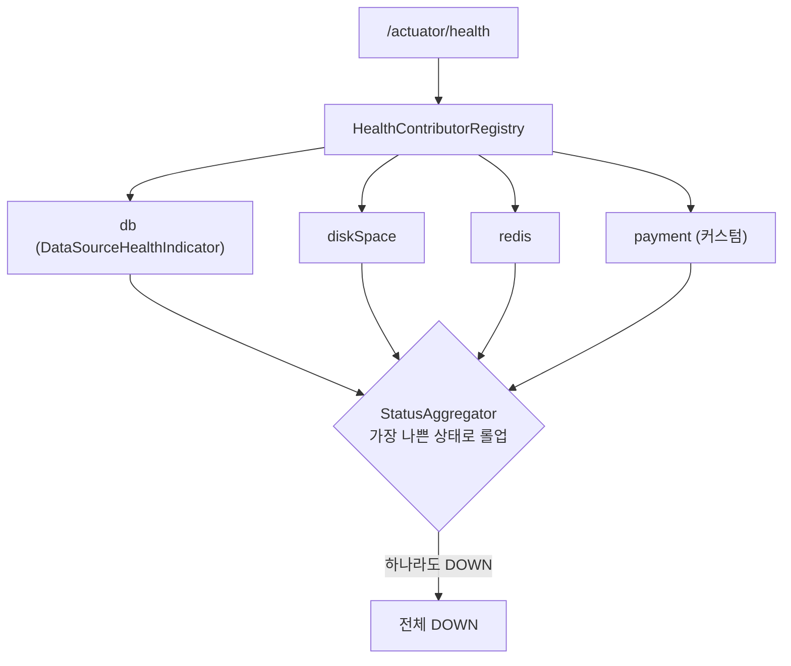

## 배포는 했는데, 잘 돌고 있는지 어떻게 알지

로컬에선 잘 되던 게 운영에선 조용히 죽어 있기도 합니다. "지금 살아 있나? DB 연결은 정상인가? 메모리는 괜찮나?"를 들여다볼 창구가 필요하죠. **Spring Boot Actuator**가 그 창구입니다.

그런데 대부분의 글은 "`starter-actuator` 추가하고 `/actuator/health` 호출하면 끝"에서 멈춥니다. 그러면 **"엔드포인트가 왜 노출이 안 되지?"**, **"health가 왜 DOWN이지?"**, **"이 엔드포인트를 외부에 열어도 되나?"** 같은 실전 질문 앞에서 막힙니다. 이 글은 `/actuator/...` 요청 하나가 **어떤 클래스를 거쳐, 어떻게 만들어진 엔드포인트로 라우팅되는지**까지 내려갑니다.

## 요청 한 번이 흐르는 길

`/actuator/health`로 들어온 요청은 일반 `@RestController`가 아니라 **엔드포인트 레지스트리**를 거쳐 처리됩니다. 흐름을 먼저 움직임으로 보세요 — <span style="color:#1971c2;font-weight:600">파랑</span> 요청이 레지스트리에서 매칭돼 각 엔드포인트로 갈라지고, health는 여러 기여자(contributor)를 모아 한 상태로 집계합니다.

<div class="act-flow" markdown="0">
<style>
.act-flow{margin:1.4rem 0;overflow-x:auto}
.act-flow svg{width:100%;max-width:720px;height:auto;display:block;margin:0 auto;font-family:inherit}
.act-flow .lbl{fill:currentColor;font-size:12px;font-weight:600}
.act-flow .sub{fill:currentColor;font-size:9px;opacity:.55}
.act-flow .arr{stroke:currentColor;opacity:.3;stroke-width:1.5;fill:none}
.act-flow rect.box{fill:none;stroke:currentColor;stroke-width:1.5;opacity:.35}
.act-flow rect.hub{animation:actpulse 3.6s ease-in-out infinite}
.act-flow rect.e1{animation:actpulse 3.6s ease-in-out infinite 1.0s}
.act-flow rect.e2{animation:actpulse 3.6s ease-in-out infinite 1.3s}
.act-flow rect.e3{animation:actpulse 3.6s ease-in-out infinite 1.6s}
.act-flow circle.req{fill:#1971c2}
.act-flow circle.r1{animation:actin 3.6s linear infinite}
.act-flow circle.f1{fill:#1971c2;animation:actfan1 3.6s linear infinite}
.act-flow circle.f2{fill:#1971c2;animation:actfan2 3.6s linear infinite}
.act-flow circle.f3{fill:#1971c2;animation:actfan3 3.6s linear infinite}
.act-flow circle.up{fill:#2f9e44}
.act-flow circle.down{fill:#e03131}
.act-flow .agg{animation:actagg 3.6s ease-in-out infinite}
@keyframes actpulse{0%,100%{opacity:.3}50%{opacity:.9}}
@keyframes actin{0%{transform:translateX(0);opacity:0}10%{opacity:1}40%{transform:translateX(150px);opacity:1}50%{opacity:0}100%{opacity:0}}
@keyframes actfan1{0%,45%{transform:translate(150px,0);opacity:0}50%{opacity:1}80%{transform:translate(150px,-46px);opacity:1}90%{opacity:0}100%{opacity:0}}
@keyframes actfan2{0%,45%{transform:translate(150px,0);opacity:0}50%{opacity:1}80%{transform:translate(150px,0);opacity:1}90%{opacity:0}100%{opacity:0}}
@keyframes actfan3{0%,45%{transform:translate(150px,0);opacity:0}50%{opacity:1}80%{transform:translate(150px,46px);opacity:1}90%{opacity:0}100%{opacity:0}}
@keyframes actagg{0%,55%{opacity:.25}75%{opacity:1}100%{opacity:.25}}
</style>
<svg viewBox="0 0 700 200" role="img" aria-label="/actuator 요청이 엔드포인트 레지스트리에서 매칭돼 health·metrics·loggers로 분기되고, health는 여러 HealthContributor를 모아 집계하는 흐름">
  <text class="lbl" x="20" y="96">GET</text>
  <text class="sub" x="20" y="110">/actuator/*</text>
  <rect class="box hub" x="150" y="74" width="150" height="52" rx="8"/>
  <text class="lbl" x="225" y="96" text-anchor="middle">EndpointDiscoverer</text>
  <text class="sub" x="225" y="112" text-anchor="middle">@Endpoint 레지스트리</text>
  <rect class="box e1" x="400" y="20"  width="140" height="42" rx="8"/>
  <rect class="box e2" x="400" y="78"  width="140" height="42" rx="8"/>
  <rect class="box e3" x="400" y="136" width="140" height="42" rx="8"/>
  <text class="lbl" x="470" y="46"  text-anchor="middle">health</text>
  <text class="lbl" x="470" y="104" text-anchor="middle">metrics</text>
  <text class="lbl" x="470" y="162" text-anchor="middle">loggers</text>
  <line class="arr" x1="70"  y1="92" x2="150" y2="98"/>
  <line class="arr" x1="300" y1="88" x2="400" y2="44"/>
  <line class="arr" x1="300" y1="100" x2="400" y2="99"/>
  <line class="arr" x1="300" y1="112" x2="400" y2="154"/>
  <rect class="box agg" x="585" y="14" width="100" height="54" rx="8"/>
  <text class="sub agg" x="635" y="34" text-anchor="middle">db ✓ disk ✓</text>
  <text class="sub agg" x="635" y="48" text-anchor="middle">payment ✗</text>
  <text class="lbl agg" x="635" y="62" text-anchor="middle" fill="#e03131">DOWN</text>
  <line class="arr" x1="540" y1="41" x2="585" y2="41"/>
  <circle class="req r1" cx="40" cy="92" r="6"/>
  <circle class="req f1" cx="290" cy="100" r="6"/>
  <circle class="req f2" cx="290" cy="100" r="6"/>
  <circle class="req f3" cx="290" cy="100" r="6"/>
</svg>
</div>

핵심: Actuator 엔드포인트는 **`@Endpoint`로 정의 → `EndpointDiscoverer`가 발견 → 노출 설정으로 필터 → 기술별 어댑터(웹/JMX)로 매핑**되는 구조입니다. 이 골격을 알면 "왜 안 떴지"의 90%가 풀립니다.

## 시작하기 — 그리고 기본값이 "닫힘"인 이유

```gradle
implementation 'org.springframework.boot:spring-boot-starter-actuator'
```

의존성만 넣으면 `health` 하나만 웹에 노출됩니다. 나머지는 명시적으로 열어야 합니다.

```yaml
management:
  endpoints:
    web:
      exposure:
        include: [health, info, metrics, loggers, prometheus]
  endpoint:
    health:
      show-details: when-authorized   # never(기본) | when-authorized | always
```

> **왜 기본이 닫힘인가?** `env`·`heapdump`·`threaddump`·`configprops`는 환경변수·메모리 덤프·설정값을 그대로 토해냅니다. 무방비 노출은 곧 정보 유출입니다. 그래서 Spring Boot는 "기본 닫힘, 명시적 열기" 정책을 씁니다 — [자동 구성의 `@ConditionalOnMissingBean`]()이 "안전한 기본값"을 주는 것과 같은 철학입니다.

## 엔드포인트는 어떻게 "만들어지나" — `@Endpoint` 인프라

Actuator 엔드포인트는 컨트롤러가 아니라 **기술 중립적**으로 정의됩니다. 한 번 정의하면 웹(HTTP)으로도, JMX로도 노출될 수 있죠.

```java
@Component
@Endpoint(id = "features")               // /actuator/features
public class FeatureFlagsEndpoint {

    private final Map<String, Boolean> flags = new ConcurrentHashMap<>();

    @ReadOperation                        // HTTP GET
    public Map<String, Boolean> all() { return flags; }

    @ReadOperation                        // GET /actuator/features/{name}
    public Boolean one(@Selector String name) { return flags.get(name); }

    @WriteOperation                       // HTTP POST
    public void set(@Selector String name, boolean enabled) {
        flags.put(name, enabled);
    }
}
```

- `@ReadOperation`/`@WriteOperation`/`@DeleteOperation` → 각각 GET/POST/DELETE로 매핑.
- `@Selector` → 경로 변수.
- `@Endpoint` 대신 `@WebEndpoint`(웹 전용)·`@ControllerEndpoint`(직접 MVC 매핑)도 있습니다.

이 클래스들을 런타임에 발견하는 게 **`EndpointDiscoverer`**(웹은 `WebEndpointDiscoverer`)입니다. 동작 순서:

```text
1. @Endpoint 빈을 모두 수집
2. @ReadOperation 등 오퍼레이션 메서드를 ExposableWebEndpoint로 변환
3. exposure.include/exclude 로 필터링
4. WebMvcEndpointHandlerMapping 이 /actuator/{id} 경로에 매핑
```

즉 `/actuator`는 별도의 핸들러 매핑이 따로 등록되는 것이고, 우리가 만든 `@Endpoint`도 정확히 같은 길로 노출됩니다. 이게 위 애니메이션의 "EndpointDiscoverer 레지스트리" 박스입니다.

## Health — 여러 기여자를 모아 한 상태로 집계

`/actuator/health`의 진짜 동작은 **여러 `HealthContributor`를 모아 가장 나쁜 상태로 롤업**하는 것입니다.



- `HealthIndicator` 하나 = 구성요소 하나의 상태. Spring Boot가 DB·Redis·디스크 등은 [자동 구성]()으로 등록해 줍니다(클래스패스에 있으면).
- `StatusAggregator`가 모아서 **하나라도 DOWN이면 전체 DOWN**. 이 순위는 커스텀 가능.

### 커스텀 HealthIndicator

```java
@Component
public class PaymentHealthIndicator implements HealthIndicator {
    private final PaymentClient client;

    @Override
    public Health health() {
        try {
            client.ping();
            return Health.up().withDetail("latencyMs", 12).build();
        } catch (Exception e) {
            return Health.down(e).build();   // 전체 health가 DOWN으로
        }
    }
}
```

> **프로덕션 함정:** 외부 의존성을 health에 넣으면, 그 의존성이 흔들릴 때마다 **로드밸런서가 인스턴스를 빼버립니다.** 결제 게이트웨이가 잠깐 느려졌다고 멀쩡한 우리 앱이 트래픽에서 제외되면 곤란하죠. 그래서 **"이 컴포넌트가 죽으면 정말 트래픽을 끊어야 하나?"**를 기준으로, 비핵심 의존성은 readiness 그룹에서 빼거나 별도 그룹으로 분리해야 합니다.

## 쿠버네티스 프로브 — liveness vs readiness

```yaml
management:
  endpoint:
    health:
      probes:
        enabled: true
      group:
        readiness:
          include: [readinessState, db]      # 트래픽 받을 준비 됐나
        liveness:
          include: [livenessState]           # 죽었으면 재시작
```

- `/actuator/health/liveness` → 실패 시 **재시작**. 그래서 **외부 의존성을 넣으면 안 됩니다**(DB 끊겼다고 앱을 재시작하면 무한 재시작 루프).
- `/actuator/health/readiness` → 실패 시 **트래픽만 차단**(재시작 X). 여기에 DB 같은 "있어야 일할 수 있는" 의존성을 넣습니다.

이 둘의 의미 차이를 헷갈려 liveness에 DB를 넣는 게 대표적인 운영 사고입니다.

## 운영에서 특히 쓰는 엔드포인트

| 엔드포인트 | 용도 | 비고 |
|-----------|------|------|
| `/actuator/health` | 살아있음 + 구성요소 상태 | LB·k8s 프로브 |
| `/actuator/loggers` | **재배포 없이** 런타임 로그레벨 변경 | 장애 시 특정 패키지만 DEBUG |
| `/actuator/metrics` | JVM·HTTP·풀 메트릭 | [관측성 글]()에서 Micrometer로 연결 |
| `/actuator/prometheus` | Prometheus 스크레이프 포맷 | `micrometer-registry-prometheus` 필요 |
| `/actuator/conditions` | [자동 구성 평가 리포트]() | "왜 이 Bean이 안 떴지" |
| `/actuator/beans` | 등록된 빈 전체 | [IoC/DI 디버깅]() |
| `/actuator/startup` | 시작 단계별 소요 시간 | `BufferingApplicationStartup` 등록 필요 |

`loggers`로 런타임 로그레벨을 바꾸는 건 실전에서 정말 자주 씁니다.

```bash
curl -X POST localhost:8080/actuator/loggers/com.example.payment \
  -H 'Content-Type: application/json' -d '{"configuredLevel":"DEBUG"}'
```

## 보안 — 가장 흔한 실수

> **프로덕션 함정:** `exposure.include: "*"`로 전부 열어두는 것. `env`·`heapdump`·`threaddump`가 외부에 열리면 환경변수(시크릿 포함)·메모리 덤프가 그대로 새어 나갑니다.

운영 체크리스트:

- 필요한 엔드포인트만 `include`. `"*"` 금지.
- **별도 관리 포트로 분리** → 외부 LB에는 노출 안 함.

  ```yaml
  management:
    server:
      port: 9090            # 앱은 8080, 액추에이터는 9090
  ```

- 그래도 여는 엔드포인트는 Spring Security로 보호([Security 기초]()).
- `health`의 `show-details: never`(기본)를 함부로 `always`로 바꾸지 말 것 — 상세에 내부 정보가 담깁니다.

## 면접/리뷰 단골 질문

- **Q. liveness와 readiness 프로브의 차이는?** → liveness 실패 = 재시작, readiness 실패 = 트래픽 차단(재시작 X). 그래서 DB 같은 외부 의존성은 readiness에만.
- **Q. `@Endpoint`는 일반 `@RestController`와 뭐가 다른가?** → 기술 중립 정의(웹+JMX 동시 노출 가능)이고, `EndpointDiscoverer`가 발견해 노출 설정으로 필터링한 뒤 전용 핸들러 매핑에 등록된다.
- **Q. `/actuator/metrics`는 떴는데 데이터가 없다?** → 노출(`include`)과 메트릭 수집(Micrometer 레지스트리/바인더)은 별개. 레지스트리 의존성·바인딩을 확인.

## 정리

- Actuator 엔드포인트 = **`@Endpoint` 정의 → `EndpointDiscoverer` 발견 → `exposure` 필터 → 전용 핸들러 매핑**. 컨트롤러가 아니다.
- 기본은 **닫힘**(`health`만). 위험 엔드포인트(`env`·`heapdump`) 때문에 명시적 열기 정책.
- `health`는 여러 `HealthContributor`를 `StatusAggregator`로 롤업 — **하나라도 DOWN이면 전체 DOWN**.
- **liveness=재시작 / readiness=트래픽 차단**. 외부 의존성은 readiness에만.
- 운영 무기: `loggers`(런타임 로그레벨)·`conditions`·`startup`. 노출은 **반드시 제한 + 별도 포트/보안**.
