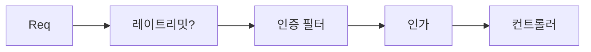

## 같은 필터라도 어디에 끼우느냐로 의미가 갈린다

시큐리티 필터 체인은 순서가 있는 파이프라인이다. 레이트리밋 필터를 **인증 앞**에 둘지 **뒤**에 둘지에 따라, 보호 대상과 비용이 완전히 달라진다.



## 앞에 둘 때 vs 뒤에 둘 때

- **인증 앞(IP/엔드포인트 기준)**: 미인증 폭주를 **인증 비용을 치르기 전에** 싸게 차단한다. 단 사용자별 정교한 한도는 아직 모른다(누군지 모르므로).
- **인증 뒤(사용자 기준)**: 인증된 주체별로 정확히 셀 수 있다. 대신 거부할 요청도 인증 연산(토큰 검증 등)을 먼저 치른다.

실무에선 둘을 **겹쳐서** 쓴다 — 앞단에 거친 IP 한도, 뒷단에 사용자 한도.

## 끼우는 기준점

커스텀 필터는 기존 필터를 기준으로 위치를 지정한다.

```java
http.addFilterBefore(rateLimitFilter, UsernamePasswordAuthenticationFilter.class);
// 또는 인증 뒤에: addFilterAfter(...)
```

## 운영 함정

- **필터에서 던진 예외는 `@ControllerAdvice`가 못 잡는다.** 필터는 디스패처서블릿 바깥이라 `@ExceptionHandler` 범위 밖이다. 거부 응답(429 등)은 필터가 **직접** 상태코드·바디를 써야 한다.
- **순서 미지정**으로 두 커스텀 필터의 상대 위치가 모호하면, 인증 컨텍스트가 채워지기 전에 사용자 기준 한도를 세려다 NPE가 난다.

## 핵심 요약

레이트리밋은 "인증 앞=싸게 거친 차단, 인증 뒤=정확한 사용자 한도"다. 필터 예외는 어드바이스가 못 잡으니 응답을 직접 구성한다.
