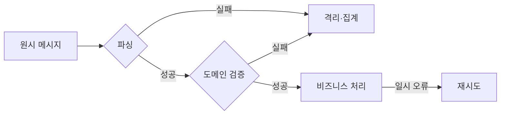

그 주엔 메시지 파서와 검증기를 분리하는 작업을 했다. HTTP 요청 검증은 다들 한다. 그런데 **컨슈머가 받는 메시지도 똑같이 신뢰 경계 밖**이라는 사실은 자주 잊힌다. 생산자가 버전이 다를 수도, 필드가 비어 올 수도, 누군가 잘못된 메시지를 흘려보낼 수도 있다. 입구에서 거르지 않으면 깨진 데이터가 도메인 깊숙이 흘러든다.

## 파싱 실패와 검증 실패는 다르다

둘을 뭉뚱그리면 운영이 흐려진다. 명확히 나눠야 한다.

- **파싱 실패** — 바이트를 객체로 풀지 못함. 깨진 JSON, 호환 안 되는 스키마, 타입 불일치. **구조의 문제**다.
- **검증 실패** — 파싱은 됐지만 도메인 규칙 위반. 음수 수량, 없는 상태값, 미래 타임스탬프. **의미의 문제**다.

구분이 중요한 이유는 **대응이 다르기 때문**이다. 파싱 실패는 재시도해봐야 똑같이 실패한다(코드/스키마가 바뀌기 전엔). 검증 실패도 보통 결정적이다. 둘 다 무한 재시도 대상이 아니라 격리 대상이다. 반면 DB 타임아웃 같은 일시적 실패는 재시도가 맞다. 입구에서 이 셋을 갈라놔야 재시도 정책을 옳게 세운다.



## 책임을 두 단계로 나눈다

역직렬화·구조 검증은 `Parser`가, 도메인 규칙은 `Validator`가 맡는다. 결과는 별도의 `ParsedMessage`로 표현한다.

```java
public record ParsedMessage(Long orderId, String status, int quantity) {}

@Component
public class OrderMessageParser {
    private final ObjectMapper mapper;

    public ParsedMessage parse(String raw) {
        try {
            JsonNode n = mapper.readTree(raw);
            return new ParsedMessage(
                n.get("orderId").asLong(),
                n.get("status").asText(),
                n.get("quantity").asInt());
        } catch (Exception e) {
            throw new MessageParseException(raw, e); // 구조 문제
        }
    }
}
```

검증 실패는 사유를 **enum으로 코드화**한다. 그래야 어떤 종류의 불량이 얼마나 들어오는지 집계·알람이 가능하다. 자유 문자열 메시지는 집계가 안 된다.

```java
public enum RejectReason { MISSING_STATUS, NEGATIVE_QUANTITY, UNKNOWN_STATUS }

@Component
public class OrderMessageValidator {
    private static final Set<String> VALID = Set.of("NEW", "PAID", "CANCELLED");

    public List<RejectReason> validate(ParsedMessage m) {
        List<RejectReason> reasons = new ArrayList<>();
        if (m.status() == null || m.status().isBlank()) reasons.add(RejectReason.MISSING_STATUS);
        else if (!VALID.contains(m.status())) reasons.add(RejectReason.UNKNOWN_STATUS);
        if (m.quantity() < 0) reasons.add(RejectReason.NEGATIVE_QUANTITY);
        return reasons; // 비어 있으면 유효
    }
}
```

리스너에서 이 둘을 입구에 세운다.

```java
@KafkaListener(topics = "order-events", groupId = "order-worker")
public void onMessage(String raw) {
    ParsedMessage msg;
    try {
        msg = parser.parse(raw);
    } catch (MessageParseException e) {
        reject(raw, "PARSE_FAILED"); // 격리, 재시도 안 함
        return;
    }
    List<RejectReason> reasons = validator.validate(msg);
    if (!reasons.isEmpty()) {
        reject(raw, reasons.toString()); // 격리 + 사유 집계
        return;
    }
    orderService.handle(msg); // 여기부터 일시 오류는 재시도 대상
}
```

## 운영 함정

**불량 메시지를 무한 재시도한다.** 파싱·검증 실패는 결정적인데 이걸 일반 예외처럼 던지면, 스프링 카프카 에러 핸들러가 같은 메시지를 끝없이 다시 돌린다. 파티션이 막히고(헤드 블로킹) 로그가 폭주한다. **결정적 실패는 재시도하지 말고 즉시 격리**해야 한다. 그래서 위 코드는 reject 후 `return`으로 정상 종료해 오프셋을 넘긴다.

**검증을 비즈니스 로직 안에 흩뿌린다.** 검증이 서비스 곳곳에 박히면 어떤 메시지가 왜 버려졌는지 추적이 안 된다. 입구 한 곳에 모아 사유를 enum으로 집계하면 "오늘 UNKNOWN_STATUS가 평소의 30배"라는 알람을 띄울 수 있다 — 이게 생산자 쪽 배포 사고의 조기 신호가 된다.

## 핵심 요약

- 컨슈머 입구는 신뢰 경계다. 메시지를 도메인에 넣기 전에 파싱·검증으로 거른다.
- 파싱 실패(구조)와 검증 실패(의미)와 일시 실패(인프라)를 구분해 재시도 정책을 다르게 적용한다.
- 검증 사유는 enum으로 코드화해 집계·알람의 근거로 삼는다. 결정적 실패는 재시도 말고 격리한다.
