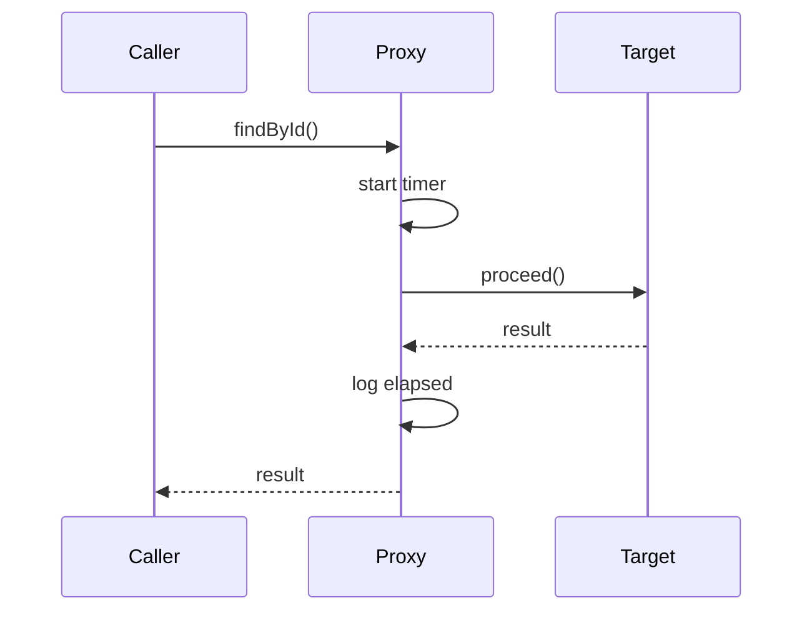

## 측정 코드를 모든 메서드에 넣을 순 없다

"각 리포지토리 메서드가 몇 ms 걸렸나"를 알려고 메서드마다 `System.nanoTime()`을 넣으면, 측정 코드가 비즈니스 로직에 들러붙는다. 실행시간 측정은 전형적인 **횡단 관심사**이고, AOP가 이를 한 곳으로 분리한다.

## 동작 — 프록시와 around 어드바이스

스프링 AOP는 대상 빈을 **프록시**로 감싸고, 포인트컷에 매칭되는 호출을 가로챈다. `@Around` 어드바이스는 실제 호출 전후를 감싸 시간을 잰다.

```java
@Around("execution(* com.example..repository..*(..))")
public Object timed(ProceedingJoinPoint pjp) throws Throwable {
    long t = System.nanoTime();
    try { return pjp.proceed(); }
    finally {
        long ms = (System.nanoTime() - t) / 1_000_000;
        MDC.put("queryMs", String.valueOf(ms));   // 구조화 로그에 실림
    }
}
```



## 프록시의 한계 (가장 중요한 함정)

- **self-invocation**: 같은 빈 안에서 `this.method()`로 부르면 프록시를 거치지 않아 **측정이 안 된다**. 슬로우 쿼리 글(DB측 로그)과 달리 AOP는 "프록시 경유 호출"만 본다.
- **포인트컷 과대 매칭**: `execution(* *(..))`처럼 넓게 잡으면 모든 메서드에 프록시 오버헤드가 붙는다. 패키지/애너테이션으로 좁힌다.

## 핵심 요약

AOP 타이밍은 측정 로직을 비즈니스에서 떼어내는 깔끔한 방법이지만, 프록시 경유 호출만 잡는다는 전제를 잊으면 self-invocation 메서드가 측정에서 통째로 빠진다.
