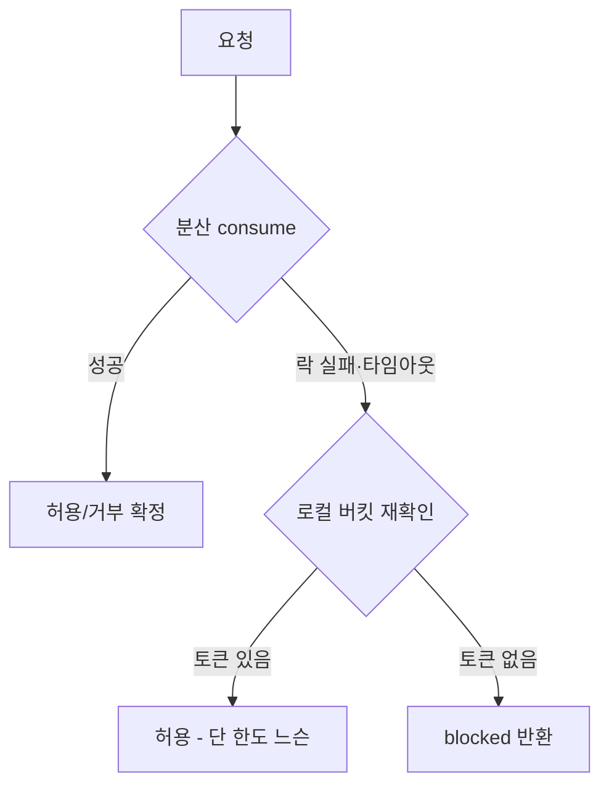

## 분산 레이트리미터도 결국 외부 의존이다

분산 토큰 버킷은 Redis 같은 공유 저장소에 의존한다. 그 저장소가 느려지거나 락 획득이 실패하면, 레이트리미터 자신이 장애 지점이 된다. "정확한 한도"와 "가용성" 사이에서 무엇을 포기할지 미리 정해야 한다.

## 폴백 경로 — 로컬 버킷으로 재확인

분산 consume이 락 경합·타임아웃으로 끝내 실패하면, 각 인스턴스의 **로컬 버킷**으로 한 번 더 판단한다.

## 폴백의 비용을 인정한다

로컬 폴백은 인스턴스마다 따로 세므로 **전역 한도가 일시적으로 느슨해진다**(인스턴스 수만큼). 이건 버그가 아니라 의도된 절충 — "저장소 장애 동안 완벽한 한도보다 서비스 지속을 택한다". 단, 로컬 한도를 분산 한도보다 보수적으로 잡아 폭주를 막는다.

## 재시도와 최종 결정의 경계

락 획득을 무한 재시도하면 그 자체가 지연·부하다. **유한 재시도 후 명시적으로 `blocked`를 반환**하는 경계가 필요하다. "재시도 소진 → 로컬 재확인 → 그래도 안 되면 차단"의 순서를 코드에 분명히 둔다.

## 운영 함정

- **폴백이 조용하면** 저장소 장애를 모른 채 한도가 새는 걸 못 본다 → 폴백 발생을 메트릭/경고로 노출한다.
- 분산 호출 타임아웃을 너무 길게 잡으면, 폴백이 의미를 잃고 모든 요청이 느려진다.

## 핵심 요약

분산 레이트리밋의 성숙도는 "성공 경로"가 아니라 "실패 경로"에서 드러난다. 유한 재시도 → 로컬 폴백(느슨함 감수) → 명시적 차단의 순서를 정하고, 폴백 발생을 반드시 관측한다.
