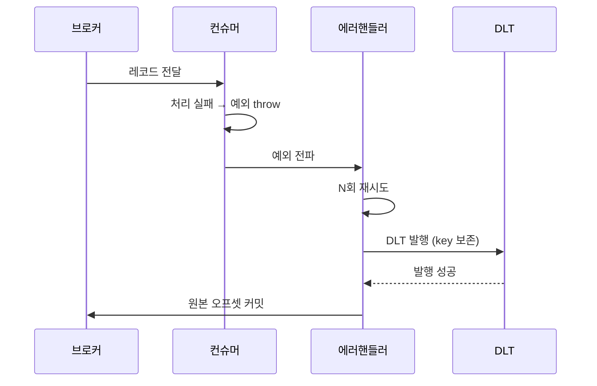

그 주엔 데드레터 처리와 재시도 정합을 손봤다. 컨슈머가 메시지를 처리하다 실패하면 그 메시지는 어디로 가는가? 외부 API 재시도와 비슷해 보이지만 메시징에는 고유한 함정이 있다. **메시지는 한 번 ack하면 사라진다.** 그래서 "버릴지, 다시 받을지"의 경계를 잘못 그으면 곧장 유실이거나 무한 루프다.

## 재시도와 데드레터의 역할

소비 실패는 두 종류다. **일시적 실패**(DB 타임아웃, 순간 부하)는 잠시 후 재시도하면 성공한다. **영구적 실패**(불량 페이로드, 결정적 버그)는 몇 번을 돌려도 실패한다. 전자는 재시도로, 후자는 **데드레터 토픽(DLT)**으로 보낸다. DLT는 "지금은 못 처리하지만 버리긴 아까운" 메시지의 격리 보관소다. 나중에 사람이 보거나 재처리한다.

스프링 카프카의 에러 핸들러는 이 흐름을 자동화한다. N번 재시도 후에도 실패하면 DLT로 발행하고 원본 오프셋을 커밋한다. 핵심은 이 자동화가 **예외에 의존**한다는 점이다.



## 함정 1 — 예외를 삼키면 아무것도 안 일어난다

가장 흔한 사고. try-catch로 예외를 잡고 로그만 남기면, 컨슈너 입장에선 **정상 종료**다. 에러 핸들러는 예외를 못 보니 재시도도 DLT 발행도 하지 않고, 오프셋만 조용히 커밋된다. 메시지는 처리되지 않은 채 영영 사라진다.

```java
// 안티패턴: 실패를 삼킴 → 유실
@KafkaListener(topics = "order-events", groupId = "order-worker")
public void bad(OrderEvent event) {
    try {
        orderService.handle(event);
    } catch (Exception e) {
        log.error("처리 실패", e); // 삼켰다. 에러핸들러는 모른다.
    }
}

// 정상: 예외를 전파해 재시도/DLT가 동작하게 둔다
@KafkaListener(topics = "order-events", groupId = "order-worker")
public void good(OrderEvent event) {
    orderService.handle(event); // 실패하면 던지고, 핸들러에 맡긴다
}
```

재시도·DLT 정책은 컨테이너 레벨에 선언한다.

```java
@Bean
DefaultErrorHandler errorHandler(KafkaTemplate<Object, Object> template) {
    var recoverer = new DeadLetterPublishingRecoverer(template); // 기본: <topic>.DLT
    return new DefaultErrorHandler(recoverer, new FixedBackOff(1000L, 3L)); // 1초 간격 3회
}
```

## 함정 2 — DLT 전송이 실패하면?

여기가 진짜 안전선이다. 재시도가 다 소진돼 DLT로 보내려는데 **DLT 발행 자체가 실패**하면(브로커 장애 등) 어떻게 해야 하나? 이때 원본 오프셋을 커밋해버리면 메시지는 재시도 토픽에도, DLT에도 없이 증발한다.

원칙은 명확하다. **DLT 전송이 확정되기 전엔 원본을 ack하지 않는다.** 발행 실패 시 예외를 재전파해 원본 메시지가 다시 전달되도록 한다. `DeadLetterPublishingRecoverer`는 발행 결과를 기다리도록 설정할 수 있고, 발행 실패는 회복 실패로 처리돼 오프셋이 커밋되지 않는다. 중복 처리(at-least-once)는 감수하더라도 유실은 막는 쪽을 택한다 — 둘 중 유실이 훨씬 비싸다.

## 함정 3 — 키를 안 실으면 순서가 깨진다

카프카의 순서 보장은 **파티션 단위**다. 같은 키는 같은 파티션으로 가므로, 한 주문에 대한 이벤트들은 순서대로 처리된다. 그런데 DLT로 보낼 때 키를 비워버리면, 재처리 시 그 메시지가 다른 파티션으로 흩어져 **순서 보장이 깨진다**. 그래서 원본 record key를 그대로 실어 파티션 어피니티를 보존한다.

```java
// DeadLetterPublishingRecoverer는 기본적으로 원본 key/partition 정보를
// 헤더와 함께 보존한다. 직접 발행한다면 키를 명시적으로 넘긴다.
template.send(new ProducerRecord<>("order-events.DLT", record.key(), record.value()));
```

## 핵심 요약

- 일시적 실패는 재시도, 영구적 실패는 DLT. 이 분류가 메시지 안전의 출발점이다.
- 예외를 삼키지 마라. 스프링 카프카의 재시도·DLT는 전파된 예외로 동작한다. 삼키면 유실이다.
- DLT 전송이 확정되기 전엔 원본을 ack하지 않는다. 유실보다 중복이 싸다.
- DLT로 보낼 때 원본 키를 실어 파티션 어피니티(순서)를 보존한다.

**면접 한 줄 Q&A.** "컨슈머 처리 실패는 어떻게 다루나?" → "일시 실패는 백오프 재시도, 영구 실패는 DLT로 격리한다. 단 DLT 발행이 확정되기 전엔 오프셋을 커밋하지 않아 유실을 막고, 원본 키를 실어 순서를 보존한다."
