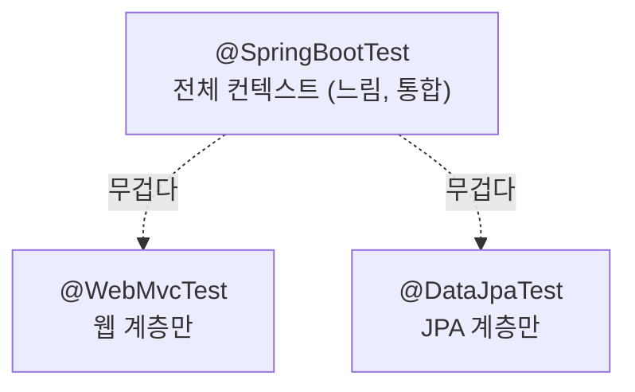

## 테스트가 느려서 안 돌리게 된다

처음엔 모든 테스트에 `@SpringBootTest`를 붙였습니다. 그랬더니 테스트 하나 돌리는 데 전체 컨텍스트가 다 떠서 느리고, 결국 테스트를 잘 안 돌리게 되더라고요. 😅 Spring Boot는 필요한 **계층만 잘라서** 띄우는 **테스트 슬라이스**를 제공합니다.



## @WebMvcTest — 컨트롤러(웹 계층)만

컨트롤러, 필터, `@ControllerAdvice` 등 웹 계층만 띄웁니다. 서비스/리포지토리는 안 뜨므로 **목(mock)으로 대체**합니다.

```java
@WebMvcTest(ProductController.class)
class ProductControllerTest {

    @Autowired MockMvc mockMvc;

    @MockitoBean ProductService productService;   // Boot 3.4+ : @MockBean 대체

    @Test
    void 상품_조회() throws Exception {
        given(productService.find(1L)).willReturn(new Product(1L, "키보드"));

        mockMvc.perform(get("/products/1"))
            .andExpect(status().isOk())
            .andExpect(jsonPath("$.name").value("키보드"));
    }
}
```

> 참고: 과거의 `@MockBean`/`@SpyBean`은 Spring Boot 3.4부터 `@MockitoBean`/`@MockitoSpyBean`으로 대체됐습니다(최신 버전 기준).
{: .prompt-tip }

## @DataJpaTest — JPA(영속성 계층)만

리포지토리와 JPA 관련 Bean만 띄웁니다. 기본적으로 **트랜잭션 후 롤백**되어 테스트 간 격리가 됩니다.

```java
@DataJpaTest
class UserRepositoryTest {

    @Autowired UserRepository userRepository;

    @Test
    void 이메일로_조회() {
        userRepository.save(new User("comdol@example.com"));
        assertThat(userRepository.findByEmail("comdol@example.com")).isPresent();
    }
}
```

기본은 임베디드 DB를 쓰지만, 실제 DB와 동작이 다를 수 있어 **Testcontainers**로 진짜 PostgreSQL을 띄워 검증하는 걸 권장합니다.

```java
@DataJpaTest
@AutoConfigureTestDatabase(replace = AutoConfigureTestDatabase.Replace.NONE)
@Testcontainers
class UserRepositoryTest { /* @Container PostgreSQLContainer ... */ }
```

## @SpringBootTest — 전체 통합 테스트

애플리케이션 컨텍스트 전체를 띄웁니다. 느리지만 **계층을 가로지르는 통합 시나리오**에 적합합니다. 실제 HTTP까지 태우려면 `webEnvironment`를 지정합니다.

```java
@SpringBootTest(webEnvironment = WebEnvironment.RANDOM_PORT)
class OrderIntegrationTest {

    @Autowired TestRestTemplate restTemplate;

    @Test
    void 주문_생성_플로우() {
        var res = restTemplate.postForEntity("/orders", request, OrderResponse.class);
        assertThat(res.getStatusCode()).isEqualTo(HttpStatus.CREATED);
    }
}
```

## 어떻게 나눠 쓸까

- 컨트롤러 검증(요청/응답/검증/예외) → **@WebMvcTest**
- 쿼리 메서드·매핑 검증 → **@DataJpaTest** (+ Testcontainers)
- 핵심 비즈니스 플로우 end-to-end → **@SpringBootTest** (소수만)
- 순수 로직 → 아무 애너테이션도 없는 **순수 단위 테스트**가 가장 빠름

테스트 피라미드처럼, **빠른 슬라이스/단위 테스트를 많이**, 무거운 통합 테스트는 핵심만 적게 두는 게 좋습니다.

## 정리

- 모든 걸 `@SpringBootTest`로 하지 말 것. **필요한 계층만** 슬라이스로.
- 웹은 `@WebMvcTest`(+`@MockitoBean`), 영속성은 `@DataJpaTest`(+Testcontainers).
- 통합 시나리오만 `@SpringBootTest`로 소수.
- 순수 로직은 프레임워크 없이 단위 테스트가 최선.
