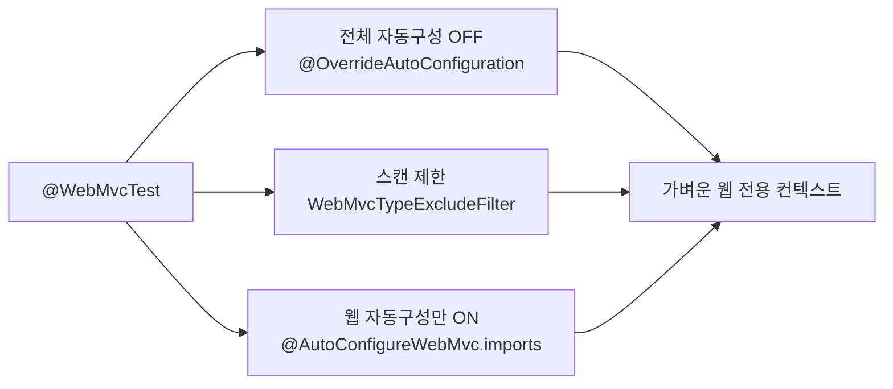
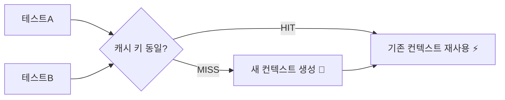

## 테스트가 느려서 안 돌리게 된다

처음엔 모든 테스트에 `@SpringBootTest`를 붙였습니다. 그랬더니 테스트 하나 돌리는 데 전체 컨텍스트가 다 떠서 느리고, 결국 테스트를 잘 안 돌리게 되더라고요. 😅

해결책은 두 가지입니다. **(1) 필요한 계층만 잘라 띄우는 테스트 슬라이스**, 그리고 의외로 더 중요한 **(2) 컨텍스트 캐시를 깨지 않는 것**. 슬라이스를 써도 캐시를 줄줄이 깨뜨리면 다시 느려집니다. 이 글은 슬라이스가 *어떻게* 일부만 띄우는지(자동 구성과 같은 메커니즘), 그리고 *왜* 테스트 수백 개가 갑자기 느려지는지를 소스 레벨에서 다룹니다.

## 전체 컨텍스트 vs 슬라이스 — 무엇이 다른가

`@SpringBootTest`는 메인 클래스의 `@SpringBootConfiguration`을 찾아 **모든 자동 구성 + 모든 컴포넌트**를 띄웁니다. 슬라이스는 그중 **한 계층에 필요한 자동 구성·빈만** 띄웁니다. 아래에서 같은 4초 동안 전체 컨텍스트는 빈을 한참 채우고, 웹 슬라이스는 몇 개만 빠르게 채우는 걸 보세요.

<div class="ts-slice" markdown="0">
<style>
.ts-slice{margin:1.4rem 0;overflow-x:auto}
.ts-slice svg{width:100%;max-width:720px;height:auto;display:block;margin:0 auto;font-family:inherit}
.ts-slice .lbl{fill:currentColor;font-size:13px;font-weight:600}
.ts-slice .sub{fill:currentColor;font-size:10px;opacity:.6}
.ts-slice rect.box{fill:none;stroke:currentColor;stroke-width:1.5;opacity:.4}
.ts-slice .bean{transform-box:fill-box;transform-origin:center}
.ts-slice .full{fill:#f08c00}
.ts-slice .slice{fill:#2f9e44}
.ts-slice .full{animation:tspop 4s ease-in-out infinite}
.ts-slice .slice{animation:tspop 4s ease-in-out infinite}
.ts-slice .f1{animation-delay:0s}.ts-slice .f2{animation-delay:.28s}.ts-slice .f3{animation-delay:.56s}
.ts-slice .f4{animation-delay:.84s}.ts-slice .f5{animation-delay:1.12s}.ts-slice .f6{animation-delay:1.4s}
.ts-slice .f7{animation-delay:1.68s}.ts-slice .f8{animation-delay:1.96s}.ts-slice .f9{animation-delay:2.24s}
.ts-slice .f10{animation-delay:2.52s}.ts-slice .f11{animation-delay:2.8s}.ts-slice .f12{animation-delay:3.08s}
.ts-slice .s1{animation-delay:0s}.ts-slice .s2{animation-delay:.18s}.ts-slice .s3{animation-delay:.36s}.ts-slice .s4{animation-delay:.54s}
@keyframes tspop{0%{opacity:0;transform:scale(.3)}12%{opacity:1;transform:scale(1)}90%{opacity:1;transform:scale(1)}100%{opacity:0;transform:scale(.3)}}
</style>
<svg viewBox="0 0 700 210" role="img" aria-label="전체 컨텍스트는 많은 빈을 느리게, 웹 슬라이스는 적은 빈을 빠르게 띄우는 대비 애니메이션">
  <text class="lbl" x="20" y="22">@SpringBootTest — 전체 컨텍스트</text>
  <text class="sub" x="560" y="22">느림 · 빈 多</text>
  <rect class="box" x="18" y="32" width="664" height="70" rx="8"/>
  <circle class="bean full f1"  cx="70"  cy="55" r="9"/><circle class="bean full f2"  cx="170" cy="55" r="9"/>
  <circle class="bean full f3"  cx="270" cy="55" r="9"/><circle class="bean full f4"  cx="370" cy="55" r="9"/>
  <circle class="bean full f5"  cx="470" cy="55" r="9"/><circle class="bean full f6"  cx="570" cy="55" r="9"/>
  <circle class="bean full f7"  cx="70"  cy="82" r="9"/><circle class="bean full f8"  cx="170" cy="82" r="9"/>
  <circle class="bean full f9"  cx="270" cy="82" r="9"/><circle class="bean full f10" cx="370" cy="82" r="9"/>
  <circle class="bean full f11" cx="470" cy="82" r="9"/><circle class="bean full f12" cx="570" cy="82" r="9"/>
  <text class="lbl" x="20" y="135">@WebMvcTest — 웹 슬라이스</text>
  <text class="sub" x="560" y="135">빠름 · 빈 少</text>
  <rect class="box" x="18" y="145" width="664" height="50" rx="8"/>
  <circle class="bean slice s1" cx="70"  cy="170" r="9"/><circle class="bean slice s2" cx="170" cy="170" r="9"/>
  <circle class="bean slice s3" cx="270" cy="170" r="9"/><circle class="bean slice s4" cx="370" cy="170" r="9"/>
</svg>
</div>

## 슬라이스는 *어떻게* 일부만 띄우나 — 자동 구성과 같은 뿌리

슬라이스가 마법으로 일부만 띄우는 게 아닙니다. 슬라이스 애너테이션을 뜯어보면 세 가지 장치가 보입니다.

```java
// @WebMvcTest 정의를 펼치면 (핵심만)
@BootstrapWith(WebMvcTestContextBootstrapper.class)
@OverrideAutoConfiguration(enabled = false)          // ① 전체 자동 구성 OFF
@TypeExcludeFilters(WebMvcTypeExcludeFilter.class)    // ② 스캔 대상을 웹 컴포넌트로 제한
@ImportAutoConfiguration                              // ③ 웹용 자동 구성만 다시 켬
public @interface WebMvcTest { ... }
```

1. **`@OverrideAutoConfiguration(enabled = false)`** 로 [자동 구성]() 전체를 끕니다.
2. **`@TypeExcludeFilter`** (여기선 `WebMvcTypeExcludeFilter`)가 컴포넌트 스캔에서 `@Controller`·`@ControllerAdvice`·`Converter` 같은 **웹 계층 타입만** 통과시키고 `@Service`·`@Repository`는 제외합니다.
3. **`@ImportAutoConfiguration`** 이 다시 켤 자동 구성 목록을 `META-INF/spring/...@AutoConfigureWebMvc.imports` 같은 큐레이션 파일에서 읽어옵니다. 자동 구성의 `imports` 파일과 **완전히 같은 메커니즘**이죠 — 끄는 게 아니라 *화이트리스트로 골라 켜는* 것입니다.

그래서 `@DataJpaTest`는 `DataJpaTypeExcludeFilter`로 `@Entity`·리포지토리만, `@JsonTest`는 직렬화 관련만 띄웁니다. "슬라이스 = 자동 구성을 끄고 그 계층용만 다시 켠 것"이라고 이해하면 전부 일관되게 보입니다.



## @WebMvcTest — 컨트롤러(웹 계층)만

서비스/리포지토리는 안 뜨므로 **목(mock)으로 대체**합니다.

```java
@WebMvcTest(ProductController.class)
class ProductControllerTest {

    @Autowired MockMvc mockMvc;

    @MockitoBean ProductService productService;   // Boot 3.4+ : @MockBean 대체

    @Test
    void 상품_조회() throws Exception {
        given(productService.find(1L)).willReturn(new Product(1L, "키보드"));

        mockMvc.perform(get("/products/1"))
            .andExpect(status().isOk())
            .andExpect(jsonPath("$.name").value("키보드"));
    }
}
```

> `@MockBean`/`@SpyBean`은 Spring Boot 3.4부터 deprecated → `@MockitoBean`/`@MockitoSpyBean`(spring-test 코어로 승격)으로 대체됐습니다. 단순 개명이 아니라, 뒤에서 볼 **컨텍스트 캐시 키**에 영향을 주는 동작은 그대로입니다.
{: .prompt-tip }

## @DataJpaTest — JPA(영속성 계층)만

리포지토리와 JPA 관련 Bean만 띄우고, 기본적으로 각 테스트를 **트랜잭션 후 롤백**해 격리합니다(`@Transactional`이 메타 애너테이션으로 들어 있음).

```java
@DataJpaTest
class UserRepositoryTest {

    @Autowired UserRepository userRepository;
    @Autowired TestEntityManager em;   // 영속성 컨텍스트 직접 제어

    @Test
    void 이메일로_조회() {
        em.persistAndFlush(new User("kuo@example.com"));
        em.clear();   // 1차 캐시 비워 진짜 쿼리 검증
        assertThat(userRepository.findByEmail("kuo@example.com")).isPresent();
    }
}
```

기본은 임베디드 DB로 **교체**(`@AutoConfigureTestDatabase`)되지만, 실제 DB와 SQL 방언·제약이 달라 통과/실패가 갈릴 수 있습니다. **Testcontainers + `@ServiceConnection`**(Boot 3.1+)으로 진짜 PostgreSQL을 띄우면 접속 정보까지 자동 주입됩니다.

```java
@DataJpaTest
@AutoConfigureTestDatabase(replace = Replace.NONE)   // 임베디드 교체 끄기
@Testcontainers
class UserRepositoryTest {
    @Container @ServiceConnection
    static PostgreSQLContainer<?> db = new PostgreSQLContainer<>("postgres:16");
}
```

## 진짜 병목: 컨텍스트 캐시를 깨고 있었다

여기가 이 글의 핵심입니다. Spring TestContext 프레임워크는 **ApplicationContext를 캐시**합니다. 같은 설정이면 다음 테스트 클래스가 그 컨텍스트를 *재사용*하므로, 컨텍스트는 테스트 클래스마다가 아니라 **고유한 설정 조합마다 한 번씩** 뜹니다.

캐시 키는 `MergedContextConfiguration` — 대략 이런 요소의 조합입니다.

| 캐시 키에 들어가는 것 | 깨지는 예 |
|----------------------|-----------|
| 설정 클래스 / 슬라이스 종류 | `@WebMvcTest` vs `@SpringBootTest` |
| `@ActiveProfiles` | `test` vs `test,redis` |
| `@TestPropertySource` / `properties` | 클래스마다 다른 프로퍼티 |
| `@MockitoBean` 조합 (ContextCustomizer) | 클래스마다 다른 목 집합 |
| `webEnvironment`, `@DirtiesContext` | `@DirtiesContext`는 매번 컨텍스트 폐기 |

즉 **테스트 클래스마다 프로퍼티/프로필/목 조합을 조금씩 다르게** 쓰면, 그만큼 새 컨텍스트가 뜹니다(캐시 미스). 컨텍스트 하나 뜨는 데 수 초 → 미스 30번이면 빌드가 분 단위로 늘어납니다. 기본 캐시 크기는 32(`spring.test.context.cache.maxSize`)라, 그 이상 다양해지면 LRU로 쫓겨나 재생성까지 반복됩니다.



**처방**: 프로퍼티/프로필/목 조합을 몇 개의 표준 묶음으로 통일하고, `@DirtiesContext`는 꼭 필요할 때만 쓰며, 테스트 베이스 클래스로 설정을 공유합니다. `-Dspring.test.context.cache.maxSize` 와 디버그 로깅(`org.springframework.test.context.cache=DEBUG`)으로 캐시 적중률을 직접 확인할 수 있습니다.

## 어떻게 나눠 쓸까

| 검증 대상 | 도구 |
|-----------|------|
| 컨트롤러(요청/응답/검증/예외) | `@WebMvcTest` + `@MockitoBean` |
| 쿼리 메서드·매핑 | `@DataJpaTest` + Testcontainers |
| 핵심 플로우 end-to-end | `@SpringBootTest`(소수만) |
| 순수 로직 | 애너테이션 없는 **순수 단위 테스트**(가장 빠름) |

테스트 피라미드대로 **빠른 슬라이스/단위 테스트를 많이**, 무거운 통합 테스트는 핵심만. 단, 슬라이스 종류를 잘게 쪼갤수록 캐시 컨텍스트 종류도 늘어난다는 트레이드오프를 기억하세요.

## 면접/리뷰 단골 질문

- **Q. `@WebMvcTest`는 서비스 빈을 왜 못 찾나?** → `WebMvcTypeExcludeFilter`가 웹 계층 타입만 스캔에 통과시키기 때문. 서비스는 `@MockitoBean`으로 채운다.
- **Q. 테스트가 점점 느려지는데 원인은?** → 컨텍스트 캐시 미스. 클래스마다 다른 프로퍼티·프로필·목 조합 또는 `@DirtiesContext`가 새 컨텍스트를 양산한다.
- **Q. 슬라이스가 일부 자동 구성만 켜는 원리는?** → `@OverrideAutoConfiguration(false)`로 전체를 끄고 `@ImportAutoConfiguration`이 `@AutoConfigure*.imports` 화이트리스트만 다시 켠다. 자동 구성의 `imports`와 같은 메커니즘.

## 정리

- 슬라이스 = **전체 자동 구성 OFF + `@TypeExcludeFilter`로 스캔 제한 + 그 계층용 자동 구성만 화이트리스트로 ON.** [자동 구성]()과 같은 뿌리.
- 웹은 `@WebMvcTest`(+`@MockitoBean`), 영속성은 `@DataJpaTest`(+Testcontainers `@ServiceConnection`), 통합은 `@SpringBootTest` 소수.
- **진짜 속도 결정 요인은 컨텍스트 캐시.** 설정 조합을 통일해 캐시 미스를 줄여라.
- `@MockBean`→`@MockitoBean`(3.4+). 순수 로직은 프레임워크 없이 단위 테스트가 최선.

> 관련 글: 트랜잭션 롤백·`@Transactional`의 동작은 [이 글]()에서, 슬라이스가 켜고 끄는 자동 구성의 원리는 [자동 구성 글]()에서 더 깊게 다룹니다.
