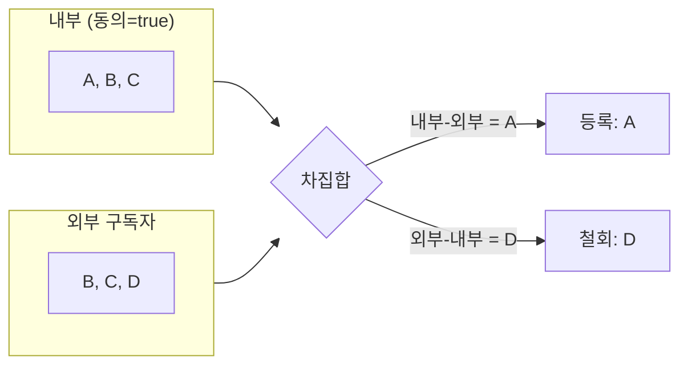

그 주엔 외부 시스템과 사용자 동의 상태를 동기화하는 로직을 양방향으로 개선했다. 두 시스템이 같은 정보를 들고 있을 때, 시간이 지나면 둘은 반드시 어긋난다. 이벤트가 유실되고, 한쪽만 배포되고, 외부 API가 잠깐 죽는다. 이렇게 쌓인 차이를 **드리프트(drift)**라 한다. 이걸 주기적으로 메우는 작업이 **리컨실리에이션(reconciliation, 조정 동기화)**이다.

## 이벤트 동기화 vs 조정 동기화

상태 동기화에는 두 축이 있다.

- **이벤트 기반(아웃박스/CDC)** — 변경이 일어날 때마다 외부에 즉시 반영한다. 빠르지만, 이벤트 한 번만 유실돼도 그 차이는 **스스로 복구되지 않는다.** 영구히 어긋난 채 남는다.
- **조정 동기화** — 주기적으로 양쪽 상태를 전수 대조해 차이를 메운다. 느리고 비싸지만 **드리프트를 무조건 복구**한다.

둘은 경쟁이 아니라 보완이다. 이벤트로 평상시를 빠르게 처리하고, 조정으로 새는 부분을 주기적으로 막는다. "최종적으로는 반드시 일치한다"를 보장하는 안전망이 조정 동기화다.

## 차집합으로 작업을 도출한다

핵심은 두 집합의 차집합이다. 동의 상태라면:

- **내부에 동의했으나 외부에 없음** → 외부에 **등록**
- **외부에 있으나 내부 동의가 철회됨** → 외부에서 **철회**
- 양쪽에 모두 있거나 모두 없음 → 할 일 없음



```java
public SyncPlan reconcile(Set<Long> internalConsented, Set<Long> externalSubscribed) {
    Set<Long> toRegister = new HashSet<>(internalConsented);
    toRegister.removeAll(externalSubscribed);      // 내부 - 외부

    Set<Long> toRevoke = new HashSet<>(externalSubscribed);
    toRevoke.removeAll(internalConsented);          // 외부 - 내부

    return new SyncPlan(toRegister, toRevoke);
}
```

`internalConsented`를 만들 때 **복합 조건**에 주의한다. 동의가 여러 종류일 수 있다 — 예컨대 "수집 동의"와 "수신 동의"가 둘 다 참이어야 유효한 구독으로 친다. 이 조건을 한 곳에서 정의해야 등록 기준과 철회 기준이 어긋나지 않는다.

```java
boolean eligible(UserConsent c) {
    return c.isCollectAgreed() && c.isReceiveAgreed(); // 둘 다 충족
}
```

## 멱등성이 생명이다

조정 작업은 주기적으로, 때로는 겹쳐서 돈다. 그래서 **여러 번 돌려도 결과가 같아야** 한다. 등록은 "이미 있으면 무시(upsert)", 철회는 "이미 없으면 무시"로 만든다. 외부 API가 등록을 PUT처럼(존재 무관하게 같은 상태로 수렴) 제공하면 이상적이고, 아니라면 우리 쪽에서 현재 상태를 먼저 비교해 흡수한다.

```java
void apply(SyncPlan plan) {
    for (Long id : plan.toRegister()) {
        try {
            externalClient.register(id); // 이미 등록돼 있어도 안전해야 한다
        } catch (AlreadyExistsException ignore) { /* 멱등 */ }
    }
    for (Long id : plan.toRevoke()) {
        try {
            externalClient.revoke(id);
        } catch (NotFoundException ignore) { /* 멱등 */ }
    }
}
```

## 운영 함정

**전수 비교의 비용.** 대상이 수백만이면 매번 양쪽을 통째로 끌어오는 게 부담이다. 페이지/배치로 나눠 처리하고, 가능하면 마지막 동기화 시각 이후 변경분만 비교하는 증분 방식과 병행한다. 전수 대조는 빈도를 낮춰(예: 하루 1회) 안전망으로만 둔다.

**부분 실패와 가시성.** 1000건 중 990건만 반영되고 10건이 외부 API 오류로 실패하는 일은 흔하다. 다음 주기에 자연히 재시도되도록(멱등이니까) 두되, 실패 건수·사유는 반드시 집계해 로그·알람으로 노출한다. "조용히 일부만 동기화됨"이 가장 위험하다.

## 핵심 요약

- 이벤트 동기화는 빠르지만 유실을 스스로 복구하지 못한다. 조정 동기화가 드리프트의 안전망이다.
- 두 상태의 차집합으로 등록/철회 작업을 도출한다. 유효 기준(복합 동의 조건)은 한 곳에 정의한다.
- 모든 작업은 멱등하게. 여러 번 돌려도 같은 결과여야 겹친 실행과 부분 실패가 안전해진다.
- 전수 대조는 비싸니 빈도를 낮추고 증분과 병행하며, 부분 실패는 반드시 집계해 노출한다.
