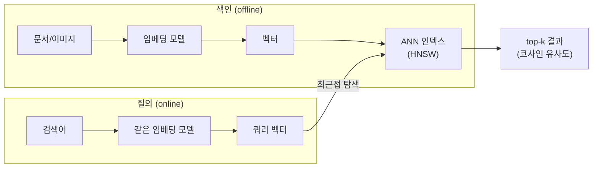

## 키워드가 아니라 의미를 찾는다

전통적 검색은 **단어 일치**입니다. "강아지"를 검색하면 "강아지"가 든 문서만 나오죠. 하지만 "반려견 키우는 법"은 "강아지"라는 글자가 없어도 분명 관련이 있습니다. 의미로 검색하려면 텍스트·이미지를 **고차원 벡터(임베딩)** 로 바꿔야 합니다. 모델이 "강아지"와 "반려견"을 **벡터 공간에서 가까운 점**으로 만들면, 검색은 "쿼리 벡터에 가장 가까운 점 찾기"가 됩니다.

> 사실 이 블로그의 [AI 시맨틱 검색](/ai-search/)이 바로 이 원리로 돕니다 — 글을 임베딩해두고, 검색어도 같은 모델로 임베딩한 뒤 **코사인 유사도**로 가장 가까운 글을 찾습니다. 시리즈의 마지막 글이 블로그 자신의 검색 엔진을 설명하는 셈이네요.

이 글은 「알고리즘 A-Z」의 피날레로, 현대 검색·추천·랭킹의 두 기둥인 **벡터 검색(근사 최근접 이웃)** 과 **PageRank**를 다룹니다. 전체 파이프라인은 이렇게 흐릅니다 — 색인 시점엔 문서를 벡터로 바꿔 인덱스에 넣고, 질의 시점엔 같은 모델로 쿼리를 벡터화해 가장 가까운 점들을 찾습니다.

## 유사도와 차원의 저주

두 벡터의 가까움은 보통 **코사인 유사도**로 잽니다 — 크기가 아니라 **방향**이 얼마나 같은지:

$$\text{cos}(\mathbf{a},\mathbf{b}) = \frac{\mathbf{a}\cdot\mathbf{b}}{\lVert\mathbf{a}\rVert\,\lVert\mathbf{b}\rVert}$$

정확히 가장 가까운 $k$개를 찾는 **k-NN**의 가장 단순한 방법은 모든 점과 거리를 재는 것 — 점 $N$개, 차원 $d$면 쿼리당 $O(Nd)$입니다. 수백만~수십억 벡터에선 감당이 안 됩니다. "그럼 [트리]()로 공간을 분할하면?"이라고 생각할 수 있지만, 여기서 **차원의 저주**가 덮칩니다 — 차원이 수십을 넘으면 모든 점이 서로 비슷하게 멀어져, k-d 트리 같은 공간 분할이 사실상 전수 탐색으로 퇴화합니다.

그래서 현대 벡터 검색은 **정확함을 약간 포기**합니다. "**정확한** 최근접" 대신 "**거의** 최근접"을 **훨씬 빠르게" — 이것이 **ANN(Approximate Nearest Neighbor)** 입니다. 99% 정확도를 100배 속도와 맞바꾸는, [확률적 자료구조]()·[스트리밍]()에서 본 "근사로 충분하다"의 또 다른 얼굴입니다.

## HNSW — 고속도로에서 골목길로 내려가는 탐색

오늘날 ANN의 사실상 표준은 **HNSW**(Hierarchical Navigable Small World)입니다. 발상은 **건너뛰기 리스트(skip list)** 의 그래프 버전입니다. 노드들을 여러 **층(layer)** 으로 쌓되, 위층일수록 노드가 희박하고 **먼 거리를 잇는 간선(고속도로)** 만 둡니다. 아래층으로 갈수록 조밀해지고 간선은 **가까운 이웃(골목길)** 을 잇습니다.

탐색은 맨 위층 한 점에서 시작해 **쿼리에 더 가까워지는 이웃으로 탐욕적으로 이동**하다, 더 못 가까워지면 한 층 내려갑니다. 위층에서 성큼성큼 대략의 동네로 워프하고, 아래층에서 세밀하게 좁히는 것이죠. 덕분에 쿼리당 평균 $O(\log N)$ 수준으로 수십억 벡터에서도 최근접을 찾습니다.

<svg viewBox="0 0 680 230" role="img" aria-label="HNSW에서 쿼리 점이 희박한 상위층에서 진입해 가까운 이웃으로 이동하다 점점 조밀한 하위층으로 내려가며 최근접 노드를 찾는 계층 탐색 애니메이션">
  <rect class="lay" x="20" y="20" width="640" height="56" rx="6"/>
  <text class="sub" x="30" y="38">상위층 (희박·고속도로)</text>
  <rect class="lay" x="20" y="84" width="640" height="56" rx="6"/>
  <text class="sub" x="30" y="102">중간층</text>
  <rect class="lay" x="20" y="148" width="640" height="56" rx="6"/>
  <text class="sub" x="30" y="166">하위층 (조밀·골목길)</text>
  <line class="edge" x1="60" y1="52" x2="240" y2="52"/><line class="edge" x1="240" y1="52" x2="520" y2="52"/>
  <line class="edge" x1="60" y1="116" x2="180" y2="116"/><line class="edge" x1="180" y1="116" x2="350" y2="116"/><line class="edge" x1="350" y1="116" x2="520" y2="116"/>
  <line class="edge" x1="80" y1="180" x2="180" y2="180"/><line class="edge" x1="180" y1="180" x2="290" y2="180"/><line class="edge" x1="290" y1="180" x2="400" y2="180"/><line class="edge" x1="400" y1="180" x2="500" y2="180"/>
  <circle class="nd" cx="60" cy="52" r="6"/><circle class="nd" cx="240" cy="52" r="6"/><circle class="nd" cx="520" cy="52" r="6"/>
  <circle class="nd" cx="60" cy="116" r="6"/><circle class="nd" cx="180" cy="116" r="6"/><circle class="nd" cx="350" cy="116" r="6"/><circle class="nd" cx="520" cy="116" r="6"/>
  <circle class="nd" cx="80" cy="180" r="6"/><circle class="nd" cx="180" cy="180" r="6"/><circle class="nd" cx="290" cy="180" r="6"/><circle class="nd" cx="400" cy="180" r="6"/>
  <circle class="tgt" cx="500" cy="180" r="7"/>
  <circle class="hit" cx="500" cy="180" r="11"/>
  <circle class="seeker" cx="60" cy="52" r="8"/>
  <text class="sub" x="500" y="172" text-anchor="middle" fill="#f08c00">최근접</text>
</svg>

또 다른 갈래는 **LSH(Locality-Sensitive Hashing)** — 가까운 점이 **같은 해시 버킷**에 떨어지도록 일부러 충돌을 설계한 해시입니다([일관된 해싱]()과는 정반대 목적이죠). 같은 버킷만 비교해 후보를 줄입니다. 구현은 단순하지만, 대부분의 벤치마크에서 HNSW가 정확도·속도 모두 앞서 실무 1순위가 됐습니다.

| 방식 | 쿼리 시간 | 정확도(recall) | 메모리 | 비고 |
|------|-----------|---------------|--------|------|
| 완전 탐색(brute) | $O(Nd)$ | 100% | 낮음 | 소규모·기준선 |
| k-d 트리 | 고차원서 퇴화 | 100%(저차원) | 중간 | 차원의 저주 |
| LSH | 빠름 | 중간 | 높음 | 튜닝 까다로움 |
| **HNSW** | $O(\log N)$ | **높음** | 높음 | **실무 표준** |
| IVF-PQ | 빠름 | 중상 | **낮음(압축)** | 초대규모·FAISS |

실무에선 OpenSearch·Elasticsearch의 kNN 필드, PostgreSQL의 **pgvector**, 그리고 FAISS·Milvus·Pinecone 같은 벡터 DB가 HNSW나 IVF-PQ를 엔진으로 씁니다. RAG·추천·이미지 검색의 검색 단계가 전부 이 위에 섭니다.

## PageRank — 링크로 권위를 흐르게 하다

벡터 검색이 "쿼리와 얼마나 비슷한가(관련성)"라면, 또 하나의 축은 "이 문서가 얼마나 중요한가(권위)"입니다. **PageRank**(Brin·Page, 구글의 출발점)는 이를 **웹 그래프**로 풉니다. 핵심 직관: **중요한 페이지로부터 링크를 많이 받은 페이지가 중요하다.** 권위가 링크를 타고 흐르는 재귀적 정의죠.

이를 **랜덤 서퍼(random surfer)** 모델로 봅니다. 무작위로 링크를 클릭하며 떠도는 사람이 어떤 페이지에 머무를 **장기 확률**이 곧 그 페이지의 PageRank입니다. 페이지 $u$의 점수는:

$$PR(u) = \frac{1-d}{N} + d \sum_{v \in B_u} \frac{PR(v)}{L(v)}$$

$B_u$는 $u$로 링크하는 페이지들, $L(v)$는 $v$의 바깥 링크 수, $d$(보통 0.85)는 **감쇠 인자**입니다. $(1-d)/N$ 항은 "가끔 아무 페이지로나 순간이동"하는 확률로, 링크 없는 막다른 페이지(dangling)에 권위가 갇히는 걸 막습니다.

푸는 방법은 **파워 반복(power iteration)**: 모든 점수를 균등하게 시작해, 위 식으로 동시에 갱신하길 반복하면 점수가 **수렴**합니다. 수학적으로는 거대한 전이 행렬의 **주고유벡터**를 찾는 것과 같습니다.

<svg viewBox="0 0 560 240" role="img" aria-label="PageRank 점수가 반복마다 링크를 타고 흘러 권위가 많이 모이는 노드의 크기가 커지며 수렴하는 애니메이션">
  <defs><marker id="vec20arr" markerWidth="8" markerHeight="8" refX="7" refY="4" orient="auto"><path d="M0,0 L8,4 L0,8 Z" fill="currentColor" opacity="0.4"/></marker></defs>
  <line class="edge" x1="110" y1="60" x2="270" y2="120"/>
  <line class="edge" x1="110" y1="190" x2="270" y2="130"/>
  <line class="edge" x1="430" y1="70" x2="300" y2="115"/>
  <line class="edge" x1="300" y1="120" x2="430" y2="180"/>
  <circle class="core" cx="100" cy="55" r="9"/><text class="sub" x="100" y="42" text-anchor="middle">B</text>
  <circle class="core" cx="100" cy="195" r="9"/><text class="sub" x="100" y="218" text-anchor="middle">C</text>
  <circle class="core" cx="440" cy="65" r="9"/><text class="sub" x="440" y="52" text-anchor="middle">D</text>
  <circle class="core" cx="440" cy="185" r="9"/><text class="sub" x="440" y="208" text-anchor="middle">E</text>
  <circle class="core grow" cx="285" cy="122" r="14"/><text class="lbl" x="285" y="126" text-anchor="middle" fill="#fff">A</text>
  <circle class="flow f1" cx="110" cy="60" r="6"/>
  <circle class="flow f2" cx="110" cy="190" r="6"/>
  <circle class="flow f3" cx="430" cy="70" r="6"/>
  <text class="sub" x="285" y="232" text-anchor="middle">권위(주황)가 링크를 타고 A로 흘러들어 A의 점수가 커지며 수렴</text>
</svg>

PageRank는 단지 옛 검색 알고리즘이 아닙니다. **그래프에서 중요도를 매기는 범용 도구**로, 소셜 네트워크 영향력, 추천(아이템-아이템 그래프), 부정행위 탐지, 학술 인용 분석에 두루 쓰입니다. [그래프 순회]()와 [최단 경로]()가 그래프의 *구조*를 다뤘다면, PageRank는 그래프의 *중요도*를 정의합니다.

실제 검색 랭킹은 이 둘을 **합칩니다** — 벡터 검색(또는 BM25 같은 키워드 점수)으로 관련성 높은 후보를 빠르게 추리고, PageRank류 권위 점수와 개인화 신호를 더해 최종 순위를 냅니다. 현대 검색은 단일 알고리즘이 아니라 이 신호들의 합주입니다.

## 프로덕션에서 마주치는 함정

| 함정 | 증상 | 해법 |
|------|------|------|
| recall↔지연 트레이드오프 | 너무 정확히 찾다 느려짐(혹은 반대) | `efSearch`/`M` 튜닝, 목표 recall 설정 |
| 메모리 폭발 | HNSW 인덱스가 RAM 초과 | IVF-PQ 양자화, 샤딩 |
| 임베딩 모델 불일치 | 색인·쿼리 모델이 달라 엉뚱한 결과 | **동일 모델·버전** 고정(이 블로그도 그 규칙) |
| 정규화 누락 | 코사인인데 미정규화로 크기 왜곡 | 벡터 L2 정규화 후 내적 |
| PageRank 미수렴 | dangling/spider trap에 권위 갇힘 | 감쇠 $d$(텔레포트)로 해소, 반복 상한 |

## 면접/리뷰 단골 질문

- **Q. 왜 정확한 k-NN 대신 ANN?** → 고차원에서 정확 최근접은 차원의 저주로 전수탐색화. ANN은 약간의 정확도를 큰 속도와 맞바꿔 수십억 벡터를 실시간 검색.
- **Q. HNSW가 빠른 이유?** → 계층 그래프 — 위층 희박 간선으로 성큼 워프, 아래층 조밀 간선으로 세밀 탐색. 평균 O(log N).
- **Q. 코사인 유사도를 쓰는 이유?** → 벡터 크기가 아닌 방향(의미)을 비교. 정규화하면 내적과 동치.
- **Q. PageRank 한 줄 정의?** → 랜덤 서퍼가 페이지에 머무는 장기 확률 = 전이행렬의 주고유벡터. 중요한 곳에서 받은 링크가 권위를 키운다.
- **Q. 감쇠 인자 d의 역할?** → 텔레포트 확률 $(1-d)$로 dangling/spider trap에 권위가 갇히는 것을 막고 수렴을 보장.

## 정리

- **벡터 검색**은 키워드가 아닌 **의미(임베딩)** 로 찾는다 — 고차원의 차원의 저주 때문에 정확 k-NN 대신 **ANN(HNSW)** 으로 "거의 최근접"을 빠르게 찾는다.
- **HNSW**는 계층 그래프로 위층은 고속도로, 아래층은 골목길 — 평균 O(log N)에 수십억 벡터를 검색한다.
- **PageRank**는 링크 그래프에서 권위를 흐르게 해 중요도를 매기는 범용 도구 — 파워 반복으로 주고유벡터를 구한다.
- 현대 검색은 **관련성(벡터)** 과 **권위(PageRank류)** 의 합주다.

> 이 글로 「알고리즘 A-Z」 20편이 끝납니다. [복잡도와 Big-O]()에서 "비용을 어떻게 재는가"로 시작해, 정렬·탐색·[트리]()·그래프·[동적계획법]() 같은 고전을 지나, 합의·레이트리미팅·벡터검색 같은 분산·AI 시대의 알고리즘까지 왔습니다. 알고리즘은 결국 **유한한 자원으로 점점 더 큰 문제를 푸는 인간의 방법론**입니다 — 그 정점에서 기계가 의미를 검색하고 권위를 계산하게 됐고요. 문자열 알고리즘을 더 파고 싶다면 [접미사 트리·나이브 베이즈]()로 이어가 보세요.
</content>
