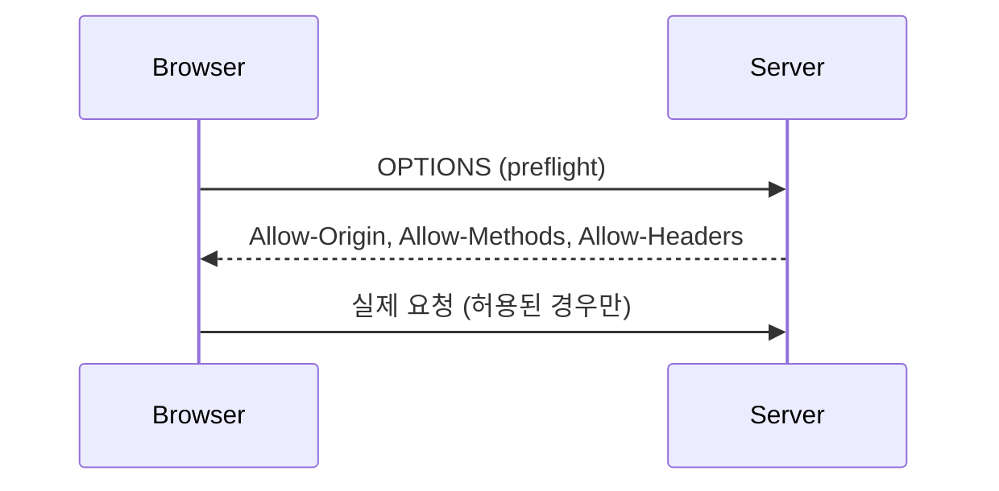

## CORS는 서버가 아니라 브라우저가 거는 규칙

CORS 오류는 서버가 요청을 막는 게 아니다. 서버는 응답하지만, **브라우저**가 "이 출처(origin)가 응답을 읽어도 되는지" 헤더를 보고 판단해 차단한다. 그래서 서버는 "누구에게 읽기를 허용하는지"를 응답 헤더로 알려야 한다.

## preflight — 본 요청 전의 사전 질의

단순 요청이 아닌 경우(커스텀 헤더, `PUT/DELETE` 등) 브라우저는 먼저 `OPTIONS`로 **preflight**를 보낸다. 서버가 `Access-Control-Allow-*` 헤더로 허용을 응답해야 본 요청이 나간다.



## `*` + 자격증명이 금지인 이유

`Access-Control-Allow-Origin: *`와 `Access-Control-Allow-Credentials: true`를 함께 쓰면 브라우저가 **거부**한다. 임의의 사이트가 사용자의 쿠키를 실은 채 응답을 읽을 수 있게 되어 보안이 무너지기 때문이다. 그래서 자격증명을 쓰려면 origin을 **구체적으로** 반향(echo)해야 한다.

이 제약 때문에 등장한 게 `allowedOriginPatterns`다. `allowedOrigins`는 정확한 목록만 받지만, 패턴(`https://*.example.com`)은 매칭된 origin을 응답에 그대로 반향해주어 **자격증명과 함께 와일드카드 같은 유연성**을 쓸 수 있다.

```java
config.setAllowedOriginPatterns(List.of("https://*.example.com"));
config.setAllowCredentials(true);
```

## 운영 함정

- **운영에서 origin을 `*`로 넓게 여는 것**은 편하지만, 자격증명 기반 API라면 위 제약에 걸리거나 보안 구멍이 된다. 허용 출처는 가능한 한 좁게 명시한다.
- preflight 응답을 캐시(`Access-Control-Max-Age`)하지 않으면 매 요청마다 OPTIONS가 두 번 왕복한다.

## 핵심 요약

CORS는 브라우저 측 정책이다. 자격증명을 쓰면 `*`가 금지되므로 `allowedOriginPatterns`로 구체 origin을 반향하고, 허용 범위는 최소로 좁힌다.
