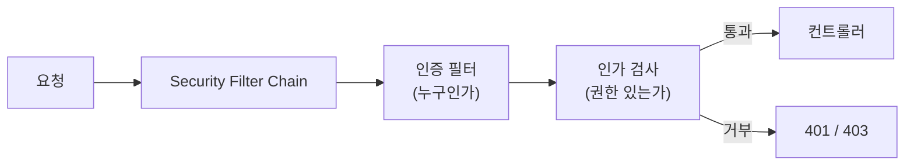

## 의존성만 추가했는데 갑자기 로그인 창이 뜬다

`spring-boot-starter-security`를 추가하면, 아무 설정도 안 했는데 모든 요청에 로그인 창이 뜹니다. 처음엔 당황스럽지만, 이건 Spring Security가 **"기본적으로 다 막는다(secure by default)"** 는 철학을 보여주는 거예요. 우리가 할 일은 "무엇을 열어줄지"를 정하는 겁니다.

## 인증(Authentication) vs 인가(Authorization)

- **인증**: 너 누구야? (로그인 — 신원 확인)
- **인가**: 너 이거 해도 돼? (권한 확인)

Spring Security는 요청이 컨트롤러에 닿기 전에 **필터 체인**을 거치게 해서 이 둘을 처리합니다.



## SecurityFilterChain 설정

요즘 방식(Spring Security 6+)은 `WebSecurityConfigurerAdapter`(제거됨) 대신 **`SecurityFilterChain` Bean**을 등록하는 컴포넌트 기반입니다.

```java
@Configuration
@EnableWebSecurity
public class SecurityConfig {

    @Bean
    SecurityFilterChain filterChain(HttpSecurity http) throws Exception {
        http
            .authorizeHttpRequests(auth -> auth
                .requestMatchers("/", "/public/**").permitAll()
                .requestMatchers("/admin/**").hasRole("ADMIN")
                .anyRequest().authenticated()
            )
            .formLogin(Customizer.withDefaults());
        return http.build();
    }
}
```

- `permitAll()`: 누구나 접근
- `hasRole("ADMIN")`: ADMIN 권한만
- `anyRequest().authenticated()`: 나머지는 로그인 필요

## 비밀번호는 반드시 해시로

비밀번호를 평문으로 저장하면 절대 안 됩니다. `PasswordEncoder`(BCrypt 권장)로 해시해서 저장하고 비교합니다.

```java
@Bean
PasswordEncoder passwordEncoder() {
    return new BCryptPasswordEncoder();
}
```

```java
String hashed = passwordEncoder.encode(rawPassword);   // 저장 시
boolean ok = passwordEncoder.matches(rawPassword, hashed); // 로그인 시
```

## 메서드 단위 인가

URL 단위뿐 아니라 메서드 단위로도 권한을 걸 수 있습니다.

```java
@EnableMethodSecurity   // 활성화
// ...

@PreAuthorize("hasRole('ADMIN')")
public void deleteUser(Long id) { ... }
```

## REST API라면 보통 토큰 기반

세션/폼 로그인 대신, REST API는 보통 **JWT 같은 토큰** 기반 인증을 씁니다. 클라이언트가 `Authorization: Bearer <token>` 헤더로 신원을 증명하고, 서버는 상태를 들고 있지 않죠(stateless). 표준을 따르려면 직접 만들기보다 **OAuth2 Resource Server** 지원을 활용하는 걸 권장합니다.

```java
http.oauth2ResourceServer(oauth -> oauth.jwt(Customizer.withDefaults()));
```

## 정리

- Spring Security는 **기본적으로 다 막는다**. 우리가 열 것을 선언.
- **인증(누구)** 과 **인가(권한)** 를 필터 체인에서 처리.
- 설정은 **`SecurityFilterChain` Bean**(컴포넌트 기반).
- 비밀번호는 **BCrypt 해시** 필수. REST API는 보통 **토큰(JWT/OAuth2)** 기반.
