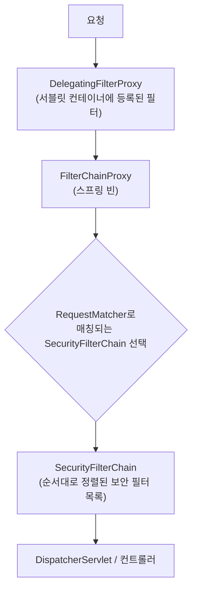
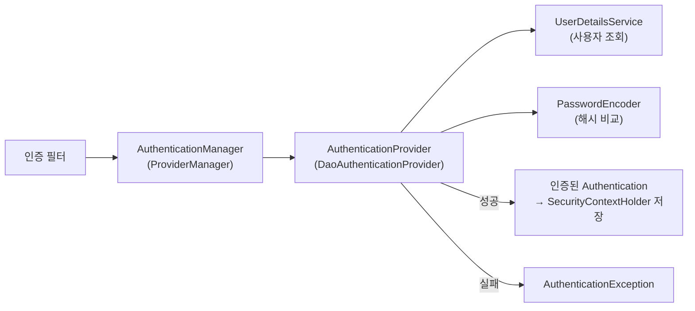

## 의존성만 추가했는데 갑자기 로그인 창이 뜬다

`spring-boot-starter-security`를 추가하면, 아무 설정도 안 했는데 모든 요청에 로그인 창이 뜹니다. 이건 Spring Security의 **"기본적으로 다 막는다(secure by default)"** 철학입니다. 그런데 이걸 "로그인 창 = 보안"으로만 이해하면, 막상 `@PreAuthorize`가 안 먹거나 401이 떠야 하는데 403이 뜨거나 `permitAll`이 무시되는 순간 손도 못 댑니다.

이 글의 목표는 Spring Security를 **"필터 체인"이라는 한 장의 그림으로 환원**하는 것입니다. 요청이 어떤 필터를 *어떤 순서로* 지나며 인증·인가가 일어나는지를 잡으면, 위의 함정들이 전부 "그 필터에서 일어난 일"로 설명됩니다.

## 한눈에 보는 보안 필터 체인

요청은 컨트롤러에 닿기 전에 **순서가 정해진 필터들의 사슬**을 통과합니다. 인증이 안 됐거나 권한이 없으면 사슬 중간에서 튕겨 나가죠 — <span style="color:#2f9e44;font-weight:600">초록</span>은 끝까지 통과한 요청, <span style="color:#e03131;font-weight:600">빨강</span>은 인가에서 거부돼 403으로 빠지는 요청입니다.

<div class="sec-chain" markdown="0">
<style>
.sec-chain{margin:1.4rem 0;overflow-x:auto}
.sec-chain svg{width:100%;max-width:720px;height:auto;display:block;margin:0 auto;font-family:inherit}
.sec-chain .lbl{fill:currentColor;font-size:12px;font-weight:600}
.sec-chain .sub{fill:currentColor;font-size:9px;opacity:.55}
.sec-chain .arr{stroke:currentColor;opacity:.35;stroke-width:1.5;fill:none}
.sec-chain .deny{fill:#e03131;font-size:11px;font-weight:700}
.sec-chain rect.box{fill:none;stroke:currentColor;stroke-width:1.5;opacity:.35}
.sec-chain rect.s1{animation:secpulse 4s ease-in-out infinite}
.sec-chain rect.s2{animation:secpulse 4s ease-in-out infinite .8s}
.sec-chain rect.s3{animation:secpulse 4s ease-in-out infinite 1.6s}
.sec-chain rect.s4{animation:secpulse 4s ease-in-out infinite 2.4s}
.sec-chain circle.tok{fill:#2f9e44}
.sec-chain circle.t1{animation:secflow 4.5s linear infinite}
.sec-chain circle.t2{animation:secflow 4.5s linear infinite 1.6s}
.sec-chain circle.rej{fill:#e03131;animation:secreject 4.5s linear infinite .8s}
@keyframes secflow{0%{transform:translateX(0);opacity:0}6%{opacity:1}94%{opacity:1}100%{transform:translateX(620px);opacity:0}}
@keyframes secreject{0%{transform:translate(0,0);opacity:0}10%{opacity:1}48%{transform:translate(418px,0);opacity:1}66%{transform:translate(418px,80px);opacity:0}100%{opacity:0}}
@keyframes secpulse{0%,100%{opacity:.3}50%{opacity:.9}}
</style>
<svg viewBox="0 0 700 190" role="img" aria-label="요청이 보안 필터 체인(컨텍스트 로드·인증·인가)을 순서대로 통과하다 인가 실패 시 403으로 거부되는 흐름 애니메이션">
  <rect class="box s1" x="8"   y="40" width="140" height="64" rx="8"/>
  <rect class="box s2" x="188" y="40" width="140" height="64" rx="8"/>
  <rect class="box s3" x="368" y="40" width="140" height="64" rx="8"/>
  <rect class="box s4" x="548" y="40" width="140" height="64" rx="8"/>
  <text class="lbl" x="78"  y="66" text-anchor="middle">컨텍스트 로드</text>
  <text class="sub" x="78"  y="83" text-anchor="middle">SecurityContextHolderFilter</text>
  <text class="lbl" x="258" y="66" text-anchor="middle">인증 필터</text>
  <text class="sub" x="258" y="83" text-anchor="middle">AuthenticationManager</text>
  <text class="lbl" x="438" y="66" text-anchor="middle">인가</text>
  <text class="sub" x="438" y="83" text-anchor="middle">AuthorizationFilter</text>
  <text class="lbl" x="618" y="66" text-anchor="middle">컨트롤러</text>
  <text class="sub" x="618" y="83" text-anchor="middle">비즈니스 로직</text>
  <line class="arr" x1="148" y1="72" x2="188" y2="72"/>
  <line class="arr" x1="328" y1="72" x2="368" y2="72"/>
  <line class="arr" x1="508" y1="72" x2="548" y2="72"/>
  <text class="deny" x="438" y="170" text-anchor="middle">↓ 403 거부 (AccessDeniedException)</text>
  <circle class="tok t1"  cx="20" cy="72" r="7"/>
  <circle class="tok t2"  cx="20" cy="72" r="7"/>
  <circle class="tok rej" cx="20" cy="72" r="7"/>
</svg>
</div>

## 필터 체인은 어떻게 끼어드나 — `DelegatingFilterProxy` → `FilterChainProxy`

Spring Security는 결국 **서블릿 필터** 한 개로 시작합니다. 부팅 시 `springSecurityFilterChain`이라는 이름의 필터가 서블릿 컨테이너(톰캣)에 등록되는데, 그 정체는 `DelegatingFilterProxy`입니다. 이 프록시는 직접 일하지 않고, 스프링 컨테이너 안의 진짜 빈 — **`FilterChainProxy`** 에게 위임합니다.



`FilterChainProxy`는 여러 개의 `SecurityFilterChain`을 들고 있고, 요청 URL을 `RequestMatcher`로 비교해 **첫 번째로 매칭되는 체인 하나**만 적용합니다(여기서 첫 함정이 시작됩니다 — 뒤에서). 선택된 체인 안에는 책임이 다른 필터들이 **정해진 순서로** 들어 있습니다.

| 순서 | 필터 | 역할 |
|------|------|------|
| 앞 | `SecurityContextHolderFilter` | 저장된 `SecurityContext`(인증 정보)를 불러와 `SecurityContextHolder`에 셋업 (구 `SecurityContextPersistenceFilter`) |
| | `CsrfFilter` | CSRF 토큰 검증 |
| | 인증 필터들 (`UsernamePasswordAuthenticationFilter`, `BasicAuthenticationFilter`, `BearerTokenAuthenticationFilter` …) | 자격 증명을 받아 인증 시도 |
| | `ExceptionTranslationFilter` | 아래에서 터진 `AuthenticationException`/`AccessDeniedException`을 HTTP 401/403로 번역 |
| 뒤 | `AuthorizationFilter` | 최종 인가 판정 (구 `FilterSecurityInterceptor`, 6.x에서 교체) |

> **포인트:** 인증·인가는 컨트롤러가 아니라 *필터*에서 끝납니다. 그래서 컨트롤러에 도달했다는 건 "이미 인증·인가를 통과했다"는 뜻이고, 반대로 필터에서 막힌 요청은 컨트롤러·`@ControllerAdvice`에 **닿지도 않습니다.** (이게 예외 처리 함정의 뿌리입니다 — 뒤에서.)

## 인증 흐름: 누구인가

인증 필터가 자격 증명을 추출하면, 실제 검증은 한 줄로 위임됩니다: `AuthenticationManager`.



- `AuthenticationManager`의 기본 구현 `ProviderManager`는 등록된 여러 `AuthenticationProvider`를 순회합니다.
- 폼/기본 로그인은 `DaoAuthenticationProvider`가 처리: `UserDetailsService`로 사용자를 조회하고 `PasswordEncoder`로 비밀번호를 **해시 비교**합니다.
- 성공하면 인증된 `Authentication` 객체가 `SecurityContextHolder`에 담깁니다. 이후 코드는 `SecurityContextHolder.getContext().getAuthentication()`으로 "현재 사용자"를 꺼낼 수 있죠. (기본 저장 전략은 `ThreadLocal`입니다 — 비동기/가상 스레드 경계에서의 함정은 뒤에서.)

```java
@Bean
PasswordEncoder passwordEncoder() {
    return new BCryptPasswordEncoder();   // 평문 저장은 절대 금지
}
```

## 인가 흐름: 권한이 있는가

인증이 "누구인가"라면 인가는 "이 사람이 이걸 해도 되는가"입니다. 6.x부터 인가는 **`AuthorizationManager`** 추상화로 통일됐습니다(URL·메서드 보안 모두 같은 인터페이스).

```java
@Configuration
@EnableWebSecurity
public class SecurityConfig {

    @Bean
    SecurityFilterChain filterChain(HttpSecurity http) throws Exception {
        http
            .authorizeHttpRequests(auth -> auth
                .requestMatchers("/", "/public/**").permitAll()   // 구체적 규칙 먼저
                .requestMatchers("/admin/**").hasRole("ADMIN")
                .anyRequest().authenticated()                     // anyRequest는 항상 마지막
            )
            .formLogin(Customizer.withDefaults());
        return http.build();
    }
}
```

URL 단위 규칙은 `AuthorizationFilter`가 `RequestMatcherDelegatingAuthorizationManager`로 위임해 판정합니다. 람다 DSL(`auth -> auth...`)은 **Spring Security 6.0에서 제거된 `WebSecurityConfigurerAdapter`** 를 대체하는 현재 표준입니다 — 더 이상 상속이 아니라 `SecurityFilterChain` *빈을 등록*합니다.

### 메서드 단위 인가는 AOP다 — `@Transactional`과 똑같은 함정

```java
@EnableMethodSecurity
// ...
@PreAuthorize("hasRole('ADMIN')")
public void deleteUser(Long id) { ... }
```

`@PreAuthorize`는 마법이 아니라 **AOP 프록시**(`AuthorizationManagerBeforeMethodInterceptor`)로 동작합니다. 즉 [`@Transactional`의 self-invocation 함정]()과 **완전히 같은 메커니즘**입니다. 같은 빈 안에서 `this.deleteUser(...)`로 직접 호출하면 프록시를 우회해 **권한 검사가 통째로 무시됩니다.** 보안에서 이건 단순 버그가 아니라 취약점이죠.

## 401과 403을 가르는 곳: `ExceptionTranslationFilter`

인증·인가 실패는 예외로 표현되고, 이를 HTTP 상태로 번역하는 전담 필터가 `ExceptionTranslationFilter`입니다.

| 상황 | 예외 | 처리 | HTTP |
|------|------|------|------|
| 인증 안 됨(또는 자격 증명 실패) | `AuthenticationException` | `AuthenticationEntryPoint` (로그인 페이지/`WWW-Authenticate`) | **401** |
| 인증은 됐지만 권한 없음 | `AccessDeniedException` | `AccessDeniedHandler` | **403** |

> **함정:** 이 예외들은 **컨트롤러 밖(필터)** 에서 터집니다. 그래서 평소에 쓰는 `@RestControllerAdvice`/`@ExceptionHandler`로는 못 잡습니다([REST 예외 처리 글]() 참고). 401/403 응답 본문을 JSON으로 통일하고 싶다면 `@ControllerAdvice`가 아니라 `AuthenticationEntryPoint`·`AccessDeniedHandler`를 커스터마이징해야 합니다.

## 프로덕션에서 실제로 밟는 함정 4가지

1. **`permitAll` 무시 (규칙 순서)** — `requestMatchers`는 **위에서부터 첫 매칭 승리**입니다. `anyRequest().authenticated()`를 위에 두면 그 아래 `permitAll`은 영원히 닿지 않습니다. 구체적 규칙 → 일반 규칙 순으로, `anyRequest()`는 항상 맨 마지막.
2. **CSRF — 폼 vs API** — CSRF 보호는 *브라우저 세션* 기반 폼 앱을 위한 것입니다. 그래서 `POST`가 403으로 막히는 일이 잦죠. 세션 쿠키를 쓰는 앱이면 **끄지 말고** 토큰을 함께 보내야 합니다. 토큰 기반 stateless API라면 `csrf(csrf -> csrf.disable())`가 정당하지만, "왜 꺼도 되는지"(세션 쿠키가 없어 CSRF 표면이 없음)를 이해하고 끄는 것과 막혀서 끄는 건 다릅니다.
3. **stateless인데 세션이 생긴다** — REST API는 `sessionManagement(s -> s.sessionCreationPolicy(STATELESS))`로 세션 생성을 막아야 합니다. 안 그러면 매 요청마다 `JSESSIONID`가 발급돼 의도와 어긋납니다.
4. **`SecurityContext`가 비동기에서 사라진다** — 저장 전략이 `ThreadLocal`이라 `@Async`·스레드 풀·[가상 스레드]() 경계를 넘으면 인증 정보가 유실됩니다. `DelegatingSecurityContextExecutor`/`MODE_INHERITABLETHREADLOCAL` 등으로 명시 전파해야 합니다.

## 디버깅: 필터 체인을 눈으로 보기

추측하지 말고 체인을 직접 출력하세요. Spring Security 6은 부팅 시 적용된 필터 목록을 로그로 남깁니다.

```yaml
logging:
  level:
    org.springframework.security: DEBUG   # 어떤 필터가 무엇을 했는지 추적
```

```java
@EnableWebSecurity(debug = true)   // 요청별로 필터 체인 통과 과정을 상세 출력
```

"왜 401이 떠야 하는데 403이지?", "왜 이 URL이 인증을 요구하지?" 같은 질문은 이 로그에서 **어느 필터가 어떤 판정을 했는지**로 거의 즉답이 됩니다.

## 면접/리뷰 단골 질문

- **Q. `DelegatingFilterProxy`가 왜 필요한가?** → 필터는 서블릿 컨테이너가 만들어 스프링 빈 생명주기 밖에 있다. 프록시가 컨테이너엔 필터로 등록되고, 실제 일은 스프링 빈 `FilterChainProxy`에 위임해 둘을 잇는다.
- **Q. 401과 403의 차이와, 그 판정이 일어나는 위치는?** → 401=인증 안 됨, 403=인증됐지만 권한 없음. `ExceptionTranslationFilter`가 `AuthenticationException`/`AccessDeniedException`을 보고 번역한다.
- **Q. `@PreAuthorize`가 같은 클래스 내부 호출에서 안 먹는 이유는?** → AOP 프록시 기반이라 self-invocation 시 프록시를 우회. `@Transactional`과 동일.
- **Q. `WebSecurityConfigurerAdapter`는 왜 사라졌나?** → 상속 기반 구성의 한계(다중 체인·테스트·명확성). 6.0부터 `SecurityFilterChain` 빈 등록 방식으로 통일.

## 정리

- Spring Security의 본질은 **순서가 정해진 서블릿 필터 체인**이다. `DelegatingFilterProxy` → `FilterChainProxy` → `SecurityFilterChain`.
- **인증**은 `AuthenticationManager`(`ProviderManager`) → `AuthenticationProvider` → `UserDetailsService`+`PasswordEncoder` 경로로, 결과는 `SecurityContextHolder`에 저장.
- **인가**는 `AuthorizationManager`로 통일. URL은 `AuthorizationFilter`, 메서드는 `@PreAuthorize`(AOP 프록시 → self-invocation 함정).
- **401/403**은 `ExceptionTranslationFilter`가 가르며, 이 예외는 필터에서 터지므로 `@ControllerAdvice`가 못 잡는다.
- 실무 함정: `permitAll` 규칙 순서, CSRF(폼 vs stateless), 세션 정책, `ThreadLocal` 컨텍스트 전파.
- 막히면 `org.springframework.security=DEBUG` / `@EnableWebSecurity(debug=true)`로 **필터 체인을 눈으로** 보자.

> 관련 글: 필터에서 던진 예외를 다루는 [REST API 예외 처리](), 같은 AOP 프록시 메커니즘인 [@Transactional 함정](), 컨텍스트 전파가 얽히는 [가상 스레드]().
