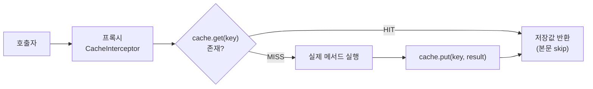

## 같은 조회를 매번 DB까지 가는 게 아까울 때

자주 바뀌지 않는데 조회는 많은 데이터(카테고리 목록, 환율, 사용자 권한)는 매번 DB를 때리는 게 낭비입니다. Spring의 **캐시 추상화**를 쓰면 저장소(로컬 맵, Caffeine, Redis…)가 무엇이든 **애너테이션만으로** 캐싱을 얹을 수 있습니다.

문제는 이 추상화를 "애너테이션 붙이면 빨라지는 마법"으로만 알면, 운영에서 정확히 세 군데서 터진다는 겁니다 — **캐시가 조용히 안 먹을 때, 캐시가 오래된 값을 줄 때, 캐시가 같은 미스를 동시에 수백 번 흘려보낼 때.** 이 글은 `@Cacheable`을 *어떤 클래스가 어떤 순서로* 처리하는지부터 시작해 그 세 지점을 정확히 짚습니다.

## 한눈에 보는 캐시 경로 — 히트는 빠르고, 미스는 멀다

같은 메서드 호출이라도 캐시에 값이 있으면(<span style="color:#2f9e44;font-weight:600">HIT</span>) 메서드 본문을 *건너뛰고* 즉시 반환하고, 없으면(<span style="color:#f08c00;font-weight:600">MISS</span>) DB까지 갔다가 결과를 캐시에 채우고 돌아옵니다.

<div class="cab-flow" markdown="0">
<style>
.cab-flow{margin:1.4rem 0;overflow-x:auto}
.cab-flow svg{width:100%;max-width:720px;height:auto;display:block;margin:0 auto;font-family:inherit}
.cab-flow .lbl{fill:currentColor;font-size:12.5px;font-weight:600}
.cab-flow .sub{fill:currentColor;font-size:9.5px;opacity:.55}
.cab-flow .arr{stroke:currentColor;opacity:.3;stroke-width:1.5;fill:none}
.cab-flow rect.box{fill:none;stroke:currentColor;stroke-width:1.5;opacity:.4}
.cab-flow rect.db{animation:cabpulse 5s ease-in-out infinite}
.cab-flow .hitlbl{fill:#2f9e44;font-size:11px;font-weight:700}
.cab-flow .misslbl{fill:#f08c00;font-size:11px;font-weight:700}
.cab-flow circle.hit{fill:#2f9e44;animation:cabhit 3.2s linear infinite}
.cab-flow circle.miss{fill:#f08c00;animation:cabmiss 5s linear infinite .4s}
@keyframes cabhit{0%{transform:translate(0,0);opacity:0}8%{opacity:1}35%{transform:translate(192px,0)}85%{transform:translate(636px,0);opacity:1}100%{transform:translate(636px,0);opacity:0}}
@keyframes cabmiss{0%{transform:translate(0,0);opacity:0}5%{opacity:1}18%{transform:translate(192px,0)}30%{transform:translate(192px,77px)}50%{transform:translate(355px,77px)}68%{transform:translate(505px,77px)}82%{transform:translate(636px,77px)}92%{transform:translate(636px,0)}99%{opacity:1}100%{transform:translate(636px,0);opacity:0}}
@keyframes cabpulse{0%,100%{opacity:.35}50%{opacity:.9}}
</style>
<svg viewBox="0 0 720 250" role="img" aria-label="캐시 히트는 메서드를 건너뛰고 즉시 반환하고, 미스는 메서드(DB) 실행 후 캐시에 저장하고 반환하는 흐름 애니메이션">
  <rect class="box" x="8"   y="101" width="118" height="46" rx="8"/>
  <rect class="box" x="160" y="101" width="104" height="46" rx="8"/>
  <rect class="box" x="600" y="101" width="112" height="46" rx="8"/>
  <rect class="box db" x="300" y="178" width="150" height="46" rx="8"/>
  <rect class="box" x="470" y="178" width="110" height="46" rx="8"/>
  <text class="lbl" x="67"  y="124" text-anchor="middle">CacheInterceptor</text>
  <text class="sub" x="67"  y="139" text-anchor="middle">AOP 프록시</text>
  <text class="lbl" x="212" y="124" text-anchor="middle">캐시 조회</text>
  <text class="sub" x="212" y="139" text-anchor="middle">Cache.get(key)</text>
  <text class="lbl" x="656" y="124" text-anchor="middle">반환</text>
  <text class="lbl" x="375" y="201" text-anchor="middle">메서드 실행 (DB)</text>
  <text class="lbl" x="525" y="201" text-anchor="middle">캐시 저장</text>
  <text class="sub" x="525" y="216" text-anchor="middle">Cache.put</text>
  <text class="hitlbl"  x="430" y="92" text-anchor="middle">HIT · 본문 건너뜀 → 즉시 반환</text>
  <text class="misslbl" x="212" y="172" text-anchor="middle">MISS ↓</text>
  <line class="arr" x1="126" y1="124" x2="160" y2="124"/>
  <line class="arr" x1="264" y1="124" x2="600" y2="124"/>
  <line class="arr" x1="212" y1="147" x2="212" y2="201"/>
  <line class="arr" x1="212" y1="201" x2="300" y2="201"/>
  <line class="arr" x1="450" y1="201" x2="470" y2="201"/>
  <line class="arr" x1="580" y1="201" x2="656" y2="201"/>
  <line class="arr" x1="656" y1="201" x2="656" y2="147"/>
  <circle class="hit"  cx="20" cy="124" r="7"/>
  <circle class="miss" cx="20" cy="124" r="7"/>
</svg>
</div>

이 그림의 핵심은 **HIT일 때 메서드 본문이 아예 실행되지 않는다**는 점입니다. 그래서 `@Cacheable` 메서드 안에 부수효과(로그 적재, 카운터 증가)를 넣으면 캐시 히트 때 통째로 사라집니다.

## 동작 원리: `CacheInterceptor`라는 또 하나의 AOP 프록시

`@Cacheable`은 마법이 아니라 **AOP 프록시**입니다. `@Transactional`, 그리고 [Spring Data 리포지토리]()와 **완전히 같은 계열**이에요. `@EnableCaching`이 `CacheInterceptor`(= `MethodInterceptor`)를 빈에 엮고, 메서드 호출이 프록시를 지날 때 다음을 합니다.

```text
CacheInterceptor.invoke()
 └─ CacheAspectSupport.execute()
     ├─ CacheOperationSource 가 메서드의 @Cacheable/@CachePut/@CacheEvict 파싱
     ├─ key 계산 (KeyGenerator)  →  cache = CacheManager.getCache(name)
     ├─ @Cacheable: cache.get(key) 있으면 그 값 반환 (★ 본문 미실행)
     ├─ 없으면 실제 메서드 invoke → cache.put(key, result)
     └─ @CacheEvict: cache.evict(key) 또는 clear()
```



여기서 두 추상화를 구분하는 게 중요합니다. **`CacheManager`** 는 이름별 `Cache`를 내주는 공장이고, **`Cache`** 는 `get/put/evict`를 가진 저장소 한 칸입니다. 우리 코드는 이 인터페이스에만 의존하고, 실제 구현(`ConcurrentMapCache`, `CaffeineCache`, `RedisCache`)은 갈아끼웁니다.

## 세 애너테이션, 정확한 의미

```java
@Service
public class ProductService {

    @Cacheable(cacheNames = "product", key = "#id", unless = "#result == null")
    public Product find(Long id) {                 // HIT면 본문 미실행
        return repository.findById(id).orElseThrow();
    }

    @CachePut(cacheNames = "product", key = "#p.id")
    public Product save(Product p) {               // 항상 실행 + 결과로 캐시 갱신
        return repository.save(p);
    }

    @CacheEvict(cacheNames = "product", key = "#id")
    public void delete(Long id) {                  // 캐시에서 제거
        repository.deleteById(id);
    }
}
```

| 애너테이션 | 본문 실행 | 캐시 동작 | 쓰임 |
|---|---|---|---|
| `@Cacheable` | HIT면 **skip** | get→없으면 put | 조회 |
| `@CachePut` | **항상** 실행 | 결과로 put(갱신) | 갱신 후 캐시 동기화 |
| `@CacheEvict` | 항상 실행 | evict / `allEntries=true`면 clear | 삭제·무효화 |

**key는 SpEL**입니다. 파라미터가 여러 개면 `key`를 생략했을 때 `SimpleKeyGenerator`가 *모든 인자를 묶어* `SimpleKey`를 만듭니다. 인자가 하나면 그 인자 자체가 키가 되죠. 그래서 파라미터가 둘인데 `key`를 안 주면, 의도와 다른 복합 키가 생겨 캐시가 안 맞는 일이 생깁니다 — **다중 인자 메서드는 `key`를 명시**하세요. `condition`(호출 전 평가, 캐시 적용 여부)과 `unless`(결과 평가, 저장 제외)도 구분 포인트입니다.

## 함정 1: self-invocation — 또 그 프록시

프록시 기반이므로 같은 클래스 안에서 `@Cacheable` 메서드를 **직접 호출**하면 캐시가 통째로 무시됩니다.

```java
public Product getOrLoad(Long id) {
    return find(id);   // ❌ this.find() → 프록시 우회 → 매번 DB
}

@Cacheable("product")
public Product find(Long id) { ... }
```

[@Transactional 함정 글]()과 **동일한 메커니즘**입니다. 해결도 같아요 — 호출 대상을 별도 빈으로 분리하거나, 자기 자신을 주입(self-injection)받아 프록시를 거치게 합니다. AOP를 아는 사람은 캐시 버그의 절반을 여기서 바로 의심합니다.

## 함정 2: 무효화 타이밍 — 트랜잭션보다 먼저 지워진다

가장 잡기 어려운 버그입니다. `@CacheEvict`는 기본적으로 **메서드 실행이 끝난 직후**(트랜잭션 커밋과 무관하게) 캐시를 지웁니다. 그런데 그 트랜잭션이 **롤백되면**, 캐시는 이미 비워졌고 DB는 옛 값 그대로 → 다음 조회가 옛 값을 다시 캐시에 채웁니다. 반대로 다른 스레드가 *커밋 전*에 미스로 옛 값을 읽어 캐시를 오염시킬 수도 있습니다.

```java
// 위험: 커밋 전에 evict가 일어남
@Transactional
@CacheEvict(cacheNames = "product", key = "#p.id")
public void update(Product p) { repository.save(p); }
```

해결은 **커밋 이후에 무효화**하는 것입니다. `@TransactionalEventListener(phase = AFTER_COMMIT)`로 이벤트를 받아 그때 evict하면, "DB는 새 값, 캐시는 비움"이 항상 보장됩니다.

## 함정 3: 캐시 스탬피드(thundering herd)와 `sync`

인기 키의 캐시가 만료된 순간, **수백 개 요청이 동시에 미스**가 되어 한꺼번에 DB로 쏟아집니다. 트래픽이 몰리는 서비스에서 캐시가 오히려 장애의 방아쇠가 되는 고전적 패턴이죠.

```java
@Cacheable(cacheNames = "product", key = "#id", sync = true)
public Product find(Long id) { ... }
```

`sync = true`면 같은 키에 대해 **하나의 스레드만 본문을 실행**하고 나머지는 그 결과를 기다립니다. 단, 주의: 이 잠금은 **로컬 캐시 구현 한정**입니다(`ConcurrentMapCache`·Caffeine은 키 단위 락 제공). **Redis 같은 분산 캐시엔 추상화 차원의 분산 락이 없으므로**, 노드 간 스탬피드는 별도 락(Redisson 등)이나 만료 지터(TTL에 ± 랜덤)로 완화해야 합니다.

## 저장소 교체 — 그리고 추상화가 끝나는 지점

```yaml
spring:
  cache:
    type: redis        # none | simple | caffeine | redis ...
  data:
    redis: { host: localhost, port: 6379 }
```

`@Cacheable` 코드는 그대로 두고 `CacheManager` 구현만 바꾸는 게 이 추상화의 힘입니다.

| 구현 | 범위 | TTL | 특징 |
|---|---|---|---|
| `ConcurrentMapCacheManager` | 로컬·JVM | ❌(직접 만료 없음) | 기본값, 테스트용 |
| Caffeine | 로컬·고성능 | ✅(빌더) | 통계·정교한 만료, 단일 인스턴스 최적 |
| `RedisCacheManager` | 분산·공용 | ✅(per-cache) | 다중 인스턴스 일관성 |

여기서 **TTL은 추상화 바깥**이라는 점이 중요합니다. `@Cacheable`엔 TTL 속성이 없어요. 만료는 구현체 설정으로 줍니다.

```java
@Bean
RedisCacheManagerBuilderCustomizer cacheTtl() {
    return b -> b.withCacheConfiguration("product",
        RedisCacheConfiguration.defaultCacheConfig()
            .entryTtl(Duration.ofMinutes(10))
            .serializeValuesWith(SerializationPair.fromSerializer(
                new GenericJackson2JsonRedisSerializer())));   // 직렬화 명시
}
```

## 함정 4: 직렬화와 null

- **직렬화**: Redis는 값을 바이트로 저장합니다. 기본 JDK 직렬화는 `Serializable` 강제 + 가독성 0이라, 보통 `GenericJackson2JsonRedisSerializer`(타입 정보 포함)로 바꿉니다. 다만 JSON 직렬화는 다형성·`LocalDateTime` 등에서 설정이 필요합니다.
- **null/관통(penetration)**: 존재하지 않는 키를 반복 조회하면 매번 미스 → DB 직격입니다. `@Cacheable`은 기본적으로 null도 캐시하므로(빈 결과로 관통 방어 가능) `unless = "#result == null"`로 *끌지*, 아니면 의도적으로 *유지할지*를 결정해야 합니다.
- **키 충돌**: 키 네임스페이스는 `cacheNames`로 갈립니다. 같은 캐시에 서로 다른 의미의 키가 섞이지 않도록 캐시 이름을 도메인 단위로 나누세요.

## 디버깅 / 관찰

```properties
logging.level.org.springframework.cache=TRACE   # get/put/evict가 로그에 찍힘
```

- Caffeine은 `recordStats()`를 켜면 hit/miss/eviction 통계가 `/actuator/metrics/cache.gets` 등으로 노출됩니다(메트릭 이름에 `result:hit|miss` 태그).
- "캐시가 안 먹는 것 같다"의 1순위 점검은 **프록시를 거치는 호출인가**(self-invocation), 2순위는 **키가 매 호출 동일한가**(SpEL 결과 확인)입니다.

## 면접/리뷰 단골 질문

- **Q. `@Cacheable` 메서드를 같은 클래스에서 호출했더니 캐시가 안 먹는다?** → AOP 프록시 우회(self-invocation). `@Transactional`과 동일 원리.
- **Q. `@CacheEvict`인데 가끔 옛 값이 보인다?** → 트랜잭션 커밋 전에 evict가 일어나고 롤백/경쟁이 발생. `AFTER_COMMIT` 이벤트로 무효화.
- **Q. 캐시 만료 순간 DB 부하가 튄다?** → 스탬피드. 로컬은 `sync=true`, 분산은 분산 락/TTL 지터.
- **Q. `@Cacheable`에 TTL을 어떻게 주나?** → 못 준다. TTL은 추상화 밖이라 `CacheManager` 구현 설정(예: `RedisCacheConfiguration.entryTtl`).

## 정리

- `@Cacheable`/`@CachePut`/`@CacheEvict`는 **`CacheInterceptor`(AOP 프록시)** 로 동작 — `@Transactional`과 같은 계열, **self-invocation 함정** 공유.
- HIT면 **메서드 본문이 실행되지 않는다**(부수효과 주의).
- 무효화는 **커밋 이후**(`@TransactionalEventListener`)에 해야 옛 값/롤백 오염을 피한다.
- 스탬피드는 로컬 `sync=true`, 분산은 별도 대책.
- **TTL·직렬화·null 정책**은 추상화 밖, 구현체에서 챙긴다.

> 관련 글: 같은 AOP 프록시 함정의 원조는 [@Transactional 동작 원리와 함정](), 분산 캐시 저장소로서의 Redis는 [Redis + Spring Boot 클러스터]()에서 다룹니다.
