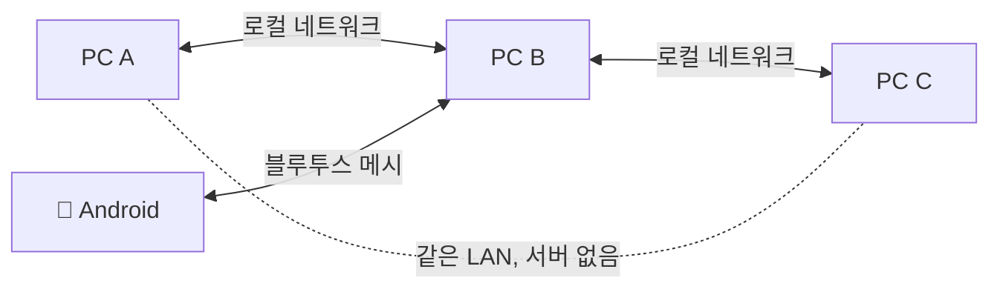

> 앱 소개·기능은 출시작 글에서 → [서버도 인터넷도 계정도 없는 채팅앱 'Murmur']()
>
> 이 글은 **상세한 아키텍처 명세가 아니라**, 약 일주일의 개발을 **주차별 흐름**으로 되짚으며 인상 깊게 막혔던 지점만 가볍게 추린 기록입니다.

## 한눈에 보는 구조

서버가 없으니 모든 기기가 **발견 → 연결 → 릴레이**를 각자 합니다. 한가운데 중앙 서버를 두는 그림을 지우고 시작했습니다.

- **발견(discovery)**: 같은 네트워크의 다른 앱을 스스로 찾아 연결 (IP 입력 불필요)
- **전송(transport)**: 찾은 기기끼리 직접 연결, 모바일은 블루투스(BLE) 병행
- **라우팅(routing)**: 메시지 ID로 중복 제거 + 홉 수 제한(TTL) 기반 **플러딩 릴레이**
- **프라이버시**: 방별 입장 코드에서 키를 유도해 본문을 암호화. **릴레이 노드는 암호문만** 보고 지나감

## 스택

| 영역 | 선택 | 한 줄 이유 |
|------|------|-----------|
| PC | Electron + TypeScript | 한 코드로 Windows·macOS, 메인/렌더러 분리로 알림 일원화 쉬움 |
| 모바일 | Flutter | Android 단일 코드 + 네이티브 BLE/네트워크 접근 |
| 발견 | mDNS / Bonjour | 설정 0으로 같은 망의 피어 자동 탐색 |
| 암호화 | 코드 기반 키 유도 + AES-256-GCM | 방 코드를 가진 사람만 해독 (서버 없이 E2E) |
| 패키징 | electron-builder / Flutter | DMG·인스톨러·APK |

## 개발 타임라인 (주 기준)

실제 커밋을 주차로 묶어 보면, **뼈대를 세운 첫날 → 일주일에 걸친 완성**의 두 구간으로 나뉩니다.

### 0주차 — 하루 만에 뼈대 (6/7, 일)

첫날에 욕심껏 핵심을 다 깔았습니다. 자동 발견 + 직접 연결 + 멀티홉 릴레이로 **"같은 망이면 대화가 된다"** 는 최소 동작을 확인하고, 곧장 사진·파일 전송과 모바일 **BLE 메시**, 그리고 카카오톡식 레이아웃까지 올렸습니다. 큰 파일을 통째로 싣지 않고 **청크로 쪼개 디스크 스트리밍**하는 구조도 이날 잡았는데, 이게 나중에 LAN·BLE 양쪽에서 똑같이 쓰여 큰 도움이 됐습니다.

### 본 빌드 주간 — 다듬고 키운 6일 (6/8~6/14, 월~일)

| 구간 | 한 일 |
|------|-------|
| 초반 (월·화) | 릴리즈 워크플로, 전달 영수증/안 읽음 수, **알림을 메인 프로세스로 일원화**(창이 몇 개든 1회), 6개 언어 i18n, **Murmur 리브랜딩** |
| 중반 (수·목) | **Silver Möbius** 모노크롬 디자인 시스템 전면 적용, 주변 기기 레이더, 코드 없는 동네 방, 콘텐츠 로컬 아카이브 |
| 후반 (금·토) | 미디어 갤러리, **네트워크 단위 방 잠금**, 그리고 가장 컸던 **Murmur Pro**(테마·진화 아바타·칭호·업적) + **기기 페어링**(QR 한 번으로 폰↔PC 동기화) |
| 마감 (일) | **store-and-forward**(자리 비운 사람도 받기), **사라지는 메시지**, 방 폴더, **메타데이터 보호**까지 넣고 정리 |

처음엔 "채팅 되네"였는데, 일주일 끝에는 디자인·다국어·꾸미기·오프라인 전달까지 갖춘 형태가 됐습니다. 아래는 그 사이 **특히 손이 많이 갔던 지점들**입니다.

## 막혔던 지점 ①: 자동 발견이 앱을 크래시시켰다

자동 발견(mDNS)을 켜자마자 macOS에서 네트워크 오류로 앱이 죽는 문제가 있었습니다.

- **원인**: 발견용 멀티캐스트를 **모든 네트워크 인터페이스**(루프백 포함)로 내보내려다 터졌습니다. 루프백엔 멀티캐스트로 나갈 경로가 없으니까요.
- **해결**: 멀티캐스트를 **실제로 쓰는 LAN 인터페이스에만 고정**했습니다. 더불어 일부 회사망은 mDNS 자체를 막아서, 안 되는 망을 위해 **다른 발견 경로(브로드캐스트)로 폴백**을 따로 뒀습니다.
- **교훈**: "모든 인터페이스에 보낸다"는 편한 기본값이 가장 깨지기 쉬운 환경(루프백·차단망)에서 먼저 무너집니다.

## 막혔던 지점 ②: 블루투스는 한 번에 아주 조금밖에 못 보낸다

모바일 BLE 메시로 사진처럼 큰 데이터를 보내면 깨졌습니다.

- **원인**: 블루투스(BLE)는 한 패킷에 실리는 양이 매우 작아, 메시지를 통째로 실을 수 없습니다.
- **해결**: 패킷마다 **"이 메시지의 몇 번째 조각/전체 몇 조각"** 헤더를 붙여 잘게 쪼개 보내고(단편화) 받는 쪽에서 다시 합칩니다(재조립). 핵심은 **조각 하나가 유실돼도 그 메시지만 버리고** 링크 전체 스트림은 어긋나지 않게 한 것 — 응답 없이 밀어 넣는 전송에서 이게 안 되면 뒤따르는 모든 메시지가 깨집니다.

## 막혔던 지점 ③: 양쪽이 서로 전화를 걸면 연결이 두 개 생긴다

서버가 없으니 두 기기가 동시에 서로에게 연결을 시도합니다. 그러면 한 쌍에 링크가 2개 생겨 메시지가 중복되거나 꼬였습니다.

- **해결**: 두 기기의 고유 ID를 비교해 **사전순으로 낮은 쪽만 연결을 걸고**, 높은 쪽은 받기만 하도록 규칙을 정했습니다. 한 쌍당 링크는 항상 하나. 이 규칙은 나중에 블루투스 링크에도 그대로 재사용됐습니다.

## 설계에서 배운 것

### 프라이버시는 "전송"이 아니라 "암호화"로
처음엔 "같은 망 = 같은 방"으로 접근을 막을까 고민했는데, 그러면 망 구성마다 예외가 쏟아집니다. 방향을 바꿔 **전송은 활짝 열어 모두에게 릴레이하되, 방별 코드 키가 없으면 아예 못 읽게** 했더니 구조가 훨씬 단순해졌습니다. 릴레이 노드는 **복호화를 시도조차 하지 않고** 암호문만 흘려보냅니다.

### 메시 코어를 전송 계층과 분리한 게 신의 한 수
핸드셰이크·중복 제거·홉 제한·암호화를 **전송과 독립**으로 짠 덕에, LAN으로 만든 로직이 블루투스에서도 거의 그대로 돌았습니다. 덤으로, 한 기기가 LAN과 블루투스에 동시에 붙으면 **두 망을 잇는 다리**가 되는 동작이 공짜로 따라왔습니다.

### 자리 비운 사람도 받게 (store-and-forward)
순수 릴레이는 보내는 순간 연결된 사람에게만 닿습니다. 그래서 각 기기가 최근 메시지를 잠깐 보관했다가, **새로 합류한 기기에 그 백로그를 한 번 재생**하도록 했습니다. 재생할 때는 더 퍼지지 않게 홉 수를 낮춰 보내고, 메시지 ID 중복 제거가 이중 표시를 막아줍니다. 서버 없이 "잠깐 자리 비운 사람도 대화를 따라잡는" 경험이 여기서 나옵니다.

## 회고

- **잘한 점**: 첫날 뼈대를 욕심껏 깔아둔 것 + 메시 코어를 전송과 분리한 것. 이후 기능들이 그 위에 빠르게 얹혔습니다.
- **아쉬운 점**: 아직 **코드 서명**이 없어 설치 문턱이 있습니다. iOS도 빌드 환경을 마저 갖춰야 하고요.
- **다음**: 오프라인 전달(store-and-forward)을 더 다듬고, 공개 배포(서명·다운로드)를 준비 중입니다.

프로토콜 상세(핸드셰이크·중복제거·홉 제한·암호화 포맷)는 공개 배포 때 함께 정리해 공유하겠습니다.

써보시고 피드백 주시면 정말 큰 힘이 됩니다. 🙌
